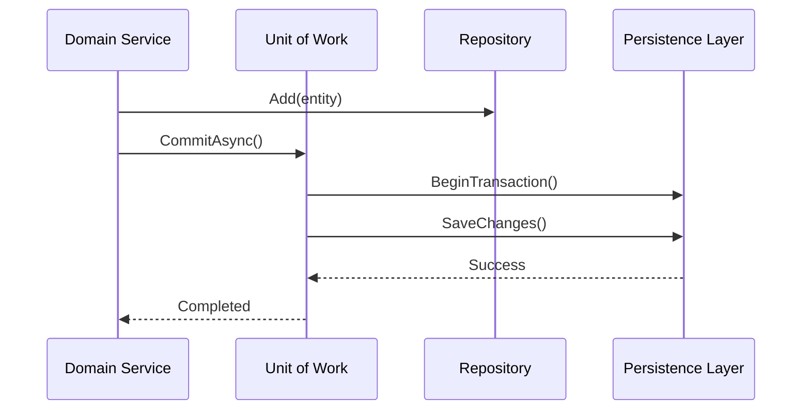

# Repository y Unit of Work [Senior]

## 1. Contexto General & Definición del Concepto
El patrón **Repository** actúa como una capa de mediación entre el dominio y la infraestructura de persistencia, encapsulando la lógica de acceso a datos. El **Unit of Work (UoW)**, por su parte, mantiene una lista de objetos afectados por una transacción de negocio, asegurando la atomicidad en la persistencia.

En arquitecturas modernas, el UoW evita la fragmentación de transacciones, mientras que el Repository desacopla el modelo de dominio de las librerías de ORM, facilitando el Testing unitario y la intercambiabilidad de almacenamiento.

## 2. Forma de Aplicación, Buenas Prácticas & Ventajas
### Cuándo aplicar
- En dominios complejos donde múltiples agregados deben persistirse como una transacción única.
- Cuando se requiere persistencia agnóstica para facilitar el TDD.

### Cuándo evitar (Antipatrón)
- En sistemas de lectura intensiva (CQRS es mejor).
- Si el ORM (como EF Core) ya provee un UoW (DbContext), envolverlo en otro UoW puede generar redundancia innecesaria y complejidad de mantenimiento.

### Matriz de Trade-offs
| Dimensión | Beneficio | Costo / Complejidad |
| :--- | :--- | :--- |
| Acoplamiento | Muy Bajo | Alta abstracción (Bajo nivel de control) |
| Mantenibilidad | Alta (Testing) | Overhead de desarrollo inicial |
| Transaccionalidad | Alta (Atomicidad) | Posible contención en BD (locks) |

## 3. Flujo Arquitectónico y Diagrama (Mermaid)


## 4. Implementación y Ejemplos Prácticos en C# / .NET 10
```csharp
// .NET 10 Implementation using Primary Constructors and C# 13 features
public interface IUnitOfWork : IDisposable {
    IRepository<T> Repository<T>() where T : class;
    Task<int> SaveChangesAsync(CancellationToken ct = default);
}

public class UnitOfWork(AppDbContext context) : IUnitOfWork {
    private readonly Dictionary<Type, object> _repositories = new();
    public IRepository<T> Repository<T>() where T : class {
        var type = typeof(T);
        if (!_repositories.ContainsKey(type)) _repositories[type] = new Repository<T>(context);
        return (IRepository<T>)_repositories[type];
    }
    public async Task<int> SaveChangesAsync(CancellationToken ct) => await context.SaveChangesAsync(ct);
    public void Dispose() => context.Dispose();
}
```

## 5. Implementación en React con Vite.js
En el frontend, el patrón se traduce en la capa de servicios mediante el uso de *Custom Hooks* que gestionan estados atómicos o procesos que requieren múltiples llamadas API transaccionales.

```typescript
// hooks/useEntityMutation.ts
export const useUnitOfWork = () => {
  const commit = async (operations: Promise<any>[]) => {
    try {
      return await Promise.all(operations);
    } catch (error) {
      console.error('UoW Transaction Failed', error);
      throw error;
    }
  };
  return { commit };
};
```

## 6. Consideraciones de Concurrencia, Consistencia y Rendimiento
Para sistemas de alta escala, el uso de UoW puede llevar a transacciones largas que bloquean recursos en base de datos. Se recomienda:
1. **Optimistic Concurrency**: Usar `RowVersion` o `ETags` en lugar de bloqueos pesimistas.
2. **Observabilidad**: Implementar trazas distribuidas (OpenTelemetry) en el `CommitAsync` para detectar cuellos de botella en latencia p99.
3. **Eventual Consistency**: Si el UoW se vuelve inmanejable, considerar migrar a patrones de consistencia eventual mediante [[Transactional-Outbox-Pattern]].

## 7. Enlaces y Referencias en Obsidian
- [[Clean-Architecture-DDD-en-DotNet10]]
- [[CQRS-y-Event-Sourcing]]
- [[Optimistic-vs-Pessimistic-Locking]]
