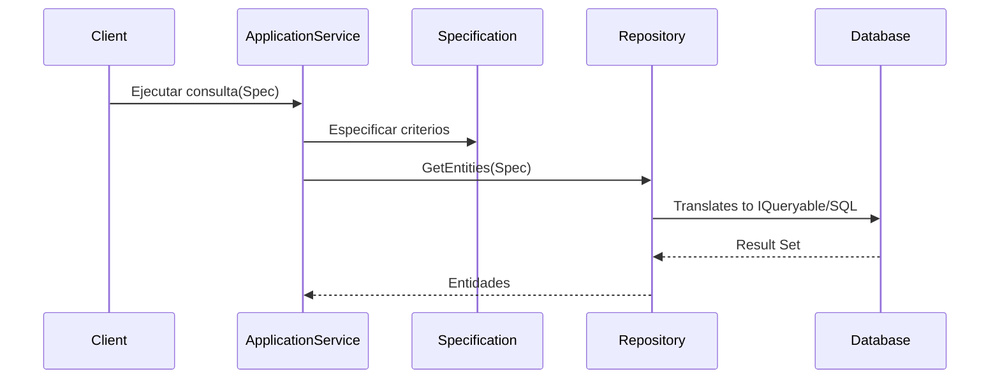

# Specification Pattern [Senior]

## 1. Contexto General & Definición del Concepto
El *Specification Pattern* permite encapsular reglas de negocio en objetos reutilizables y combinables. En sistemas distribuidos, actúa como un DSL para definir criterios de filtrado, validación o selección de entidades, desacoplando la lógica de negocio de la capa de persistencia (Infrastructure).

Este patrón resuelve el problema del *God Object* en repositorios y la proliferación de métodos de consulta (Query Overloading), permitiendo expresar predicados complejos (ej: "Pedidos activos pendientes de pago hace más de 30 días") de forma declarativa.

## 2. Forma de Aplicación, Buenas Prácticas & Ventajas
- **Cuándo aplicar:** Reglas de negocio recurrentes que involucran múltiples entidades o criterios complejos de filtrado.
- **Antipatrón:** No sobre-ingenierizar para consultas simples (CRUDS básicos). La complejidad de abstracción puede ocultar la generación de SQL ineficiente en EF Core.

### Matriz de Trade-offs
| Ventaja | Desventaja / Costo |
| :--- | :--- |
| Alta reutilización de lógica (DRY) | Curva de aprendizaje para el equipo |
| Altamente testeable unitariamente | Riesgo de I/O bloqueante (N+1) si no se vigila |
| Composición fluida (AND/OR/NOT) | Dificultad para debuggear SQL generado |

## 3. Flujo Arquitectónico y Diagrama (Mermaid)


## 4. Implementación y Ejemplos Prácticos en C# .NET 10
Utilizamos `Expression<Func<T, bool>>` para transformar la especificación en SQL nativo mediante el proveedor de EF Core.

```csharp
public abstract class Specification<T> {
    public Expression<Func<T, bool>> Criteria { get; protected set; }
    public List<Expression<Func<T, object>>> Includes { get; } = new();
    
    protected void AddInclude(Expression<Func<T, object>> includeExpression) => Includes.Add(includeExpression);
}

public class ActiveOrdersSpecification : Specification<Order> {
    public ActiveOrdersSpecification(DateTime threshold) {
        Criteria = o => o.Status == OrderStatus.Pending && o.CreatedAt < threshold;
        AddInclude(o => o.Items);
    }
}

// Uso en Repositorio
public async Task<IEnumerable<T>> GetAsync(Specification<T> spec) {
    var query = _dbSet.AsQueryable();
    query = spec.Includes.Aggregate(query, (current, include) => current.Include(include));
    return await query.Where(spec.Criteria).ToListAsync();
}
```

## 5. Implementación en React con Vite.js
En el frontend, el patrón suele implementarse como un *Query Factory* que serializa los filtros para el consumo de APIs REST/GraphQL.

```typescript
// Specification Factory en TypeScript
export const OrderFilters = {
  active: (days: number) => ({ status: 'PENDING', minAgeDays: days }),
  byUser: (userId: string) => ({ userId }),
};

// Custom Hook resiliencia
export const useOrders = (filter: any) => {
  const [data, setData] = useState([]);
  useEffect(() => {
    api.get('/orders', { params: filter }).then(res => setData(res.data));
  }, [JSON.stringify(filter)]);
  return data;
};
```

## 6. Consideraciones de Concurrencia, Consistencia y Rendimiento
- **Latencia:** La serialización de especificaciones complejas puede generar *Cartesian Product* en SQL; validar siempre con `EXPLAIN ANALYZE`.
- **Consistencia:** En arquitecturas con [[CQRS-y-Event-Sourcing]], las especificaciones de lectura deben ser eventuales; considerar que el estado en caché local del frontend puede diferir del servidor.
- **Resiliencia:** Usar *Circuit Breakers* cuando la especificación involucre múltiples llamadas a microservicios.

## 7. Enlaces y Referencias en Obsidian
- [[Clean-Architecture-Senior-Implementation]]
- [[CQRS-Arquitectura-Distribuida]]
