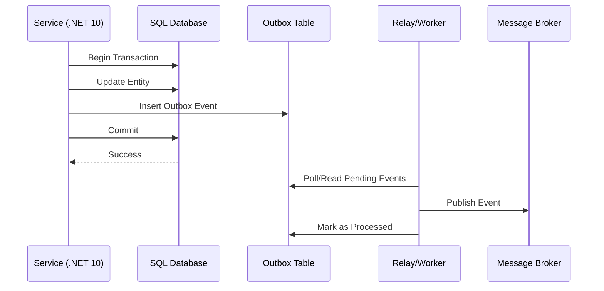

# Transactional Outbox Pattern [Senior]

## 1. Contexto General & Definición del Concepto
El Transactional Outbox Pattern es un patrón arquitectónico fundamental para garantizar la **consistencia atómica** en sistemas distribuidos cuando se requiere realizar cambios en una base de datos relacional y, simultáneamente, publicar un evento a un bus de mensajes (Kafka, RabbitMQ, Azure Service Bus).

En un entorno de microservicios, el problema de "Dual Write" (escribir en DB y publicar evento por separado) es una receta para el desastre: si la DB se confirma pero la red falla al publicar el evento, el sistema queda inconsistente. Este patrón introduce una tabla `Outbox` dentro de la misma transacción ACID de la base de datos, garantizando que el evento sea persistido exactamente al mismo tiempo que la entidad.

## 2. Forma de Aplicación, Buenas Prácticas & Ventajas

### Matriz de Trade-offs
| Dimensión | Beneficio | Costo / Complejidad |
| :--- | :--- | :--- |
| Consistencia | Garantiza atomicidad al publicar | Requiere polling o CDC (Change Data Capture) |
| Disponibilidad | Desacopla el servicio del broker | Mayor latencia percibida en escritura (DB overhead) |
| Resiliencia | Permite retentativas automáticas | Gestión de eventos duplicados (Idempotencia) |

## 3. Flujo Arquitectónico


## 4. Implementación en C# .NET 10
Utilizando EF Core 10 con una transacción explícita dentro del Unit of Work:
```csharp
public async Task CreateOrderAsync(Order order, CancellationToken ct) 
{
    using var transaction = await _context.Database.BeginTransactionAsync(ct);
    try {
        _context.Orders.Add(order);
        
        var outboxEvent = new OutboxMessage {
            Id = Guid.NewGuid(),
            Type = nameof(OrderCreatedIntegrationEvent),
            Payload = JsonSerializer.Serialize(new OrderCreatedIntegrationEvent(order.Id)),
            OccurredOn = DateTime.UtcNow
        };
        
        _context.OutboxMessages.Add(outboxEvent);
        await _context.SaveChangesAsync(ct);
        await transaction.CommitAsync(ct);
    } catch {
        await transaction.RollbackAsync(ct);
        throw;
    }
}
```

## 5. Implementación en React con Vite.js
En el frontend, el patrón se manifiesta como una gestión de estado optimista que espera la confirmación del servidor (eventual consistency awareness):
```typescript
const useOrderSubmission = () => {
  const [status, setStatus] = useState('idle');
  
  const submitOrder = async (data: OrderRequest) => {
    setStatus('pending');
    try {
      // Post a la API, el backend asegura consistencia vía Outbox
      await apiClient.post('/orders', data);
      setStatus('success');
    } catch (e) {
      // Manejo de errores resiliente
      setStatus('error');
      handleFallback(e);
    }
  };
  return { submitOrder, status };
};
```

## 6. Consideraciones de Concurrencia
- **Idempotencia:** Dado que el Relay puede fallar después de enviar el mensaje pero antes de marcarlo como procesado, el consumidor debe ser idempotente.
- **Orden:** El polling debe ser secuencial por `OccurredOn` para mantener el orden cronológico de eventos.
- **Performance:** El uso de CDC (ej: Debezium) es preferible sobre el polling tradicional para reducir la carga en la base de datos principal.

## 7. Enlaces y Referencias
- [[CQRS-y-Event-Sourcing]]
- [[CAP-y-Eventual-Consistency]]
- [[Idempotencia-en-APIs-y-Consumidores-de-Eventos]]
