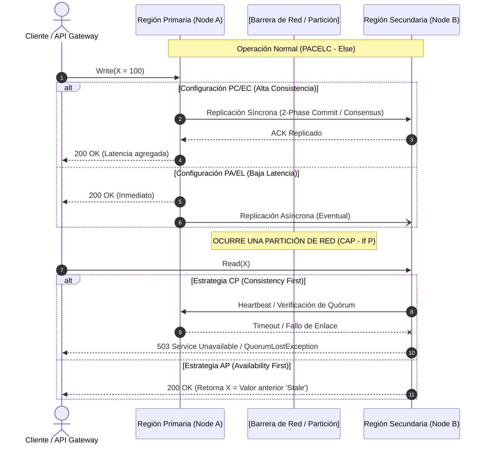

# Bases del Teorema CAP & PACELC [Principal]

## 1. Contexto General & Definición del Concepto

En la ingeniería de sistemas distribuidos a escala planetaria, el **Teorema CAP** (propuesto por Eric Brewer en 1999 y formalizado por Seth Gilbert y Nancy Lynch en 2002) postula que un almacén de datos distribuido y asíncrono no puede garantizar simultáneamente más de dos de las siguientes tres propiedades ante la presencia de fallos:

1. **Consistency (Linearizability / Consistencia Fuerte):** Cada lectura recibe la escritura más reciente o un error explícito. Todos los nodos ven el mismo estado de manera instantánea.
2. **Availability (Disponibilidad):** Cada petición que no falle en el nodo emisor recibe una respuesta no errónea (sin garantía de contener la escritura más reciente).
3. **Partition Tolerance (Tolerancia a Particiones):** El sistema continúa operando a pesar de que la red pierda o retrase un número arbitrario de mensajes entre nodos.

Dado que en redes físicas las particiones de red (**P**) son inevitables (cables submarinos cortados, saturación de buffers en switches, caídas transregionales), la elección real en momentos de partición se reduce a **CP** (Consistencia sobre Disponibilidad) o **AP** (Disponibilidad sobre Consistencia).

### La Extensión: Teorema PACELC
Formulado por Daniel Abadi en 2012, **PACELC** subsana la limitación de CAP, el cual solo analiza el comportamiento del sistema cuando ocurre una falla de red (**Partition**). PACELC modela el ciclo de vida completo:

$$\text{Si hay una Partición (P)} \rightarrow \text{Elegir entre Availability (A) o Consistency (C)}$$
$$\text{Else (E, en operación normal)} \rightarrow \text{Elegir entre Latency (L) o Consistency (C)}$$

- **PC/EC (ej. Spanner, CockroachDB, RDBMS sincronizado):** En partición elige Consistencia; en estado normal minimiza discrepancias a costa de mayor Latencia (requiere rondas de consenso estilo Raft/Paxos).
- **PA/EL (ej. DynamoDB con lectura eventual, Cassandra, Couchbase):** En partición elige Disponibilidad; en estado normal optimiza Latencia leyendo/escribiendo en quórums mínimos locales.
- **PA/EC (ej. MongoDB primario con replicación asíncrona pero lecturas mayoritarias):** En partición prefiere disponibilidad en particiones aisladas, pero en operación normal sacrifica latencia para sincronización.
- **PC/EL (ej. Sistemas transaccionales que relajan lecturas en steady-state pero abortan en partición):** Menos común pero viable en microservicios transaccionales con caching local.

---

## 2. Forma de Aplicación, Buenas Prácticas & Ventajas

### Cuándo Aplicar cada Modelo vs. Antipatrón de Sobreingeniería

- **Modelo CP / PC-EC:** Indispensable en dominios como **Ledgers contables, transferencias bancarias interbancarias, asignación de inventario crítico único (asientos de avión, entradas de conciertos)**. Es un antipatrón implementarlo en catálogos de productos, contadores de métricas o feeds sociales, donde el bloqueo por quórum destruye el Throughput y eleva el blast radius.
- **Modelo AP / PA-EL:** Indispensable en **telemetría IoT, carritos de compra e-commerce resilientes, sistemas de chat, feeds sociales**. Es un antipatrón cuando la lógica de negocio requiere invariantes atómicas globales sin mecanismos de reconciliación compensatoria (Sagas/CRDTs).

### Matriz de Trade-offs y Gobernanza Operacional

| Dimensión | Enfoque CP / PC-EC | Enfoque AP / PA-EL |
| :--- | :--- | :--- |
| **Garantía Semántica** | Linearizability, Serializability | Consistencia Eventual, Read-Your-Writes, Monotonic |
| **Latencia p99 (Steady State)** | Alta (múltiples RTTs para Quórums/Paxos/2PC) | Ultra-baja (lectura/escritura en nodo local más cercano) |
| **Comportamiento en Partición** | Falla rápida / Rechazo de solicitudes (`HTTP 503/504`) | Respuesta exitosa con datos potencialmente obsoletos |
| **Resolución de Conflictos** | Bloqueo o aborto distribuido inmediato | LWW (Last-Write-Wins), Vector Clocks o CRDTs |
| **Costo Total de Propiedad (TCO)** | Alto (infraestructura de red de baja latencia, HW dedicado) | Medio/Bajo (escala horizontal con nodos commodity) |
| **Complejidad de Dominio** | Baja en frontend/consumidores; alta en motor de datos | Alta en la lógica de aplicación (tolerancia a divergencia) |

---

## 3. Flujo Arquitectónico y Diagrama (Mermaid)



---

## 4. Implementación y Ejemplos Prácticos en C# / .NET 10 (Backend & Domain)

El siguiente ejemplo materializa un **Coordinador de Almacenamiento Adaptativo PACELC** en .NET 10. Permite alternar políticas de consistencia síncrona con quórum (PC/EC) vs. respuesta inmediata con reconciliación asíncrona (PA/EL) basado en el SLA de la operación y el estado de la partición de red.

```csharp
// Archivo: Infrastructure/DistributedStorage/PacelcStorageCoordinator.cs
namespace Enterprise.DistributedSystems.Pacelc;

using System;
using System.Collections.Concurrent;
using System.Collections.Generic;
using System.Linq;
using System.Threading;
using System.Threading.Tasks;
using Microsoft.Extensions.Logging;

public enum ConsistencyLevel
{
    Linearizable_CP,
    Eventual_AP
}

public readonly record struct StorageNodeId(string Value);
public readonly record struct DataPayload<T>(string Key, T Value, long Version, DateTime TimestampUtc);

public interface IDistributedNode
{
    StorageNodeId Id { get; }
    Task<bool> PingAsync(CancellationToken ct);
    Task WriteLocalAsync<T>(DataPayload<T> payload, CancellationToken ct);
    Task<DataPayload<T>?> ReadLocalAsync<T>(string key, CancellationToken ct);
}

public sealed class PacelcStorageCoordinator
{
    private readonly IReadOnlyList<IDistributedNode> _clusterNodes;
    private readonly ILogger<PacelcStorageCoordinator> _logger;

    public PacelcStorageCoordinator(
        IEnumerable<IDistributedNode> clusterNodes,
        ILogger<PacelcStorageCoordinator> logger)
    {
        _clusterNodes = clusterNodes.ToList().AsReadOnly();
        _logger = logger ?? throw new ArgumentNullException(nameof(logger));
    }

    public async Task<bool> WriteAsync<T>(
        string key,
        T value,
        ConsistencyLevel consistencyLevel,
        CancellationToken ct = default)
    {
        var payload = new DataPayload<T>(key, value, Environment.TickCount64, DateTime.UtcNow);
        int totalNodes = _clusterNodes.Count;
        int quorumThreshold = (totalNodes / 2) + 1;

        _logger.LogInformation("Iniciando escritura para Clave: {Key} con Estrategia: {Strategy}", key, consistencyLevel);

        if (consistencyLevel == ConsistencyLevel.Linearizable_CP)
        {
            // [P/C - E/C]: Requerimos Quórum estricto. Si hay partición, abortamos para proteger consistencia.
            var writeTasks = _clusterNodes.Select(async node =>
            {
                try
                {
                    using var timeoutCts = new CancellationTokenSource(TimeSpan.FromMilliseconds(250));
                    using var linkedCts = CancellationTokenSource.CreateLinkedTokenSource(ct, timeoutCts.Token);
                    
                    await node.WriteLocalAsync(payload, linkedCts.Token);
                    return true;
                }
                catch (Exception ex)
                {
                    _logger.LogWarning("Fallo escritura en nodo {NodeId}: {Message}", node.Id.Value, ex.Message);
                    return false;
                }
            });

            var results = await Task.WhenAll(writeTasks);
            int successfulAcks = results.Count(success => success);

            if (successfulAcks < quorumThreshold)
            {
                _logger.LogError("Violación de Quórum: {Acks}/{Threshold}. Partición detectada. Abortando operación.", successfulAcks, quorumThreshold);
                throw new InvalidOperationException($"QuorumLostException: Partición de red detectada. Fallo al alcanzar consistencia estricta ({successfulAcks}/{totalNodes} nodos disponibles).");
            }

            return true;
        }
        else
        {
            // [P/A - E/L]: Escritura ultra-rápida. Respondemos con 1 ACK y disparamos sincronización en background.
            var primaryNode = _clusterNodes.First();
            await primaryNode.WriteLocalAsync(payload, ct);

            _ = Task.Run(async () =>
            {
                foreach (var replicaNode in _clusterNodes.Skip(1))
                {
                    try
                    {
                        await replicaNode.WriteLocalAsync(payload, CancellationToken.None);
                    }
                    catch (Exception ex)
                    {
                        _logger.LogWarning("Replicación asíncrona postergada en nodo {NodeId}: {Message}", replicaNode.Id.Value, ex.Message);
                    }
                }
            }, CancellationToken.None);

            return true;
        }
    }
}
```

---

## 5. Implementación y Ejemplos Prácticos en React con Vite.js (Frontend Architecture)

En arquitecturas AP/PA-EL, el frontend debe manejar **Consistencia Débil/Eventual** mediante interfaces optimistas y señalización explícita de frescura de datos (Stale Data Warnings y reconciliación reactiva vía SSE/WebSockets).

```tsx
// Archivo: src/features/inventory/hooks/usePacelcInventory.ts
import { useState, useCallback, useTransition } from 'react';

export interface InventoryItem {
  sku: string;
  stock: number;
  isStale: boolean;
  lastSyncTimestamp: number;
}

interface WriteOptions {
  mode: 'STRICT_CP' | 'OPTIMISTIC_AP';
}

export function usePacelcInventory(initialItem: InventoryItem) {
  const [inventory, setInventory] = useState<InventoryItem>(initialItem);
  const [isDegradedState, setIsDegradedState] = useState<boolean>(false);
  const [isPending, startTransition] = useTransition();
  const [error, setError] = useState<string | null>(null);

  const mutateStock = useCallback(
    async (delta: number, options: WriteOptions) => {
      setError(null);
      const previousState = { ...inventory };

      if (options.mode === 'OPTIMISTIC_AP') {
        // Actualización Optimista inmediata (PA/EL friendly)
        startTransition(() => {
          setInventory((prev) => ({
            ...prev,
            stock: prev.stock + delta,
            isStale: true,
            lastSyncTimestamp: Date.now(),
          }));
        });
      }

      try {
        const response = await fetch(`/api/v1/inventory/${inventory.sku}`, {
          method: 'PATCH',
          headers: { 'Content-Type': 'application/json' },
          body: JSON.stringify({
            delta,
            consistencyRequirement: options.mode,
          }),
        });

        if (!response.ok) {
          if (response.status === 503) {
            // Fallo por partición en modo CP
            setIsDegradedState(true);
            throw new Error('El sistema se encuentra en partición de red. Operación denegada por seguridad.');
          }
          throw new Error(`Error de servidor: ${response.statusText}`);
        }

        const confirmedData = await response.json();
        setInventory({
          sku: confirmedData.sku,
          stock: confirmedData.stock,
          isStale: false,
          lastSyncTimestamp: Date.now(),
        });
        setIsDegradedState(false);
      } catch (err: unknown) {
        // Rollback automático si falló el modelo AP o CP
        setInventory(previousState);
        setError(err instanceof Error ? err.message : 'Error desconocido de consistencia');
      }
    },
    [inventory]
  );

  return {
    inventory,
    isDegradedState,
    isPending,
    error,
    mutateStock,
  };
}
```

```tsx
// Archivo: src/features/inventory/components/InventoryManager.tsx
import React from 'react';
import { usePacelcInventory } from '../hooks/usePacelcInventory';

export const InventoryManager: React.FC = () => {
  const {
    inventory,
    isDegradedState,
    isPending,
    error,
    mutateStock
  } = usePacelcInventory({
    sku: 'SKU-CORE-998',
    stock: 45,
    isStale: false,
    lastSyncTimestamp: Date.now()
  });

  return (
    <div className="p-6 max-w-lg mx-auto bg-slate-900 text-white rounded-xl shadow-md border border-slate-800">
      <h2 className="text-xl font-bold mb-4">Gestión de Stock Distribuido</h2>
      
      {isDegradedState && (
        <div className="p-3 mb-4 bg-amber-900/40 border border-amber-600 rounded text-amber-200 text-sm">
          ⚠️ <strong>Modo Degradado (CAP Partition):</strong> Consistencia estricta no disponible temporalmente.
        </div>
      )}

      {error && (
        <div className="p-3 mb-4 bg-rose-900/40 border border-rose-600 rounded text-rose-200 text-sm">
          ❌ {error}
        </div>
      )}

      <div className="flex justify-between items-center mb-6">
        <div>
          <p className="text-sm text-slate-400">SKU: {inventory.sku}</p>
          <p className="text-3xl font-mono font-bold">{inventory.stock} unidades</p>
        </div>
        {inventory.isStale && (
          <span className="px-2 py-1 bg-yellow-600 text-xs font-semibold rounded animate-pulse">
            Consistencia Eventual (Syncing)
          </span>
        )}
      </div>

      <div className="grid grid-cols-2 gap-4">
        <button
          disabled={isPending}
          onClick={() => mutateStock(-1, { mode: 'STRICT_CP' })}
          className="px-4 py-2 bg-blue-600 hover:bg-blue-700 disabled:opacity-50 rounded font-medium transition-colors"
        >
          Decrementar (CP - Seguro)
        </button>
        <button
          disabled={isPending}
          onClick={() => mutateStock(1, { mode: 'OPTIMISTIC_AP' })}
          className="px-4 py-2 bg-emerald-600 hover:bg-emerald-700 disabled:opacity-50 rounded font-medium transition-colors"
        >
          Incrementar (AP - Rápido)
        </button>
      </div>
    </div>
  );
};
```

---

## 6. Consideraciones de Concurrencia, Consistencia y Rendimiento

1. **Aislamiento de Blast Radius (Mamparas / Bulkheads):** En un cluster multi-región, forzar consistencia linealizable (PC/EC) de manera indiscriminada expone toda la topología a que una degradación transatlántica bloquee todos los subprocesos de la aplicación por acumulación de *Connection Pool Exhaustion*.
2. **Técnicas de Fencing y Epoch Ticketing:** Cuando un nodo aislado cree seguir siendo el líder (Split-Brain), debe utilizarse un *Fencing Token* monótonamente creciente validado por el storage engine (ej. en Postgres vía `xmin` o etcd vía `raft_index`) para invalidar escrituras huérfanas.
3. **Monitoreo de Lag de Replicación & RPO/RTO:** En arquitecturas PA/EL, es mandatario instrumentar la métrica `replication_lag_seconds` y exponerla vía OpenTelemetry. Si la latencia supera el SLA de recuperación, el API Gateway debe aplicar *Load Shedding* preventivo o degradar a lecturas en caché secundaria.

---

## 7. Enlaces y Referencias en Obsidian

- [[CAP-y-Eventual-Consistency]] - Desglose formal de consistencia eventual y modelos de réplica.
- [[CQRS-y-Event-Sourcing]] - Segregación de responsabilidades para desacoplar modelos de lectura eventual y escritura CP.
- [[Transactional-Outbox-Pattern]] - Garantía de entrega atómica de eventos en arquitecturas distribuidas.
- [[Optimistic-vs-Pessimistic-Locking]] - Estrategias de control de concurrencia a nivel de persistencia.
- [[Distributed-Caching-Redis-Cache-Aside]] - Patrones de optimización de latencia en estado normal (PACELC - Else Latency).
