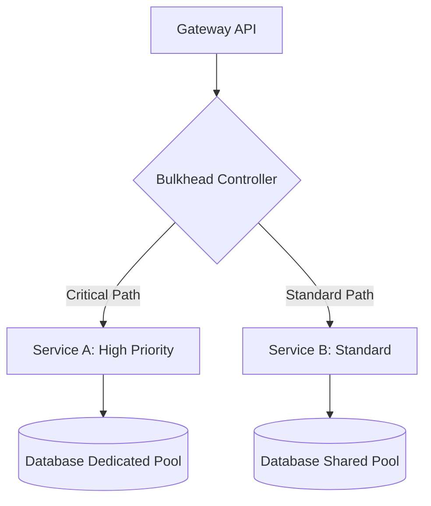

# Bulkhead Pattern: Resiliencia en Sistemas Distribuidos [Principal]

## 1. Contexto General & Definición del Concepto
El patrón Bulkhead (mamparo) toma su nombre de la construcción naval, donde el casco del barco se divide en compartimentos estancos. Si un compartimento se inunda, el resto del barco permanece a flote. En arquitectura de software, este patrón aísla elementos de un servicio para que un fallo en uno no comprometa todo el sistema, garantizando la continuidad de las operaciones críticas ante fallos parciales.

## 2. Forma de Aplicación, Buenas Prácticas & Ventajas
Se aplica para limitar el uso de recursos compartidos (hilos, conexiones de BD, memoria) por tipo de carga o cliente. Es ideal en arquitecturas de microservicios donde las llamadas externas son el eslabón más débil.

| Ventaja | Desventaja |
| :--- | :--- |
| Contención de radio de explosión (Blast Radius) | Aumento de complejidad en la gestión de infraestructura |
| Priorización de tráfico crítico (QoS) | Posible subutilización de recursos compartidos |
| Mejora en la latencia bajo carga extrema | Necesidad de observabilidad avanzada (métricas) |

## 3. Flujo Arquitectónico


## 4. Implementación en C# .NET 10
Utilizamos `Polly` con semáforos asíncronos para limitar la concurrencia por dominio.

```csharp
public class BulkheadResiliencePolicy
{
    private readonly AsyncBulkheadPolicy _policy = Policy.BulkheadAsync(10, 20);

    public async Task<T> ExecuteAsync<T>(Func<Task<T>> action)
    {
        return await _policy.ExecuteAsync(action);
    }
}
// Uso en un servicio de dominio .NET 10
public record OrderCommand(Guid Id, decimal Amount);
```

## 5. Implementación en React con Vite.js
En el frontend, el aislamiento se logra mediante `Error Boundaries` y la separación de queries (React Query) para evitar que una petición lenta bloquee la UI.

```tsx
import { useQuery } from '@tanstack/react-query';

export const CriticalDataComponent = () => {
  // Aislamiento mediante keys separadas y límites de concurrencia
  const { data, isLoading } = useQuery({
    queryKey: ['criticalData'],
    queryFn: fetchCriticalData,
    staleTime: 5000
  });

  if (isLoading) return <SkeletonLoader />;
  return <div>{data.payload}</div>;
};
```

## 6. Consideraciones de Concurrencia
El diseño principal debe considerar que el aislamiento en el servidor no sirve de nada si el cliente se satura. Es mandatorio implementar timeouts y circuit breakers en ambos extremos, garantizando que el `Backpressure` no rompa la consistencia eventual del sistema.

## 7. Enlaces y Referencias
- [[CQRS-y-Event-Sourcing]]
- [[CAP-y-Eventual-Consistency]]
