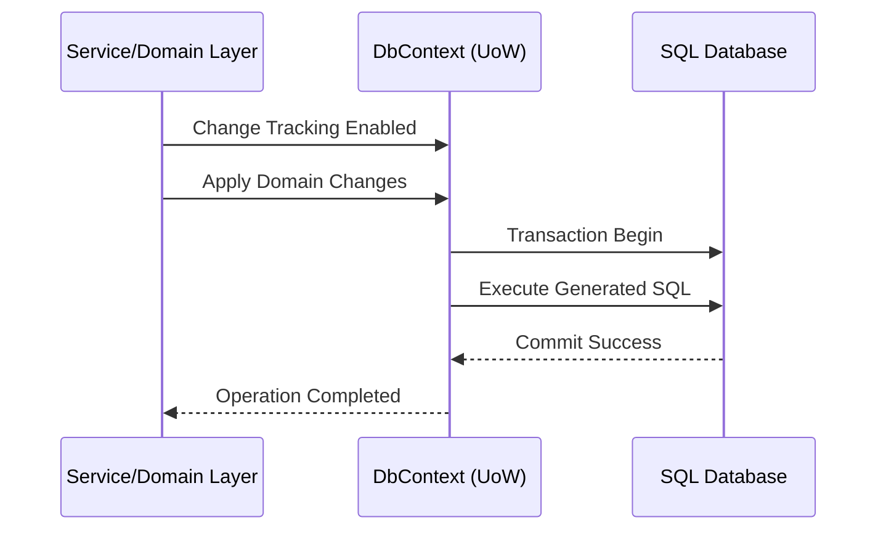

# Arquitectura Avanzada de EF Core DbContext [Principal]

## 1. Contexto General & Definición del Concepto
En sistemas de alta escala, el `DbContext` de EF Core no es solo un mapeador; es el guardián de la consistencia transaccional y el límite de la Unidad de Trabajo (UoW). A nivel Principal, debemos tratar al `DbContext` como una abstracción que encapsula el grafo de objetos y la comunicación con el almacenamiento persistente, evitando fugas de abstracción hacia las capas de aplicación.

## 2. Forma de Aplicación, Buenas Prácticas & Ventajas
- **Uso:** Implementar como una interfaz `IDbContext` o `IUnitOfWork` inyectada con `Scoped` lifetime.
- **Antipatrón:** Compartir el `DbContext` entre hilos de ejecución o usarlo directamente en controladores (anemic domain).

| Ventaja | Costo de Operación | Desventaja |
| :--- | :--- | :--- |
| Integridad Transaccional | Alto (Manejo de estados) | Sobrecarga de tracking |
| Abstracción de Persistencia | Medio (Mantenimiento) | Curva de aprendizaje |

## 3. Flujo Arquitectónico y Diagrama


## 4. Implementación y Ejemplos Prácticos en C# / .NET 10
```csharp
public sealed class AppDbContext : DbContext, IUnitOfWork
{
    public AppDbContext(DbContextOptions<AppDbContext> options) : base(options) 
    {
        ChangeTracker.QueryTrackingBehavior = QueryTrackingBehavior.NoTrackingWithIdentityResolution;
    }

    public async Task<int> SaveChangesAsync(CancellationToken ct = default)
    {
        // Hook para auditoría o outbox pattern
        return await base.SaveChangesAsync(ct);
    }
}
```

## 5. Implementación y Ejemplos Prácticos en React con Vite.js
El frontend debe consumir el estado a través de contratos definidos en DTOs, gestionando la consistencia mediante UI optimista.
```typescript
// useGenericMutation.ts
export const useSaveEntity = <T>(endpoint: string) => {
  return useMutation({
    mutationFn: async (data: T) => await apiClient.post(endpoint, data),
    onSettled: () => queryClient.invalidateQueries(['entities'])
  });
};
```

## 6. Consideraciones de Concurrencia, Consistencia y Rendimiento
Para evitar *race conditions* en entornos distribuidos, priorizar el uso de `RowVersion` (Timestamp) en SQL Server para implementaciones de *Optimistic Locking*. En escenarios de alta carga, utilizar `SplitQueries` para evitar el problema de N+1 mientras se mantiene la consistencia del grafo.

## 7. Enlaces y Referencias en Obsidian
- [[Clean-Architecture-DDD-en-DotNet10]]
- [[CQRS-y-Event-Sourcing]]
- [[repository-unit-of-work-pattern-senior]]
