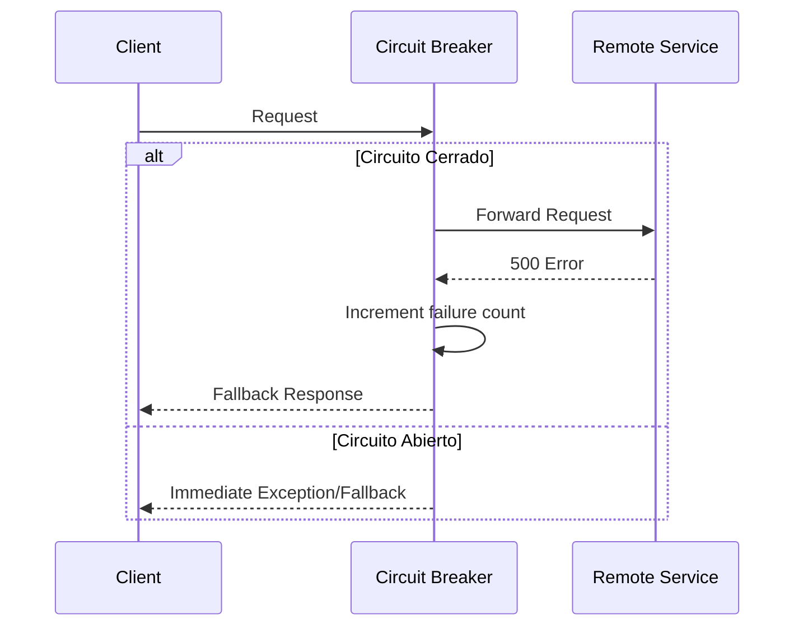

# Resiliencia Distribuida: Circuit Breaker, Retry & Fallback [Principal]

## 1. Contexto General & Definición del Concepto
En sistemas distribuidos, la falibilidad es una constante. El patrón de **Circuit Breaker** junto con **Retry** y **Fallback** conforma la tríada fundamental para la tolerancia a fallos. Estos patrones previenen el efecto de "falla en cascada" (cascading failure), donde un servicio degradado consume los recursos (hilos, memoria) de sus dependientes, colapsando el sistema completo.

## 2. Forma de Aplicación, Buenas Prácticas & Ventajas
- **Retry**: Aplicar solo en fallos transitorios (503, 429, timeouts). Nunca reintentar sobre errores de lógica de negocio (400, 403).
- **Circuit Breaker**: Estado finito (Closed, Open, Half-Open) para detener peticiones a un servicio que claramente no responde.
- **Fallback**: Proporcionar una respuesta degradada (valores cacheados, valores por defecto) para mantener la experiencia de usuario.

| Estrategia | Ventaja | Costo / Desventaja |
| :--- | :--- | :--- |
| Retry | Recupera fallos efímeros | Puede amplificar la carga (Thundering Herd) |
| Circuit Breaker | Detiene propagación de fallos | Complejidad de observabilidad y estados |
| Fallback | Mantiene disponibilidad | Riesgo de inconsistencia de datos |

## 3. Flujo Arquitectónico


## 4. Implementación en C# .NET 10
Usando `Polly` en una arquitectura moderna con delegating handlers:

```csharp
public static IServiceCollection AddResilientServices(this IServiceCollection services) {
    var pipeline = new ResiliencePipelineBuilder<HttpResponseMessage>()
        .AddRetry(new RetryStrategyOptions<HttpResponseMessage> { MaxRetryAttempts = 3 })
        .AddCircuitBreaker(new CircuitBreakerStrategyOptions<HttpResponseMessage> {
            FailureRatio = 0.5,
            SamplingDuration = TimeSpan.FromSeconds(30),
            MinimumThroughput = 10
        })
        .Build();

    services.AddHttpClient("RemoteService").AddResilienceHandler("main", (builder) => builder.AddPipeline(pipeline));
    return services;
}
```

## 5. Implementación en React con Vite.js
Estrategia de consumo resiliente usando un Custom Hook:

```typescript
export const useResilientQuery = (url: string) => {
  const [data, setData] = useState(null);
  const [error, setError] = useState(false);

  useEffect(() => {
    const fetchData = async (retries = 3) => {
      try {
        const response = await fetch(url);
        if (!response.ok) throw new Error();
        setData(await response.json());
      } catch (err) {
        if (retries > 0) fetchData(retries - 1);
        else { 
            setError(true);
            setData({ fallback: true }); // Fallback UI strategy
        }
      }
    };
    fetchData();
  }, [url]);

  return { data, error };
};
```

## 6. Consideraciones de Concurrencia
La clave es la observabilidad. El uso de `Distributed Tracing` es obligatorio para identificar qué nodo del circuito falló. En sistemas de alta escala, las estrategias de reintento deben incluir *Jitter* (aleatorización) para evitar la sincronización de carga en el backend.

## 7. Enlaces y Referencias
- [[CAP-y-Eventual-Consistency]]
- [[Clean-Architecture-DDD-en-DotNet10]]
