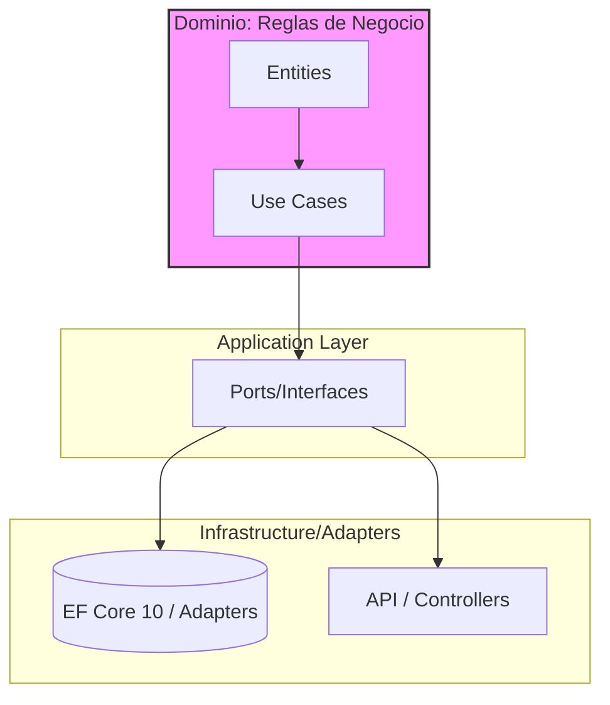

# Arquitectura Limpia a Escala en Sistemas Distribuidos [Principal]

## 1. Contexto General & Definición del Concepto
La *Clean Architecture* es una filosofía de diseño de software que prioriza la independencia de frameworks, UI, bases de datos y agentes externos. En sistemas de misión crítica, actúa como una **barrera de aislamiento** contra el *framework drift* y el acoplamiento técnico excesivo. Resuelve el problema del *big ball of mud* mediante la Regla de Dependencia: las dependencias internas solo apuntan hacia adentro, hacia las reglas de negocio (Entidades y Casos de Uso).

## 2. Forma de Aplicación, Buenas Prácticas & Ventajas
Aplicar Clean Architecture a nivel *Principal* significa gestionar la complejidad de dominios acotados (*Bounded Contexts*) y garantizar la transitabilidad entre servicios sin sacrificar la mantenibilidad. 

| Factor | Ventaja | Desventaja / Riesgo |
| :--- | :--- | :--- |
| **Testeabilidad** | Aislamiento total del dominio | Curva de aprendizaje inicial alta |
| **Flexibilidad** | Fácil reemplazo de infraestructura | Mayor número de proyectos/ensamblados |
| **Mantenibilidad** | Código agnóstico al framework | Over-engineering en servicios CRUD simples |

## 3. Flujo Arquitectónico y Diagrama


## 4. Implementación en C# .NET 10
Utilizando C# 10/11/12+ features y minimización de registros:
```csharp
// Domain/Entities/Order.cs
public record Order(Guid Id, decimal TotalAmount, OrderStatus Status);

// Application/UseCases/PlaceOrder.cs
public record PlaceOrderCommand(decimal Amount);

public class PlaceOrderHandler(IOrderRepository repository) 
    : IRequestHandler<PlaceOrderCommand, Result>
{
    public async Task<Result> Handle(PlaceOrderCommand command, CancellationToken ct)
    {
        var order = new Order(Guid.NewGuid(), command.Amount, OrderStatus.Pending);
        await repository.SaveAsync(order, ct);
        return Result.Success();
    }
}
```

## 5. Implementación en React con Vite.js
Estructura de arquitectura hexagonal para el frontend:
```typescript
// src/infrastructure/api/orderService.ts
export const createOrder = async (payload: OrderDto): Promise<void> => {
  const response = await fetch('/api/orders', {
    method: 'POST',
    body: JSON.stringify(payload)
  });
  if (!response.ok) throw new Error('Infrastructure Failure');
};

// src/application/hooks/usePlaceOrder.ts
export const usePlaceOrder = () => {
  const mutation = useMutation({ mutationFn: createOrder });
  return { submit: mutation.mutateAsync, loading: mutation.isPending };
};
```

## 6. Consideraciones de Concurrencia y Consistencia
A este nivel, la consistencia debe ser eventual fuera de los límites transaccionales. Utilizamos el [[Transactional-Outbox-Pattern]] para asegurar que los eventos de dominio se publiquen sin generar *race conditions* entre el estado de la base de datos y el bus de mensajes.

## 7. Enlaces y Referencias
- [[CQRS-y-Event-Sourcing]]
- [[Transactional-Outbox-Pattern]]
- [[Teorema-CAP-y-PACELC]]
