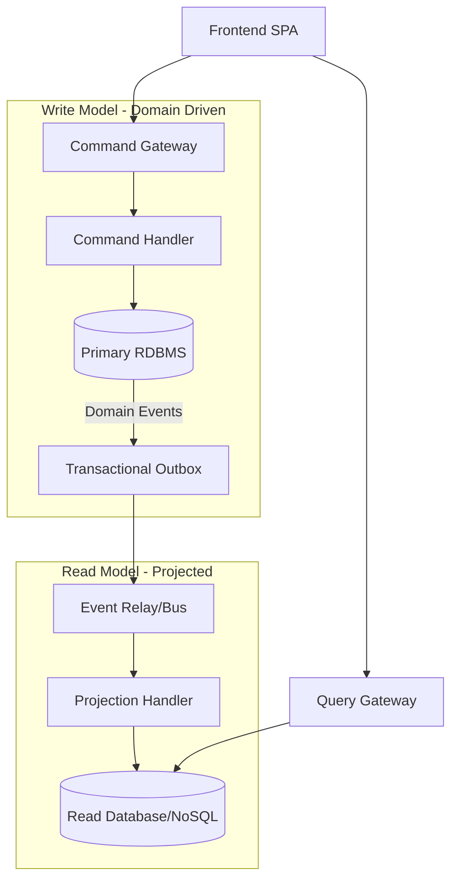

# CQRS: Arquitectura de Segregación de Responsabilidades [Principal]

## 1. Contexto General & Definición del Concepto
El patrón **Command Query Responsibility Segregation (CQRS)** no es solo separar modelos de lectura y escritura; es una decisión estratégica para desvincular los flujos de datos en sistemas distribuidos. En el nivel Principal, CQRS se utiliza para optimizar la escalabilidad independiente de las cargas de trabajo, reducir la contención de bloqueos en bases de datos relacionales y habilitar modelos de datos optimizados para queries complejas (ej. proyecciones de lectura en ElasticSearch o Read Models específicos).

## 2. Forma de Aplicación, Buenas Prácticas & Ventajas

### Matriz de Trade-offs
| Dimensión | Ventaja | Desafío / Costo |
| :--- | :--- | :--- |
| **Escalabilidad** | Escalado independiente de Read/Write | Incremento en complejidad operativa |
| **Performance** | Modelos de lectura optimizados | Latencia por eventual consistency |
| **Mantenibilidad** | Código enfocado por casos de uso | Duplicación de lógica de dominio |
| **Seguridad** | Zero-trust: separación de privilegios | Sincronización entre modelos |

## 3. Flujo Arquitectónico y Diagrama


## 4. Implementación y Ejemplos Prácticos en C# / .NET 10
Utilizando C# 10/11 records y MediatR para desacoplamiento.

```csharp
// Command (Write side)
public record CreateProductCommand(string Name, decimal Price) : IRequest<Guid>;

public class CreateProductHandler : IRequestHandler<CreateProductCommand, Guid>
{
    private readonly AppDbContext _db; // EF Core 10
    public async Task<Guid> Handle(CreateProductCommand cmd, CancellationToken ct)
    {
        var product = new Product(cmd.Name, cmd.Price);
        _db.Products.Add(product);
        await _db.SaveChangesAsync(ct);
        return product.Id;
    }
}

// Query (Read side - DTO optimized)
public record GetProductByIdQuery(Guid Id) : IRequest<ProductDto>;
public record ProductDto(string Name, string FormattedPrice);
```

## 5. Implementación y Ejemplos Prácticos en React con Vite.js
Uso de React Query para manejar el estado asíncrono y la consistencia eventual.

```tsx
// Hook para lectura eficiente
export const useProduct = (id: string) => {
  return useQuery({
    queryKey: ['product', id],
    queryFn: () => apiClient.get<ProductDto>(`/products/${id}`),
    staleTime: 5000 // Cache para optimizar throughput
  });
};

// Componente de mutación
const CreateProduct = () => {
  const mutation = useMutation({ mutationFn: (data) => apiClient.post('/products', data) });
  return <button onClick={() => mutation.mutate({ name: 'A' })}>Guardar</button>;
};
```

## 6. Consideraciones de Concurrencia, Consistencia y Rendimiento
- **Consistencia Eventual:** Implementar *UI Optimistic Updates* en el frontend para enmascarar la latencia de replicación.
- **Blast Radius:** En fallos de infraestructura, asegurar que el canal de lectura siga disponible aunque la escritura falle.
- **Idempotencia:** Vital en el bus de eventos entre modelos para evitar estados corrompidos.

## 7. Enlaces y Referencias en Obsidian
- [[CQRS-y-Event-Sourcing]]
- [[CAP-y-Eventual-Consistency]]
- [[Transactional-Outbox-Pattern]]
- [[Clean-Architecture-Principal-Level]]
