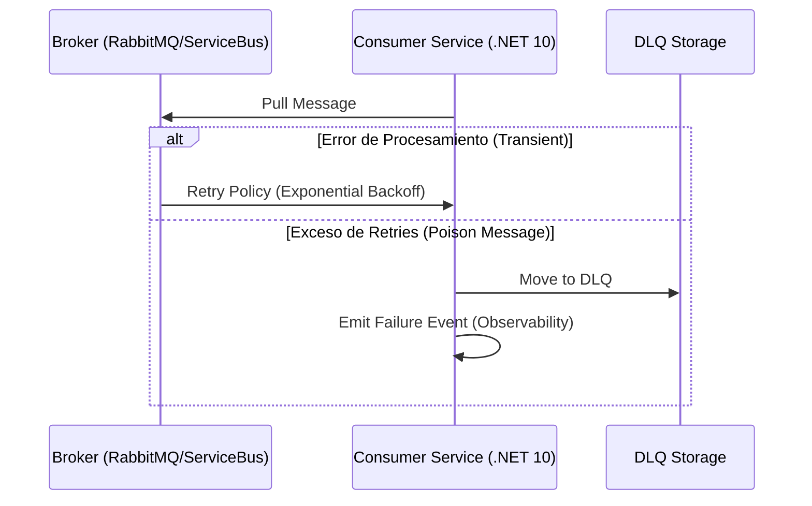

# Arquitectura de Dead Letter Queues y Manejo de Poison Messages [Principal]

## 1. Contexto General & Definición del Concepto
En sistemas distribuidos, una **Dead Letter Queue (DLQ)** es un sub-sistema de contención de fallos diseñado para capturar mensajes que no pueden ser procesados tras múltiples reintentos o debido a violaciones de esquema (Poison Messages). Como arquitecto, el objetivo no es solo "guardar" estos mensajes, sino garantizar la **observabilidad, trazabilidad y recuperación automática** sin sacrificar la integridad del sistema o causar fallos en cascada.

## 2. Forma de Aplicación, Buenas Prácticas & Ventajas

### Matriz de Trade-offs
| Ventaja | Desventaja | Costo de Operación |
| :--- | :--- | :--- |
| Aislamiento de fallos (Bulkhead) | Complejidad de re-procesamiento | Gestión de almacenamiento DLQ |
| Observabilidad mejorada | Riesgo de 'Infinite Loop' si no se controla | Alertas de monitoreo requeridas |
| Evita pérdida de eventos críticos | Latencia de diagnóstico | Implementación de 'Dead-Letter-Reprocessing' |

## 3. Flujo Arquitectónico


## 4. Implementación en .NET 10
Utilizando un pipeline de middleware para capturar excepciones y mover el mensaje al storage de DLQ.

```csharp
public record IntegrationEvent(Guid Id, string Payload, int RetryCount);

public class PoisonMessageProcessor(ILogger<PoisonMessageProcessor> logger, IDlqRepository dlq)
{
    public async Task ProcessAsync(IntegrationEvent message, CancellationToken ct)
    {
        try {
            // Lógica de dominio
        } catch (Exception ex) when (message.RetryCount >= 3) {
            logger.LogCritical("Poison message detected: {Id}", message.Id);
            await dlq.ArchiveAsync(message, ex.Message, ct);
        } catch (Exception) {
            // Logica de retry delegada a Polly v9
            throw;
        }
    }
}
```

## 5. Implementación en React + Vite.js
En el frontend, el manejo de errores ante mensajes fallidos se gestiona mediante un `Error Boundary` especializado en la capa de UI que interactúa con la API de monitoreo de eventos.

```tsx
import { useMutation } from '@tanstack/react-query';

const useEventProcessor = () => {
  return useMutation({
    mutationFn: (data: Payload) => apiClient.post('/events', data),
    onError: (err, variables) => {
      // Sincronización con el estado de DLQ en el dashboard
      reportToMonitoring({ error: err, context: variables });
    }
  });
};
```

## 6. Consideraciones de Concurrencia, Consistencia y Rendimiento
Para sistemas de alta escala, la clave es el **Idempotent Consumer Pattern**. Si un mensaje entra en la DLQ y es re-procesado, el sistema debe ser capaz de detectar si parte de la lógica (ej. actualización de base de datos) fue ejecutada parcialmente antes del fallo.

## 7. Enlaces y Referencias
- [[CQRS-y-Event-Sourcing]]
- [[Transactional-Outbox-Pattern]]
- [[Bulkhead-Pattern-Aislamiento-Recursos]]
