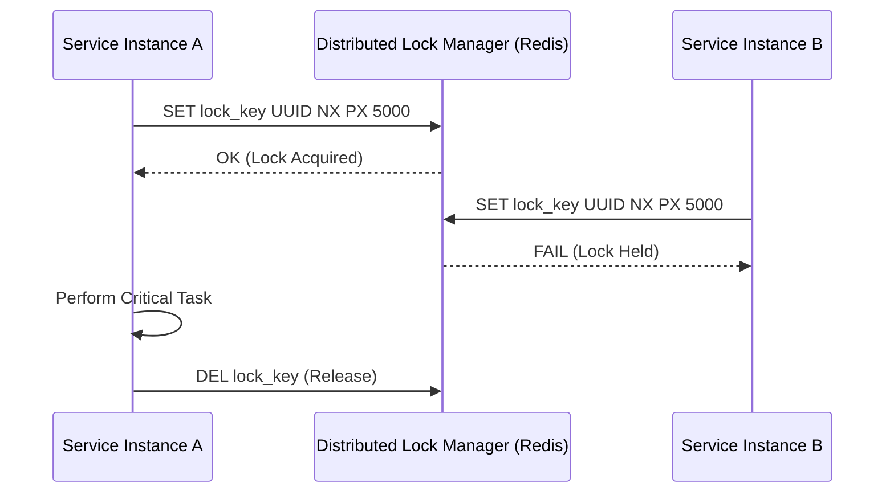

# Distributed Locks: Estrategias de Sincronización a Escala [Principal]

## 1. Contexto General & Definición del Concepto
En sistemas distribuidos, los Distributed Locks son mecanismos para garantizar exclusión mutua sobre un recurso compartido entre múltiples procesos o nodos independientes. A diferencia de los locks de memoria (mutex/semáforos), los distribuidos operan sobre un store compartido (Redis, Etcd, Zookeeper).

Su propósito fundamental es evitar condiciones de carrera (Race Conditions) y asegurar la integridad transaccional cuando la consistencia eventual no es suficiente para procesos críticos.

## 2. Forma de Aplicación, Buenas Prácticas & Ventajas
Se deben aplicar únicamente en secciones críticas donde la idempotencia no es suficiente o donde el costo de la resolución de conflictos (compensación) supera el costo de la latencia del bloqueo.

| Criterio | Ventaja | Desventaja / Costo |
| :--- | :--- | :--- |
| **Integridad** | Garantía fuerte de exclusividad. | Riesgo de Deadlocks si no hay TTL. |
| **Latencia** | Reduce reintentos innecesarios. | Introduce round-trips de red extra. |
| **Resiliencia** | Protección contra ejecuciones paralelas. | Punto único de fallo (si no es HA). |

## 3. Flujo Arquitectónico y Diagrama (Mermaid)


## 4. Implementación en C# .NET 10
Utilizando RedLock y abstracciones modernas para asegurar un manejo limpio mediante `IDisposable`.

```csharp
public interface IDistributedLockService { Task<IDisposable?> AcquireLockAsync(string resource, TimeSpan timeout); }

public class RedisDistributedLock(IDatabase db) : IDistributedLockService
{
    public async Task<IDisposable?> AcquireLockAsync(string resource, TimeSpan timeout)
    {
        var token = Guid.NewGuid().ToString();
        if (await db.LockTakeAsync(resource, token, timeout))
            return new LockHandle(db, resource, token);
        return null;
    }
}

// Uso en Domain Service
public async Task ProcessCriticalOperation(string id) {
    using var lockHandle = await _lockService.AcquireLockAsync($"lock:{id}", TimeSpan.FromSeconds(5));
    if (lockHandle is null) throw new ConflictException("Recurso bloqueado");
    // Lógica protegida...
}
```

## 5. Implementación en React con Vite.js
Para el frontend, la estrategia principal es el "Optimistic Locking" coordinado con el estado del servidor, evitando locks de red bloqueantes.

```tsx
const useOptimisticUpdate = (resourceId: string) => {
  const [isLocked, setIsLocked] = useState(false);
  
  const executeAction = async (payload: any) => {
    setIsLocked(true); // Bloqueo de UI
    try {
      await api.post(`/resources/${resourceId}/lock`, { payload });
    } catch (err) {
      handleError(err);
    } finally {
      setIsLocked(false);
    }
  };
  return { isLocked, executeAction };
};
```

## 6. Consideraciones de Concurrencia
Como Principal, recuerda: 
1. **Clock Skew**: No dependas de relojes locales; usa el tiempo del lock store.
2. **Fencing Tokens**: Incluye un número de versión creciente en el lock para prevenir que procesos tardíos invaliden escrituras recientes (STONITH en almacenamiento).
3. **Blast Radius**: Configura siempre un TTL (Time-To-Live) para prevenir que un nodo colapsado bloquee el sistema indefinidamente.

## 7. Enlaces y Referencias
- [[CAP-y-Eventual-Consistency]]
- [[Optimistic-vs-Pessimistic-Locking]]
- [[Distributed-Caching-Redis-Cache-Aside]]
