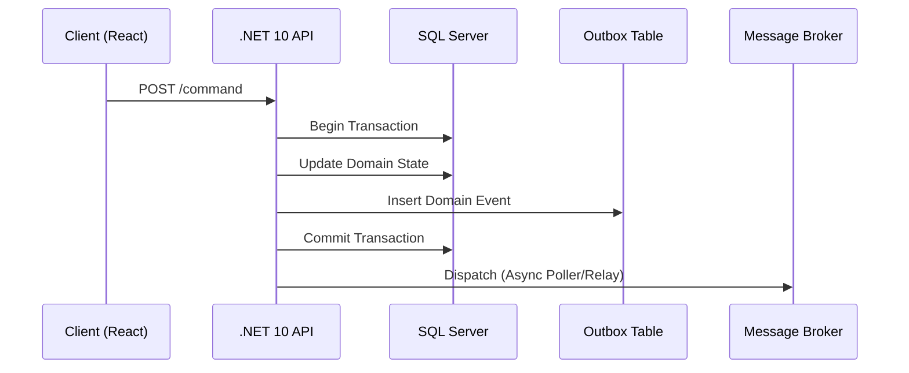

# Domain Events & Dispatching en Transacción [Principal]

## 1. Contexto General & Definición del Concepto
El despacho de eventos de dominio dentro del ámbito transaccional garantiza la consistencia atómica entre el estado del modelo y la propagación de cambios hacia el exterior. En sistemas distribuidos, resolver la dualidad entre 'escribir en DB' y 'publicar evento' es crítico para evitar inconsistencias (Dual Write Problem). Este patrón asegura que un evento solo sea publicado si y solo si la transacción local se ha confirmado (ACID).

## 2. Forma de Aplicación, Buenas Prácticas & Ventajas
Se recomienda cuando la consistencia eventual es aceptable pero la pérdida de eventos es crítica. Es un antipatrón en operaciones simples de CRUD donde el overhead de infraestructura no justifica el riesgo.

| Ventaja | Desventaja / Costo |
| :--- | :--- |
| Integridad de Datos (ACID) | Aumento de latencia en escritura |
| Desacoplamiento de Servicios | Complejidad en la infraestructura (Outbox) |
| Resiliencia ante fallos | Monitoreo y limpieza de tablas de Outbox |

## 3. Flujo Arquitectónico y Diagrama (Mermaid)


## 4. Implementación y Ejemplos Prácticos en C# / .NET 10
Utilizamos `MediatR` para la orquestación y el patrón Outbox en el `DbContext` para asegurar atoricidad.

```csharp
public record OrderCreatedEvent(Guid OrderId, decimal Amount) : INotification;

public async Task HandleCommand(CreateOrderCommand cmd, CancellationToken ct) {
    var order = new Order(cmd.Id, cmd.Amount);
    _dbContext.Orders.Add(order);
    
    // Guardar evento en la misma transacción
    var outboxEntry = new OutboxMessage {
        Type = nameof(OrderCreatedEvent),
        Content = JsonSerializer.Serialize(new OrderCreatedEvent(order.Id, order.Amount)),
        OccurredOn = DateTime.UtcNow
    };
    _dbContext.OutboxMessages.Add(outboxEntry);
    
    await _dbContext.SaveChangesAsync(ct); // Atómico
}
```

## 5. Implementación y Ejemplos Prácticos en React con Vite.js
En el frontend, gestionamos el estado optimista mientras esperamos que el backend procese el evento vía WebSockets o polling.

```tsx
export const useCreateOrder = () => {
  const [isPending, setIsPending] = useState(false);
  const execute = async (payload: OrderDto) => {
    setIsPending(true);
    try {
      const response = await apiClient.post('/orders', payload);
      // Implementar actualización optimista o invalidate queries (React Query)
      queryClient.invalidateQueries({ queryKey: ['orders'] });
    } catch (err) {
      handleError(err);
    } finally {
      setIsPending(false);
    }
  };
  return { execute, isPending };
};
```

## 6. Consideraciones de Concurrencia, Consistencia y Rendimiento
Para sistemas de alta escala, la tabla de `Outbox` debe ser particionada. La consistencia es eventual desde la perspectiva del bus de eventos, pero fuerte a nivel de base de datos. Se debe implementar `Idempotency-Key` en el consumidor para evitar el procesamiento duplicado del evento (At-Least-Once Delivery).

## 7. Enlaces y Referencias en Obsidian
- [[CQRS-y-Event-Sourcing]]
- [[Transactional-Outbox-Pattern]]
- [[CAP-y-Eventual-Consistency]]
