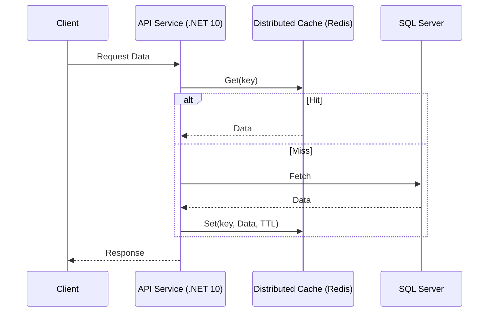

# Estrategias Avanzadas de Caché Distribuido [Principal]

## 1. Contexto General & Definición del Concepto
El caché distribuido es un componente crítico en sistemas de alta escala para mitigar la latencia de I/O y reducir la carga en bases de datos relacionales (RDBMS). A nivel Principal, no se trata solo de almacenar datos, sino de gestionar el ciclo de vida del dato (TTL, invalidación, coherencia) bajo el modelo PACELC.

## 2. Forma de Aplicación, Buenas Prácticas & Ventajas
Aplicar caché distribuido cuando la lectura supera a la escritura en una relación > 10:1. Evitar caché en datos con alta frecuencia de escritura o donde la consistencia estricta es mandatoria sin mecanismos de distribución de estado.

| Estrategia | Ventajas | Desventajas | Costo Op. |
| :--- | :--- | :--- | :--- |
| Cache-Aside | Control total, resiliente | Latencia inicial, 'thundering herd' | Bajo |
| Write-Through | Consistencia fuerte | Aumenta latencia de escritura | Medio |
| Read-Through | Transparencia al cliente | Acoplamiento a proveedor | Bajo |

## 3. Flujo Arquitectónico y Diagrama


## 4. Implementación y Ejemplos Prácticos en C# / .NET 10
Utilizando `IDistributedCache` con decoradores para aplicar el patrón Proxy y evitar ensuciar el Domain Layer.
```csharp
public record Product(int Id, string Name, decimal Price);

public class CachedProductService(IDistributedCache cache, IProductRepository repo) : IProductService {
    public async Task<Product?> GetProductAsync(int id, CancellationToken ct) {
        string key = $"prod:{id}";
        var cached = await cache.GetStringAsync(key, ct);
        if (cached is not null) return JsonSerializer.Deserialize<Product>(cached);

        var product = await repo.GetByIdAsync(id, ct);
        if (product is not null) {
            await cache.SetStringAsync(key, JsonSerializer.Serialize(product), 
                new DistributedCacheEntryOptions { AbsoluteExpirationRelativeToNow = TimeSpan.FromMinutes(10) }, ct);
        }
        return product;
    }
}
```

## 5. Implementación y Ejemplos Prácticos en React con Vite.js
Uso de `TanStack Query` para orquestar la caché en el cliente, minimizando llamadas al backend.
```typescript
import { useQuery } from '@tanstack/react-query';

const fetchProduct = async (id: number) => {
  const res = await fetch(`/api/products/${id}`);
  return res.json();
};

export const ProductDetail = ({ id }: { id: number }) => {
  const { data, isLoading } = useQuery({
    queryKey: ['product', id],
    queryFn: () => fetchProduct(id),
    staleTime: 60000 // Mantener caché 1 minuto
  });

  if (isLoading) return <div>Loading...</div>;
  return <h1>{data.name}</h1>;
};
```

## 6. Consideraciones de Concurrencia, Consistencia y Rendimiento
Es vital implementar 'Cache Stampede Protection' (usando `SemaphoreSlim` o `Distributed Lock` como RedLock) para evitar que múltiples instancias del backend golpeen la BD simultáneamente ante un miss masivo.

## 7. Enlaces y Referencias en Obsidian
- [[CAP-y-Eventual-Consistency]]
- [[Distributed-Caching-Redis-Cache-Aside]]
