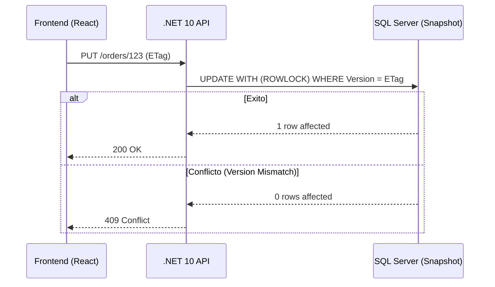

# Estrategias de Concurrencia en SQL Server [Principal]

## 1. Contexto General & Definición del Concepto
En sistemas de alta carga, la gestión de la concurrencia en SQL Server no es solo una configuración de aislamiento, sino una decisión estratégica de arquitectura que afecta directamente el throughput y la latencia. En un entorno distribuido, debemos balancear entre consistencia fuerte (ACID) y disponibilidad. El uso de niveles de aislamiento como `SNAPSHOT` o `READ_COMMITTED_SNAPSHOT` (RCSI) es fundamental para evitar el bloqueo de escritores por parte de lectores, minimizando el impacto en el *blast radius* de las transacciones bloqueantes.

## 2. Forma de Aplicación, Buenas Prácticas & Ventajas
- **RCSI**: Recomendado como estándar para sistemas OLTP modernos.
- **Optimistic Locking**: Priorizar en microservicios mediante columnas `RowVersion` o `ETag`.
- **Pessimistic Locking**: Reservar para estados financieros críticos donde la contención es baja pero el costo de reintento es prohibitivo.

| Estrategia | Ventajas | Desventajas | Escenario Ideal |
| :--- | :--- | :--- | :--- |
| Snapshot Isolation | Alta concurrencia, no bloquea lectores | Costo de TempDB, conflicto de actualizaciones | Sistemas de alta lectura |
| Optimistic | Escalabilidad horizontal | Requiere lógica de reintento | API REST / Microservicios |
| Pessimistic | Consistencia absoluta | Deadlocks, reducción de throughput | Ledger contable | 

## 3. Flujo Arquitectónico y Diagrama (Mermaid)


## 4. Implementación en C# .NET 10
Utilizando EF Core 10 con manejo de concurrencia optimista mediante `RowVersion`.

```csharp
public record OrderAggregate(Guid Id, decimal Amount, byte[] Version);

public async Task UpdateOrderAsync(OrderAggregate order, CancellationToken ct) {
    var entity = await _context.Orders.FindAsync(order.Id, ct);
    // EF Core detecta la RowVersion automáticamente mediante el atributo [Timestamp]
    _context.Entry(entity).Property("Version").OriginalValue = order.Version;
    
    try {
        await _context.SaveChangesAsync(ct);
    } catch (DbUpdateConcurrencyException ex) {
        throw new ConcurrencyException("El registro fue modificado por otro proceso.", ex);
    }
}
```

## 5. Implementación en React con Vite.js
Uso de `SWR` o `TanStack Query` para manejar el estado optimista.

```typescript
const updateOrder = async (orderId: string, data: any, etag: string) => {
  const res = await fetch(`/api/orders/${orderId}`, {
    method: 'PUT',
    headers: { 'If-Match': etag, 'Content-Type': 'application/json' },
    body: JSON.stringify(data)
  });
  if (res.status === 409) throw new Error('Conflict');
  return res.json();
};
```

## 6. Consideraciones de Concurrencia, Consistencia y Rendimiento
La sincronización cliente-servidor requiere un protocolo robusto. Implementar `ETag` permite que el cliente valide si la versión que posee sigue siendo vigente. Ante un `409 Conflict`, el frontend debe implementar una política de *Exponential Backoff* para reintentar la operación, asegurando que la experiencia de usuario sea fluida sin sacrificar la integridad de los datos.

## 7. Enlaces y Referencias
- [[Optimistic-vs-Pessimistic-Locking]]
- [[CAP-y-Eventual-Consistency]]
