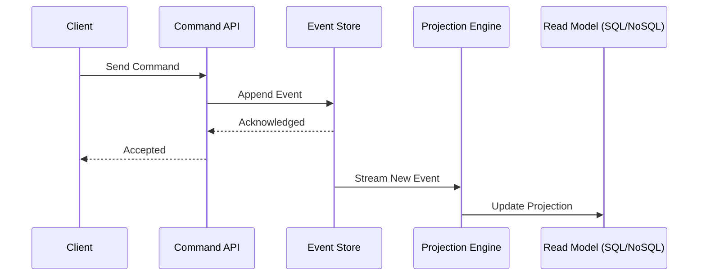

# Event Sourcing & CQRS Sync: Arquitectura de Alta Escala [Principal]

## 1. Contexto General & Definición del Concepto
El patrón Event Sourcing (ES) junto a Command Query Responsibility Segregation (CQRS) representa el paradigma de "verdad única" basada en hechos inmutables. A diferencia de los sistemas CRUD tradicionales, donde solo el estado final persiste, ES almacena cada cambio de estado como una secuencia de eventos. CQRS desacopla las operaciones de escritura (comandos) de las de lectura (queries), permitiendo escalar cada parte de manera independiente y optimizada.

## 2. Forma de Aplicación, Buenas Prácticas & Ventajas
- **Aplicación:** Ideal en dominios complejos con auditoría estricta y alta carga transaccional.
- **Trade-offs:**
| Ventaja | Desventaja |
| :--- | :--- |
| Auditoría histórica completa | Alta complejidad operativa |
| Escalabilidad por lectura | Consistencia eventual (Eventual Consistency) |
| Flexibilidad en proyecciones | Curva de aprendizaje empinada |

## 3. Flujo Arquitectónico


## 4. Implementación en C# .NET 10
```csharp
// Representación de un Evento inmutable con C# 10 records
public record OrderCreated(Guid OrderId, decimal Amount, DateTime CreatedAt);

public class OrderAggregate {
    public Guid Id { get; private set; }
    public void Apply(OrderCreated e) => Id = e.OrderId;

    public async Task HandleCommand(CreateOrderCommand cmd, IEventStore store) {
        var @event = new OrderCreated(Guid.NewGuid(), cmd.Amount, DateTime.UtcNow);
        await store.AppendAsync(Id, @event);
    }
}
```

## 5. Implementación en React + Vite.js
```tsx
// Custom hook para sincronización optimista
export const useCommandMutation = (endpoint: string) => {
  const [isSyncing, setIsSyncing] = useState(false);
  const execute = async (payload: any) => {
    setIsSyncing(true);
    try {
      await fetch(endpoint, { method: 'POST', body: JSON.stringify(payload) });
    } finally {
      setIsSyncing(false);
    }
  };
  return { execute, isSyncing };
};
```

## 6. Consideraciones de Concurrencia y Consistencia
La sincronización entre el estado del cliente y la base de lectura debe manejar la latencia mediante *Optimistic UI Updates* en React, mientras el backend asegura la idempotencia mediante identificadores de correlación en el `Event Store`. El uso de *Versionamento de Eventos* evita colisiones en la escritura concurrente.

## 7. Enlaces y Referencias
- [[CQRS-y-Event-Sourcing]]
- [[CAP-y-Eventual-Consistency]]
- [[Transactional-Outbox-Pattern]]
