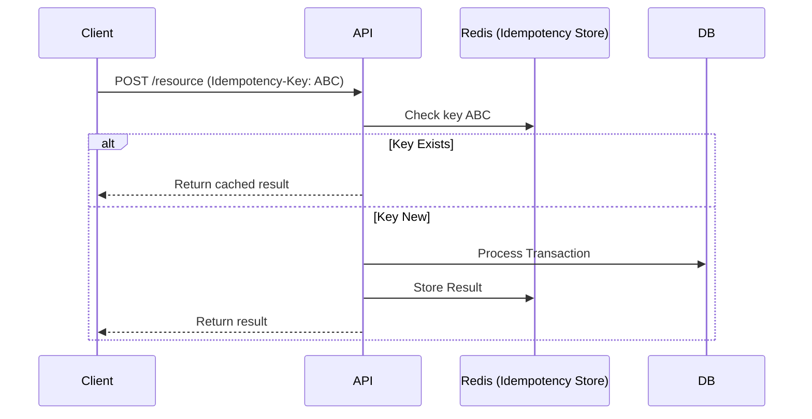

# Idempotencia en APIs y Consumidores de Eventos [Principal]

## 1. Contexto General & Definición del Concepto
La idempotencia es la propiedad de una operación que puede aplicarse múltiples veces sin cambiar el resultado más allá del estado inicial. En sistemas distribuidos, es la base de la **tolerancia a fallos ante reintentos de red**. Dado que no podemos garantizar la entrega "exactamente una vez" (exactly-once) a bajo costo, debemos garantizar el procesamiento idempotente para alcanzar la consistencia final.

## 2. Forma de Aplicación, Buenas Prácticas & Ventajas
### Matriz de Trade-offs
| Estrategia | Ventajas | Desventajas | Costo Op. |
| :--- | :--- | :--- | :--- |
| Idempotency Keys | Simple, estándar, universal | Requiere almacenamiento de estado | Medio |
| Estado de Entidad (Versionado) | Robusto, previene condiciones de carrera | Complejo de implementar | Alto |
| Operaciones Nativas (UPSERT) | Rendimiento óptimo | Dependiente del motor de persistencia | Bajo |

## 3. Flujo Arquitectónico


## 4. Implementación y Ejemplos Prácticos en C# / .NET 10
Utilizamos un `ActionFilter` y `DistributedCache` para capturar la idempotencia a nivel de controlador.

```csharp
public record IdempotentRequest(Guid RequestId, string Payload);

public class IdempotencyFilter : IAsyncActionFilter {
    private readonly IDistributedCache _cache;
    public async Task OnActionExecutionAsync(ActionExecutingContext context, ActionExecutionDelegate next) {
        if (context.HttpContext.Request.Headers.TryGetValue("X-Idempotency-Key", out var key)) {
            var cached = await _cache.GetStringAsync(key);
            if (cached != null) { context.Result = new OkObjectResult(cached); return; }
            
            var result = await next();
            await _cache.SetStringAsync(key, JsonConvert.SerializeObject(result.Result), new DistributedCacheEntryOptions { AbsoluteExpirationRelativeToNow = TimeSpan.FromHours(24) });
        }
    }
}
```

## 5. Implementación y Ejemplos Prácticos en React con Vite.js
Uso de un `custom hook` para inyectar headers y manejar estados de carga.

```typescript
import { useMutation } from '@tanstack/react-query';
import { v4 as uuidv4 } from 'uuid';

export const useIdempotentMutation = (url: string) => {
  const idempotencyKey = uuidv4();
  return useMutation({
    mutationFn: (data: any) => 
      fetch(url, {
        method: 'POST',
        headers: { 'X-Idempotency-Key': idempotencyKey, 'Content-Type': 'application/json' },
        body: JSON.stringify(data)
      }).then(res => res.json())
  });
};
```

## 6. Consideraciones de Concurrencia, Consistencia y Rendimiento
Para sistemas de alta escala, el uso de Redis debe configurarse con `SET NX` (Set if Not Exists) para evitar condiciones de carrera donde dos hilos intenten procesar la misma clave simultáneamente. Se recomienda el uso de **Optimistic Locking** en la base de datos (versiones de fila) como segunda capa de defensa.

## 7. Enlaces y Referencias en Obsidian
- [[CQRS-y-Event-Sourcing]]
- [[Transactional-Outbox-Pattern]]
- [[CAP-y-Eventual-Consistency]]
