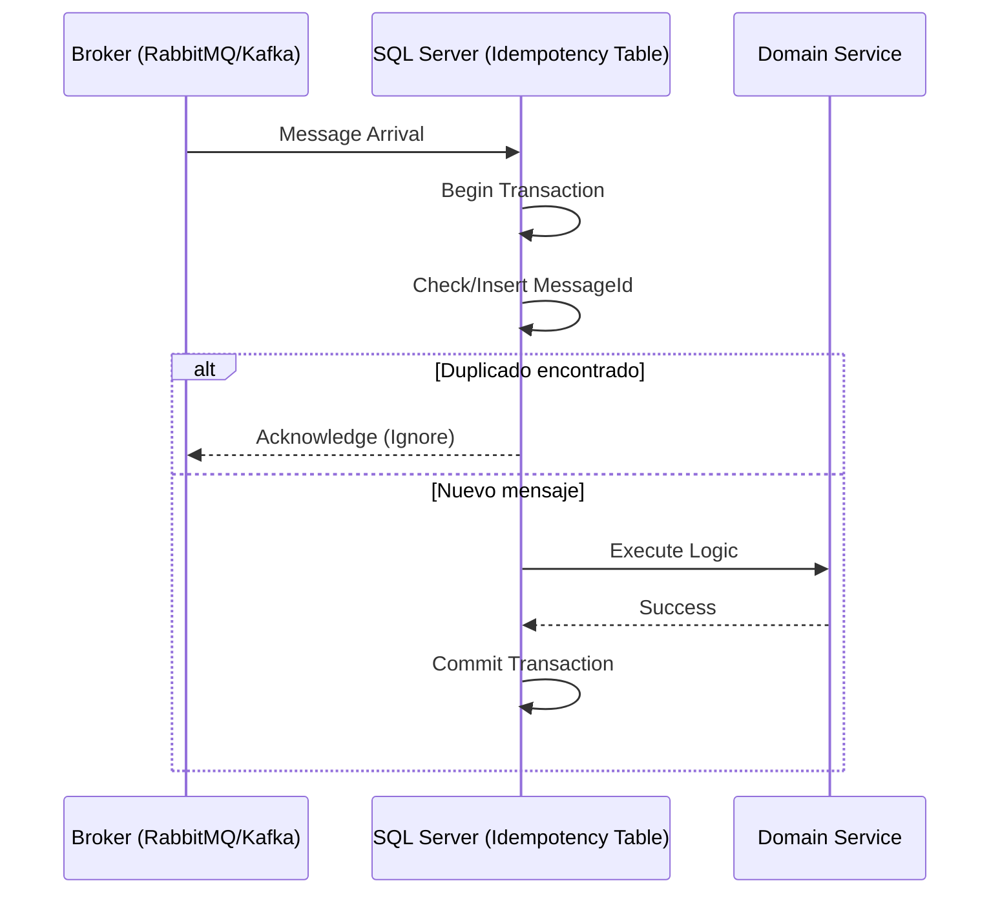

# Idempotent Consumer con SQL Server Deduplication Table [Principal]

## 1. Contexto General & Definición del Concepto
El patrón Idempotent Consumer es una estrategia esencial en sistemas distribuidos para garantizar que el procesamiento de un mensaje repetido no produzca efectos secundarios no deseados. En sistemas de alta escala, la entrega "at-least-once" (al menos una vez) es la norma; por ende, el consumidor debe ser capaz de ignorar duplicados. La implementación con una tabla de deduplicación en SQL Server asegura atomicidad entre la lógica de negocio y la marca de procesamiento del mensaje.

## 2. Forma de Aplicación, Buenas Prácticas & Ventajas
- **Cuándo aplicar**: En sistemas orientados a eventos donde la pérdida de mensajes es inaceptable pero la duplicidad es un subproducto inevitable de la red.
- **Antipatrón**: Evitar cuando se puede lograr idempotencia natural (ej: operaciones PUT) o cuando el throughput es tan masivo que la base de datos se convierte en un cuello de botella.

### Matriz de Trade-offs
| Característica | Ventaja | Desventaja |
| :--- | :--- | :--- |
| **Consistencia** | Fuerte mediante transacciones ACID | Penalización por latencia de I/O |
| **Resiliencia** | Protección total contra reintentos | Mantenimiento de tabla de historial |
| **Complejidad** | Baja al usar EF Core 10 | Requiere limpieza (TTL/Particionamiento) |

## 3. Flujo Arquitectónico


## 4. Implementación y Ejemplos Prácticos en C# .NET 10
```csharp
public record ProcessedMessage(Guid MessageId, DateTime ProcessedAt);

public async Task HandleAsync(Guid messageId, Func<Task> businessLogic, CancellationToken ct)
{
    await using var transaction = await _dbContext.Database.BeginTransactionAsync(ct);
    
    // Implementación usando EF Core 10 y atomicidad
    var exists = await _dbContext.ProcessedMessages.AnyAsync(m => m.MessageId == messageId, ct);
    if (exists) return;

    await businessLogic();
    
    _dbContext.ProcessedMessages.Add(new ProcessedMessage(messageId, DateTime.UtcNow));
    await _dbContext.SaveChangesAsync(ct);
    await transaction.CommitAsync(ct);
}
```

## 5. Implementación y Ejemplos Prácticos en React con Vite.js
```typescript
// Frontend: Manejo de idempotencia para peticiones críticas
const useIdempotentMutation = () => {
  const [idempotencyKey] = useState(() => crypto.randomUUID());

  const execute = async (payload: any) => {
    return await api.post('/api/orders', payload, {
      headers: { 'X-Idempotency-Key': idempotencyKey }
    });
  };
  return { execute };
};
```

## 6. Consideraciones de Concurrencia, Consistencia y Rendimiento
Para sistemas de alto rendimiento, la tabla de deduplicación debe ser particionada por rangos de fecha para evitar bloqueos excesivos. La estrategia de `Optimistic Locking` es preferible para evitar deadlocks en la tabla de control durante picos de carga.

## 7. Enlaces y Referencias en Obsidian
- [[CQRS-y-Event-Sourcing]]
- [[Transactional-Outbox-Pattern]]
- [[persistencia-ef-core-arquitectura-avanzada]]
