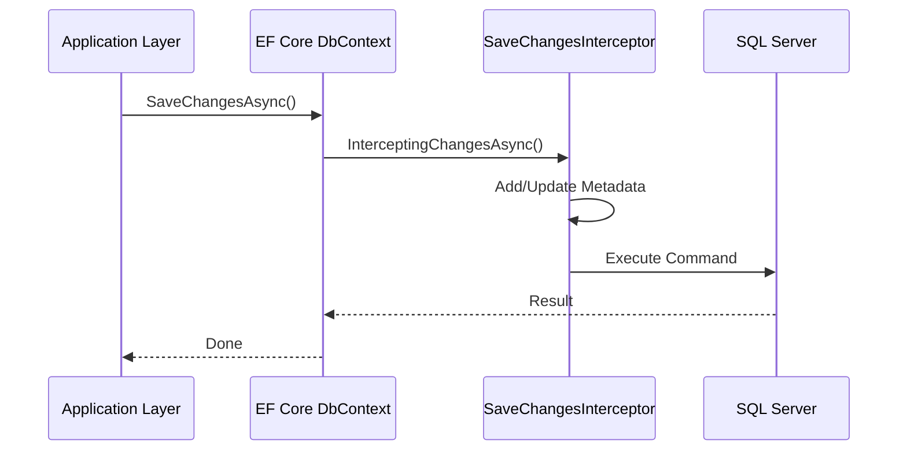

# Interceptor Pattern en EF Core: Diseño Estratégico [Principal]

## 1. Contexto General & Definición del Concepto
El patrón **Interceptor** en EF Core permite inyectar lógica transversal (cross-cutting concerns) directamente en el pipeline de ejecución de comandos SQL o en la materialización de entidades. En sistemas distribuidos, es una pieza fundamental para implementar la observabilidad, la auditoría imborrable y la seguridad basada en políticas sin contaminar el Dominio.

Resuelve el acoplamiento excesivo entre la persistencia y la lógica de negocio, centralizando comportamientos como el *Soft Deleting*, *Multi-tenancy* o la inyección de metadatos de auditoría (IAuditable).

## 2. Forma de Aplicación, Buenas Prácticas & Ventajas
Se recomienda su uso para:
- **Seguridad:** Filtrado dinámico de datos (Row-Level Security) en entornos multi-inquilino.
- **Transacciones:** Sincronización con el [[Transactional-Outbox-Pattern]].
- **Observabilidad:** Inyección de Correlation IDs para trazabilidad distribuida.

| Ventaja | Desventaja / Riesgo |
| :--- | :--- |
| Desacoplamiento total del dominio | Ocultamiento de lógica (efectos colaterales) |
| Centralización de auditoría | Riesgo de degradación si el interceptor es bloqueante |
| Consistencia garantizada | Dificultad en el debugging profundo |

## 3. Flujo Arquitectónico y Diagrama


## 4. Implementación en C# / .NET 10
```csharp
public sealed class AuditableInterceptor : SaveChangesInterceptor
{
    public override ValueTask<InterceptionResult<int>> SavingChangesAsync(
        DbContextEventData eventData, InterceptionResult<int> result, CancellationToken ct = default)
    {
        var context = eventData.Context;
        var entries = context?.ChangeTracker.Entries<IAuditable>();
        
        foreach (var entry in entries ?? Enumerable.Empty<EntityEntry<IAuditable>>())
        {
            if (entry.State == EntityState.Added)
                entry.Entity.CreatedAt = DateTime.UtcNow;
            entry.Entity.UpdatedAt = DateTime.UtcNow;
        }
        return base.SavingChangesAsync(eventData, result, ct);
    }
}
```

## 5. Implementación en React con Vite.js
En el frontend, el patrón equivalente se implementa mediante **Axios Interceptors** o **Fetch Wrappers** para asegurar que cada petición lleve los headers de trazabilidad que el backend requiere.
```typescript
// src/api/client.ts
import axios from 'axios';

const apiClient = axios.create({ baseURL: import.meta.env.VITE_API_URL });

apiClient.interceptors.request.use((config) => {
  const correlationId = crypto.randomUUID();
  config.headers['X-Correlation-ID'] = correlationId;
  return config;
}, (error) => Promise.reject(error));

export default apiClient;
```

## 6. Consideraciones de Concurrencia y Rendimiento
En sistemas de alta carga, los interceptores no deben realizar operaciones de I/O bloqueantes. Si requiere acceso a servicios externos (ej. validar un permiso en Redis), use una caché local o realice la validación fuera del flujo crítico de escritura para evitar latencias transaccionales que disparen los tiempos de espera del pool de conexiones de SQL.

## 7. Enlaces y Referencias
- [[Transactional-Outbox-Pattern]]
- [[Clean-Architecture-DDD-en-DotNet10]]\]]
