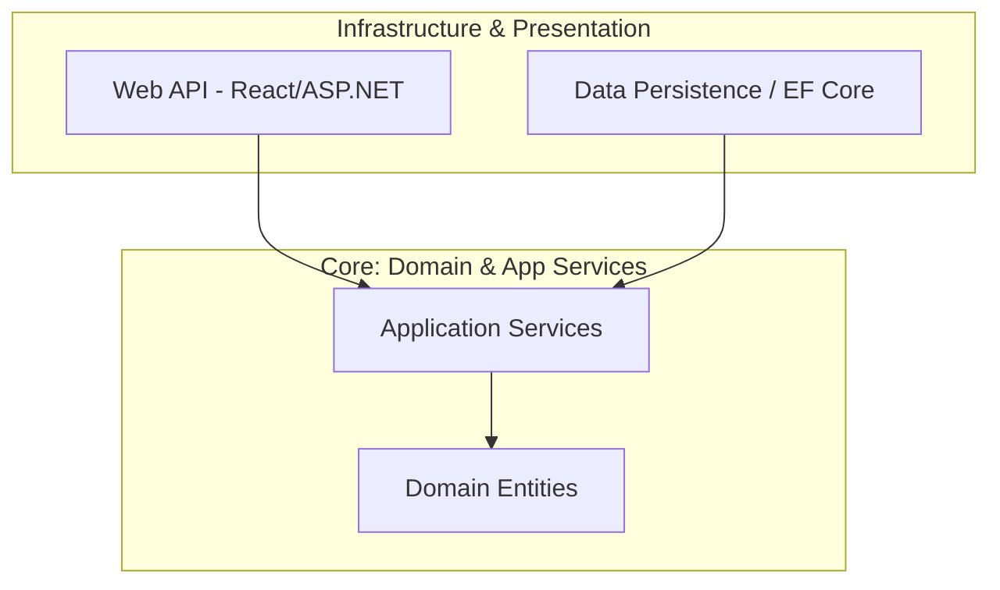

# Onion Architecture: Estrategias de Implementación para Sistemas de Alta Complejidad [Principal]

## 1. Contexto General & Definición del Concepto
La Onion Architecture, propuesta por Jeffrey Palermo, es una evolución estratégica de los sistemas multicapa tradicionales. Su principio core es el **Dependency Rule**: las dependencias siempre apuntan hacia el interior (Domain Layer). A diferencia de las arquitecturas tradicionales donde la base de datos es el centro, aquí el dominio es el núcleo absoluto, siendo agnóstico a cualquier framework de infraestructura o persistencia.

## 2. Forma de Aplicación, Buenas Prácticas & Ventajas
### Cuándo aplicar:
- Sistemas complejos con lógica de negocio persistente (LOB).
- Proyectos con largo ciclo de vida donde la deuda técnica debe minimizarse.
- Equipos que requieren testeabilidad total mediante mocks sin levantar infraestructura real.

### Matriz de Trade-offs
| Dimensión | Ventajas | Desventajas / Riesgos |
| :--- | :--- | :--- |
| **Acoplamiento** | Desacoplamiento total de infraestructura | Overhead de creación de Interfaces (Abstraction Leak) |
| **Mantenibilidad** | Alta, al aislar el core | Curva de aprendizaje empinada para juniors |
| **Testeabilidad** | Unidades de prueba puras | Complejidad en el mapeo de objetos entre capas |

## 3. Flujo Arquitectónico y Diagrama


## 4. Implementación en C# .NET 10
En .NET 10, utilizamos `primary constructors` y `records` para mantener la inmutabilidad y la pureza del modelo.

```csharp
// Domain Layer: Pure logic, no dependencies
public record Order(Guid Id, decimal Total) {
    public bool IsValid() => Total > 0;
}

// Application Layer: Defining the interface to hide infra details
public interface IOrderRepository {
    Task SaveAsync(Order order);
}

// Infrastructure Layer: Implementation details
public class SqlOrderRepository(AppDbContext context) : IOrderRepository {
    public async Task SaveAsync(Order order) {
        await context.Orders.AddAsync(order);
        await context.SaveChangesAsync();
    }
}
```

## 5. Implementación en React con Vite.js
La arquitectura en el frontend debe reflejar esta separación mediante el uso de servicios desacoplados.

```typescript
// Services Layer (Infrastructure simulation)
export const createOrder = async (orderData: OrderRequest): Promise<Order> => {
  const response = await api.post('/orders', orderData);
  return response.data;
};

// Hooks Layer (Application Logic)
export const useCreateOrder = () => {
  const mutation = useMutation({ mutationFn: createOrder });
  return { execute: mutation.mutateAsync, loading: mutation.isLoading };
};
```

## 6. Consideraciones de Concurrencia y Consistencia
La principal preocupación es evitar que la latencia en el acceso a datos rompa la integridad del dominio. Se recomienda implementar [[CQRS-y-Event-Sourcing]] para separar lecturas de escrituras y [[Transactional-Outbox-Pattern]] para garantizar la consistencia en sistemas distribuidos.

## 7. Enlaces y Referencias
- [[Clean-Architecture-DDD-en-DotNet10]]
- [[CQRS-y-Event-Sourcing]]
- [[transactional-outbox-pattern]]
