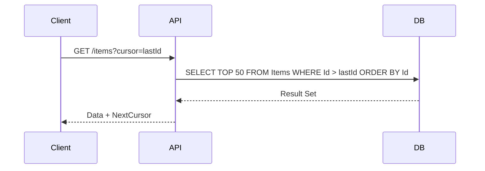

# Arquitectura de Paginación Eficiente [Principal]

## 1. Contexto General & Definición del Concepto
La paginación no es un simple filtro de UI; en sistemas a escala, es una estrategia de control de flujo y gestión de memoria. A nivel *Principal*, distinguimos entre **Offset-based Pagination** (vulnerable a inconsistencias y degradación de rendimiento con `OFFSET` alto en SQL) y **Keyset Pagination** (Cursor-based), la cual ofrece estabilidad O(1) independientemente del tamaño del dataset.

## 2. Forma de Aplicación, Buenas Prácticas & Ventajas
- **Keyset Pagination:** Obligatorio para datasets masivos. Utiliza un puntero (ej. `Timestamp` + `Id`) para saltar directamente al índice.
- **Antipatrón:** Uso de `OFFSET/LIMIT` en tablas de +10M de filas sin índices compuestos adecuados.

| Estrategia | Ventaja | Desventaja |
| :--- | :--- | :--- |
| Offset/Limit | Fácil implementación | Rendimiento O(N) al escalar |
| Keyset (Cursor) | Rendimiento O(1) / Consistente | Difícil para saltar a página N |
| Relay Connection | Estándar GraphQL / Robusto | Complejidad de implementación |

## 3. Flujo Arquitectónico


## 4. Implementación en C# .NET 10
Utilizamos records para inmutabilidad y `IQueryable` para composición dinámica.

```csharp
public record PagedResult<T>(IEnumerable<T> Items, string? NextCursor);

public async Task<PagedResult<Product>> GetProductsAsync(string? cursor, int pageSize = 50)
{
    var query = _context.Products.AsNoTracking().OrderBy(p => p.Id);
    
    if (!string.IsNullOrEmpty(cursor))
        query = query.Where(p => p.Id > cursor);

    var items = await query.Take(pageSize).ToListAsync();
    var nextCursor = items.Count == pageSize ? items.Last().Id.ToString() : null;
    
    return new PagedResult<Product>(items, nextCursor);
}
```

## 5. Implementación en React con Vite.js
Uso de un hook especializado para manejar el estado de paginación mediante `useInfiniteQuery` (patrón sugerido).

```typescript
import { useInfiniteQuery } from '@tanstack/react-query';

export const useProducts = (pageSize = 50) => {
  return useInfiniteQuery({
    queryKey: ['products'],
    queryFn: ({ pageParam = '' }) => fetch(`/api/products?cursor=${pageParam}`).then(res => res.json()),
    getNextPageParam: (lastPage) => lastPage.nextCursor,
    initialPageParam: ''
  });
};
```

## 6. Consideraciones de Concurrencia y Rendimiento
Para sistemas de alta escritura, la paginación basada en cursor es resiliente a la inserción de nuevos registros durante la lectura, a diferencia del *Offset* que provoca duplicados o saltos al cambiar el orden del dataset. Se recomienda implementar `ETag` para el almacenamiento en caché distribuido.

## 7. Enlaces y Referencias en Obsidian
[[CQRS-y-Event-Sourcing]]
[[Distributed-Caching-Redis-Cache-Aside]]
