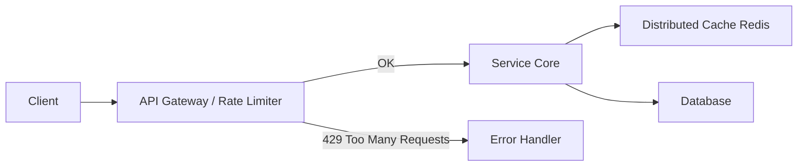

# Rate Limiting & Throttling [Principal]

## 1. Contexto General & Definición del Concepto
El Rate Limiting y el Throttling son mecanismos críticos de control de flujo diseñados para proteger la integridad y disponibilidad de los sistemas distribuidos. Mientras que el *Rate Limiting* impone una cuota estricta (p.ej., 1000 req/min), el *Throttling* gestiona la degradación del servicio bajo carga pesada. En sistemas de nivel Principal, estas técnicas son la primera línea de defensa contra el 'Efecto Vecino Ruidoso' (Noisy Neighbor) y los ataques de denegación de servicio (DoS).

## 2. Forma de Aplicación, Buenas Prácticas & Ventajas
- **Uso:** Implementar en el Gateway de entrada, servicios core de alto tráfico y dependencias externas de terceros.
- **Antipatrón:** Implementar lógica de negocio de limitación dentro del dominio de negocio puro (debe estar en la capa de infraestructura).

| Criterio | Ventaja | Desventaja / Costo |
| :--- | :--- | :--- |
| **Estabilidad** | Prevención de cascada | Latencia añadida por inspección |
| **Costos** | Optimización de recursos | Complejidad en la configuración |
| **Seguridad** | Mitigación DoS | Riesgo de falsos positivos |

## 3. Flujo Arquitectónico


## 4. Implementación en .NET 10
Utilizando `System.Threading.RateLimiting` en un pipeline de middleware.

```csharp
public static class RateLimitingExtensions
{
    public static IServiceCollection AddCustomRateLimiting(this IServiceCollection services) =>
        services.AddRateLimiter(options => {
            options.AddFixedWindowLimiter("api-policy", opt => {
                opt.Window = TimeSpan.FromSeconds(10);
                opt.PermitLimit = 100;
                opt.QueueLimit = 0;
            });
        });
}

// En Program.cs
app.UseRateLimiter();
app.MapControllers().RequireRateLimiting("api-policy");
```

## 5. Implementación en React con Vite.js
Uso de un custom hook para gestionar la retroalimentación visual ante el error 429.

```typescript
const useApiThrottle = () => {
  const [isThrottled, setIsThrottled] = useState(false);

  const executeRequest = async (apiCall: () => Promise<any>) => {
    try {
      return await apiCall();
    } catch (err: any) {
      if (err.response?.status === 429) {
        setIsThrottled(true);
        setTimeout(() => setIsThrottled(false), 5000);
      }
      throw err;
    }
  };
  return { isThrottled, executeRequest };
};
```

## 6. Consideraciones de Concurrencia y Rendimiento
La sincronización de contadores entre nodos requiere un estado distribuido (ej. Redis). Un enfoque puramente local en memoria no escala en despliegues multi-instancia. Es vital implementar `Exponential Backoff` en el frontend para evitar que el cliente sature el sistema tras la recuperación del servicio.

## 7. Enlaces y Referencias
- [[circuit-breaker-retry-fallback]]
- [[estrategias-cache-distribuido-principal]]
