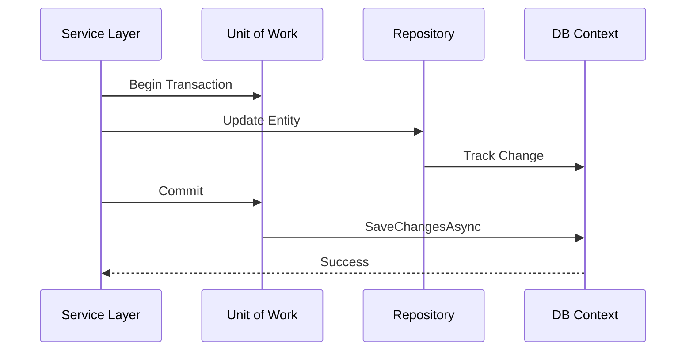

# Patrón Repository y Unit of Work [Principal]

## 1. Contexto General & Definición del Concepto
En sistemas de alta escala, el desacoplamiento entre la capa de dominio y la persistencia es vital para la mantenibilidad. El **Repository Pattern** actúa como una capa de abstracción sobre la lógica de acceso a datos, mientras que el **Unit of Work (UoW)** garantiza la integridad transaccional manteniendo una lista de objetos afectados durante una operación de negocio.

## 2. Forma de Aplicación, Buenas Prácticas & Ventajas

### Matriz de Trade-offs
| Ventaja | Desventaja / Costo |
| :--- | :--- |
| Aislamiento de dominio | Overhead de abstracción |
| Testabilidad unitaria | Complejidad en escenarios de alta concurrencia |
| Centralización de transacciones | Riesgo de contención en DB |

## 3. Flujo Arquitectónico y Diagrama


## 4. Implementación en C# .NET 10
```csharp
public interface IUnitOfWork : IDisposable {
    IRepository<T> Repository<T>() where T : class;
    Task<int> CommitAsync(CancellationToken ct = default);
}

public sealed class UnitOfWork(AppDbContext context) : IUnitOfWork {
    private readonly Dictionary<Type, object> _repositories = new();
    public IRepository<T> Repository<T>() where T : class {
        var type = typeof(T);
        if (!_repositories.ContainsKey(type)) 
            _repositories[type] = new Repository<T>(context);
        return (IRepository<T>)_repositories[type];
    }
    public async Task<int> CommitAsync(CancellationToken ct) => await context.SaveChangesAsync(ct);
    public void Dispose() => context.Dispose();
}
```

## 5. Implementación en React con Vite.js
En el frontend, el UoW se traduce a un 'Command Manager' para orquestar mutaciones complejas con rollback optimista.
```typescript
const useTransaction = () => {
  const [queue, setQueue] = useState<Mutation[]>([]);
  const commit = async () => {
    try {
      await Promise.all(queue.map(m => api.post(m.url, m.payload)));
      setQueue([]);
    } catch (e) { 
      /* Manejo de rollback de estado UI */ 
    }
  };
  return { commit, add: (m: Mutation) => setQueue([...queue, m]) };
};
```

## 6. Consideraciones de Concurrencia
Para evitar condiciones de carrera, se recomienda el uso de **Optimistic Concurrency** mediante `[Timestamp]` o `RowVersion` en .NET 10, combinando con estrategias de reintento (Polly) y el patrón [[Circuit-Breaker-Retry-Fallback]].

## 7. Enlaces y Referencias
[[CQRS-Patron-Implementacion-Practica]]
[[Clean-Architecture-Principal-Level]]
[[Transactional-Outbox-Pattern]]
