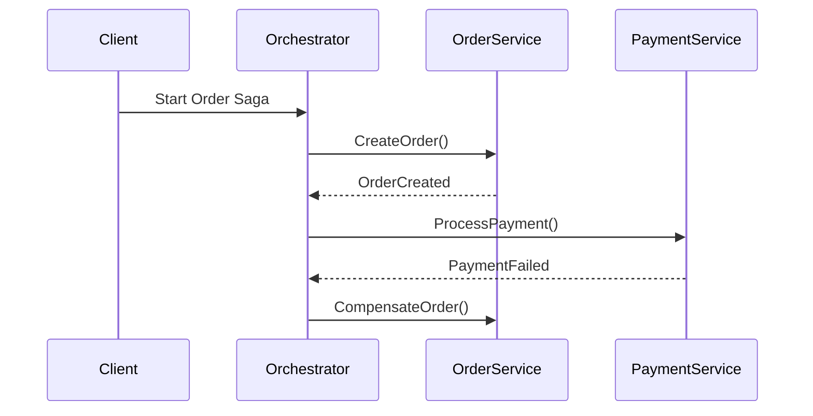

# Saga Pattern: Orquestación vs Coreografía [Principal]

## 1. Contexto General & Definición del Concepto
El patrón Saga resuelve la imposibilidad de utilizar transacciones atómicas distribuidas (2PC - Two-Phase Commit) en microservicios debido a la latencia y problemas de disponibilidad (CAP Theorem). Una Saga es una secuencia de transacciones locales donde cada transacción actualiza un servicio y publica un evento/mensaje para disparar la siguiente transacción en otro servicio.

- **Orquestación:** Un controlador centralizado coordina los estados.
- **Coreografía:** Intercambio de eventos sin un punto central de control (decentralized).

## 2. Forma de Aplicación, Buenas Prácticas & Ventajas
Se aplica cuando se requiere integridad de datos en procesos de negocio de larga duración. Es un antipatrón si el flujo es simple o si los servicios están altamente acoplados.

| Característica | Orquestación | Coreografía |
| :--- | :--- | :--- |
| Acoplamiento | Bajo | Muy Bajo |
| Complejidad | Alta (Logic Centralized) | Alta (Complexity Dist) |
| Visibilidad | Clara (Saga Execution Coordinator) | Difícil (Eventual) |
| Escalabilidad | Alta | Muy Alta |

## 3. Flujo Arquitectónico y Diagrama (Mermaid)


## 4. Implementación y Ejemplos Prácticos en C# / .NET 10
Utilizando un enfoque de orquestación mediante `MediatR` y `MassTransit`.
```csharp
public record ProcessOrderSagaState : SagaStateMachineInstance {
    public Guid CorrelationId { get; set; }
    public string CurrentState { get; set; }
}

public class OrderStateMachine : MassTransitStateMachine<ProcessOrderSagaState> {
    public State PendingPayment { get; private set; }
    public Event<IOrderCreated> OrderCreated { get; private set; }

    public OrderStateMachine() {
        InstanceState(x => x.CurrentState);
        Initially(When(OrderCreated).Then(ctx => Console.WriteLine("Saga Iniciada")).TransitionTo(PendingPayment));
    }
}
```

## 5. Implementación y Ejemplos Prácticos en React con Vite.js
El frontend debe manejar el estado optimista mientras la saga procesa en segundo plano.
```typescript
const useOrderSaga = () => {
  const [status, setStatus] = useState('pending');
  const executeSaga = async (payload: OrderData) => {
    setStatus('processing');
    try {
      const response = await api.post('/orders', payload);
      // Esperar vía WebSockets o Polling
    } catch (e) {
      setStatus('compensation-triggered');
    }
  };
  return { status, executeSaga };
};
```

## 6. Consideraciones de Concurrencia, Consistencia y Rendimiento
- **Idempotencia:** Obligatoria en todos los servicios (crucial para reintentos).
- **Compensación:** Las operaciones deben ser reversibles (rollback semántico).
- **Consistencia Eventual:** Aceptación de que el estado no será inmediato en todas las vistas de lectura.

## 7. Enlaces y Referencias en Obsidian
- [[CQRS-y-Event-Sourcing]]
- [[Transactional-Outbox-Pattern]]
- [[CAP-y-Eventual-Consistency]]
