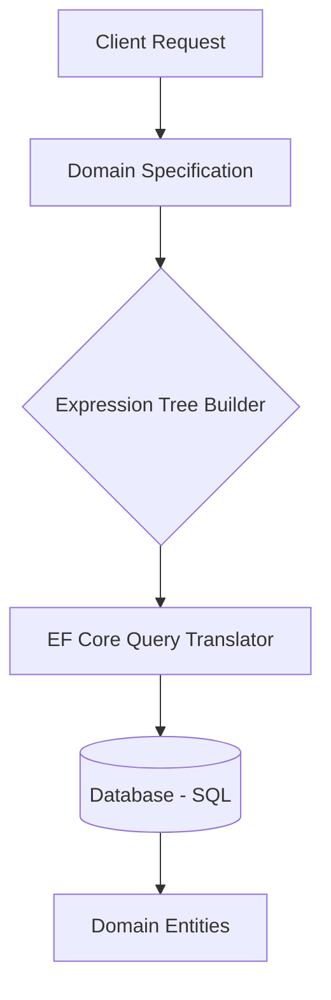

# Specification Pattern + Expression Trees [Principal]

## 1. Contexto General & Definición del Concepto
El Specification Pattern permite encapsular reglas de negocio complejas en objetos reutilizables. En sistemas distribuidos a gran escala, la combinación con `Expression Trees` en C# permite traducir estas reglas a consultas SQL optimizadas (via EF Core) o filtros de memoria, eliminando el acoplamiento entre la capa de dominio y la capa de persistencia.

## 2. Forma de Aplicación, Buenas Prácticas & Ventajas
- **Uso:** Ideal para criterios de filtrado dinámico en sistemas con alta carga de lectura.
- **Antipatrón:** No usar para lógica que requiera persistencia de estado transaccional. Es puramente de consulta o validación.

| Ventaja | Desventaja / Costo |
| :--- | :--- |
| Desacoplamiento total de filtros | Curva de aprendizaje técnica |
| Reutilización cross-domain | Complejidad en debugging de expresiones |
| Performance (SQL nativo) | Riesgo de `N+1` en proyecciones complejas |

## 3. Flujo Arquitectónico


## 4. Implementación en C# .NET 10
```csharp
public abstract record Specification<T>(Expression<Func<T, bool>> Expression) {
    public bool IsSatisfiedBy(T entity) => Expression.Compile()(entity);
}

public class HighValueOrderSpec : Specification<Order> {
    public HighValueOrderSpec() : base(o => o.TotalAmount > 1000 && o.Status == OrderStatus.Paid) { }
}

// Uso en Repositorio
public async Task<List<Order>> GetOrdersAsync(Specification<Order> spec) {
    return await _context.Orders.Where(spec.Expression).ToListAsync();
}
```

## 5. Implementación en React + Vite
```typescript
// Representación de filtros para el backend
interface FilterSpec {
  field: string;
  operator: 'eq' | 'gt';
  value: any;
}

const useOrderQuery = (specs: FilterSpec[]) => {
  return useQuery({
    queryKey: ['orders', specs],
    queryFn: () => apiClient.post('/orders/search', { specs }),
    staleTime: 5000
  });
};
```

## 6. Consideraciones de Concurrencia y Rendimiento
Para evitar `race conditions` al aplicar especificaciones, utilice `Optimistic Locking` (`rowversion` en EF Core). La serialización de especificaciones entre frontend y backend debe incluir validación para prevenir inyecciones de expresiones (Expression Injection).

## 7. Enlaces y Referencias
[[CQRS-y-Event-Sourcing]]
[[Clean-Architecture-DDD-en-DotNet10]]
