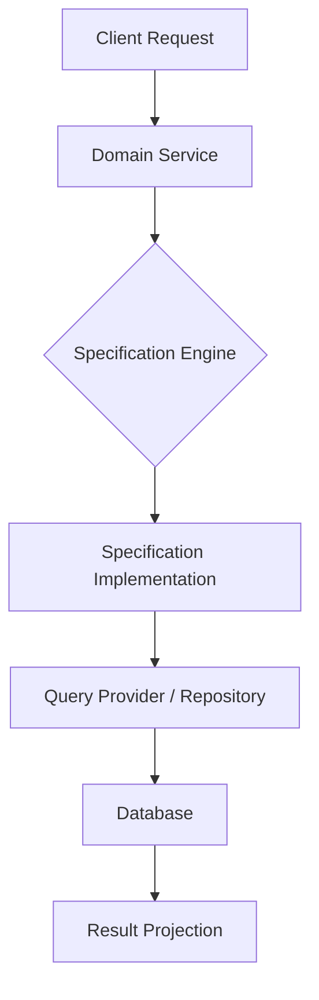

# Specification Pattern [Principal]

## 1. Contexto General & Definición del Concepto
El *Specification Pattern* permite encapsular reglas de negocio en objetos reutilizables. En sistemas de gran escala, evita el "anémico modelo de dominio" y la proliferación de lógica condicional dispersa. Es fundamental para definir criterios de búsqueda y validación de entidades (Business Rules) desacoplados de la persistencia.

## 2. Forma de Aplicación, Buenas Prácticas & Ventajas
Se aplica cuando las reglas de negocio varían frecuentemente o necesitan ser combinadas dinámicamente. 

| Ventaja | Desventaja / Costo |
| :--- | :--- |
| Alta cohesión de reglas de negocio | Riesgo de explosión de clases (Clase por especificación) |
| Composición mediante operadores (AND, OR, NOT) | Curva de aprendizaje para equipos junior |
| Abstracción total de la capa de datos | Posible impacto en rendimiento si se abusa de traducciones LINQ |

## 3. Flujo Arquitectónico


## 4. Implementación en C# .NET 10
```csharp
public abstract record Specification<T>(Expression<Func<T, bool>> Criteria) {
    public bool IsSatisfiedBy(T entity) => Criteria.Compile()(entity);
    public Specification<T> And(Specification<T> other) => new AndSpecification<T>(this, other);
}

public class CustomerIsActiveSpec : Specification<Customer> {
    public CustomerIsActiveSpec() : base(c => c.Status == Status.Active && c.LastOrderDate > DateTime.UtcNow.AddMonths(-6)) { }
}

// Uso en EF Core 10
public async Task<List<Customer>> GetCustomersAsync(Specification<Customer> spec) => 
    await _db.Customers.Where(spec.Criteria).ToListAsync();
```

## 5. Implementación en React + Vite
```tsx
// Specification como objeto de filtrado tipado para React
interface Specification<T> {
  predicate: (item: T) => boolean;
}

export const useFilteredData = <T,>(data: T[], spec: Specification<T>) => {
  return useMemo(() => data.filter(spec.predicate), [data, spec]);
};

// Uso
const activeUserSpec: Specification<User> = { predicate: (u) => u.isActive && u.role === 'Admin' };
const filtered = useFilteredData(users, activeUserSpec);
```

## 6. Consideraciones de Concurrencia, Consistencia y Rendimiento
En arquitecturas distribuidas, el uso de especificaciones debe evitar la transferencia masiva de datos. Se recomienda proyectar las especificaciones a nivel de base de datos usando `IQueryable` para aprovechar los índices, evitando la evaluación en memoria del servidor de aplicaciones.

## 7. Enlaces y Referencias
- [[Clean-Architecture-DDD-en-DotNet10]]
- [[cqrs-patron-arquitectura-principal]]
- [[repository-unit-of-work-principal]]
