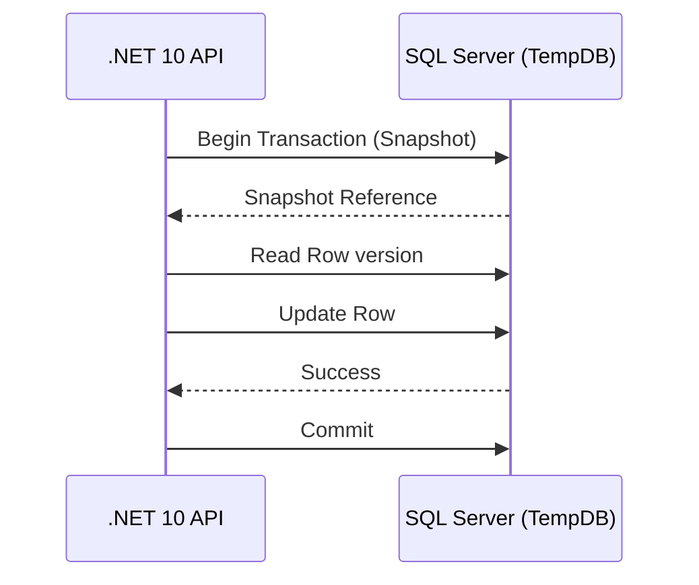

# Niveles de Aislamiento en SQL Server: Estrategias de Concurrencia a Escala [Principal]

## 1. Contexto General & Definición del Concepto
En sistemas distribuidos, el nivel de aislamiento es la piedra angular que define el equilibrio entre la integridad de los datos (ACID) y el throughput del sistema. En un entorno .NET 10 de alta escala, la elección inadecuada de un nivel de aislamiento puede derivar en bloqueos innecesarios (deadlocks) o anomalías de datos (dirty reads, non-repeatable reads).

## 2. Forma de Aplicación, Buenas Prácticas & Ventajas
El uso de `READ COMMITTED SNAPSHOT` (RCSI) es la práctica recomendada para arquitecturas modernas. Permite que los lectores no bloqueen a los escritores mediante versionado de filas (TempDB).

| Nivel de Aislamiento | Throughput | Riesgo de Anomalía | Caso de Uso Principal |
| :--- | :--- | :--- | :--- |
| Read Uncommitted | Muy Alto | Muy Alto | Reportes rápidos/Analytics |
| Read Committed | Medio | Medio | Default, lectura estándar |
| Snapshot / RCSI | Alto | Bajo | Aplicaciones transaccionales de alta concurrencia |
| Serializable | Muy Bajo | Nulo | Procesos financieros críticos |

## 3. Flujo Arquitectónico y Diagrama (Mermaid)


## 4. Implementación en C# / .NET 10
Utilizando EF Core 10 con ejecución explícita de transacciones controladas:

```csharp
public async Task ExecuteTransactionAsync(Func<Task> action, CancellationToken ct)
{
    using var executionStrategy = _context.Database.CreateExecutionStrategy();
    await executionStrategy.ExecuteAsync(async () => {
        using var transaction = await _context.Database.BeginTransactionAsync(IsolationLevel.Snapshot, ct);
        try {
            await action();
            await _context.SaveChangesAsync(ct);
            await transaction.CommitAsync(ct);
        }
        catch (DbUpdateConcurrencyException ex) {
            await transaction.RollbackAsync(ct);
            throw new ConflictException("Concurrency conflict detected", ex);
        }
    });
}
```

## 5. Implementación en React con Vite.js
Uso de estrategias de UI para manejar concurrencia, implementando un patrón de actualización optimista con validación de estado mediante `ETag`.

```typescript
const updateResource = async (id: string, data: Partial<Resource>, version: string) => {
  const response = await fetch(`/api/resources/${id}`, {
    method: 'PATCH',
    headers: { 'If-Match': version, 'Content-Type': 'application/json' },
    body: JSON.stringify(data)
  });
  if (response.status === 412) throw new Error('Conflict: Data modified by another user');
  return response.json();
};
```

## 6. Consideraciones de Concurrencia, Consistencia y Rendimiento
Para sistemas a escala, se recomienda migrar de bloqueos pesimistas a **Optimistic Concurrency Control (OCC)** utilizando versiones de fila. El impacto en `TempDB` al usar RCSI debe ser monitoreado mediante métricas de latencia de E/S en Azure SQL o SQL Server On-Premise.

## 7. Enlaces y Referencias en Obsidian
[[CQRS-y-Event-Sourcing]]
[[Optimistic-vs-Pessimistic-Locking]]
[[concurrencia-y-runtime-dotnet-10]]
