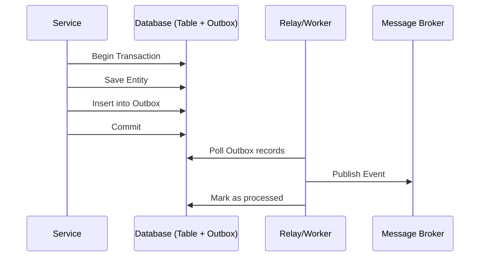

# Transactional Outbox Pattern [Principal]

## 1. Contexto General & Definición del Concepto
El Transactional Outbox Pattern resuelve el problema de la atomicidad en sistemas distribuidos cuando se requiere persistir datos en una base de datos relacional y, simultáneamente, publicar un evento en un message broker (ej. Kafka, RabbitMQ). Evita el "Dual Write Problem" garantizando consistencia eventual mediante una tabla `Outbox` dentro de la misma transacción ACID que la entidad de negocio.

## 2. Forma de Aplicación, Buenas Prácticas & Ventajas
### Matriz de Trade-offs
| Ventaja | Desventaja / Costo |
| :--- | :--- |
| Atomicidad garantizada | Sobrecarga de I/O en DB | 
| Resiliencia ante fallos de broker | Complejidad de implementacion (Poller/CDC) |
| Consistencia eventual fuerte | Necesidad de consumidores idempotentes |

## 3. Flujo Arquitectónico


## 4. Implementación en C# .NET 10
```csharp
public record OutboxMessage(Guid Id, string Type, string Payload, DateTime OccurredOn);

public async Task SaveOrderAsync(Order order, CancellationToken ct) {
    await using var transaction = await _dbContext.Database.BeginTransactionAsync(ct);
    try {
        _dbContext.Orders.Add(order);
        var outboxEntry = new OutboxMessage(Guid.NewGuid(), "OrderCreated", JsonSerializer.Serialize(order), DateTime.UtcNow);
        _dbContext.OutboxMessages.Add(outboxEntry);
        await _dbContext.SaveChangesAsync(ct);
        await transaction.CommitAsync(ct);
    } catch { await transaction.RollbackAsync(ct); throw; }
}
```

## 5. Implementación en React (Vite.js)
En el frontend, el enfoque principal es la resiliencia y el feedback de consistencia:
```typescript
import { useMutation, useQueryClient } from '@tanstack/react-query';

export const useCreateOrder = () => {
  const queryClient = useQueryClient();
  return useMutation({
    mutationFn: (order: Order) => apiClient.post('/orders', order),
    onSuccess: () => {
      // Optimistic UI updates mientras el broker procesa el evento
      queryClient.invalidateQueries({ queryKey: ['orders'] });
    },
    onError: (err) => {
      // Error Boundary logic para manejar fallos en la persistencia del outbox
      handleDomainError(err);
    }
  });
};
```

## 6. Consideraciones de Concurrencia y Consistencia
La principal preocupación es la duplicidad de eventos. Se requiere obligatoriamente una estrategia de **Idempotencia** en los consumidores. El uso de Change Data Capture (CDC) con herramientas como Debezium es preferible sobre el "Polling" tradicional para reducir el lag y la carga en la base de datos principal.

## 7. Enlaces y Referencias en Obsidian
- [[CQRS-y-Event-Sourcing]]
- [[Saga-Pattern-Orquestacion-vs-Coreografia]]
- [[Idempotencia-en-APIs-y-Consumidores-de-Eventos]]
