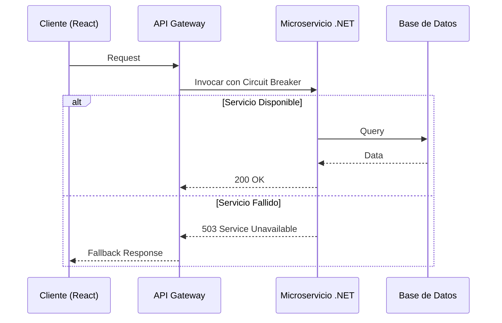

# Arquitectura de APIs y Resiliencia [Semi-Senior]

## 1. Contexto General & Definición del Concepto
La resiliencia en arquitecturas de APIs es la capacidad de un sistema para mantener su funcionalidad bajo condiciones de estrés, fallos parciales o sobrecarga. En sistemas modernos, no se asume que los componentes fallarán, se diseña para que el sistema opere a pesar de esos fallos.

El problema central es evitar el **efecto cascada** (donde un servicio lento tumba a todo el sistema) y asegurar una degradación elegante del servicio cuando los recursos de backend están agotados.

## 2. Forma de Aplicación, Buenas Prácticas & Ventajas
Se aplica mediante estrategias como Circuit Breakers, Retries con Exponential Backoff y Timeouts. Es un antipatrón implementar lógica de reintento infinita o timeouts extremadamente largos.

| Estrategia | Ventaja | Desventaja / Costo |
| :--- | :--- | :--- |
| Circuit Breaker | Detiene peticiones a sistemas caídos | Requiere monitoreo de estado complejo |
| Exponential Backoff | Evita saturar sistemas en recuperación | Aumenta la latencia percibida al inicio |
| Timeouts | Libera recursos rápidamente | Puede cancelar peticiones legítimas lentas |

## 3. Flujo Arquitectónico y Diagrama (Mermaid)


## 4. Implementación y Ejemplos Prácticos en C# / .NET 10
Usamos el patron de resiliencia de Microsoft.Extensions.Http.Resilience.

```csharp
// Program.cs configurando resiliencia nativa en .NET 10
builder.Services.AddHttpClient("OrderClient", client => {
    client.BaseAddress = new Uri("https://api.orders.com");
}).AddStandardResilienceHandler(options => {
    options.Retry.MaxRetryAttempts = 3;
    options.CircuitBreaker.FailureRatio = 0.5;
    options.CircuitBreaker.SamplingDuration = TimeSpan.FromSeconds(30);
});

// Minimal API Handler
app.MapGet("/orders/{id}", async (IHttpClientFactory factory, string id) => {
    var client = factory.CreateClient("OrderClient");
    try {
        return await client.GetFromJsonAsync<Order>($"/v1/orders/{id}");
    } catch (HttpRequestException ex) {
        return Results.Problem("Servicio temporalmente no disponible", statusCode: 503);
    }
});
```

## 5. Implementación y Ejemplos Prácticos en React con Vite.js
Uso de un custom hook para manejar estados de carga y errores de red de forma resiliente.

```tsx
// hooks/useResilientFetch.ts
export function useResilientFetch<T>(url: string) {
  const [data, setData] = useState<T | null>(null);
  const [error, setError] = useState<string | null>(null);

  useEffect(() => {
    const controller = new AbortController(); // Manejo de timeouts
    const timeoutId = setTimeout(() => controller.abort(), 5000);

    fetch(url, { signal: controller.signal })
      .then(res => res.ok ? res.json() : Promise.reject("Error de API"))
      .then(setData)
      .catch(err => setError(err.message))
      .finally(() => clearTimeout(timeoutId));

    return () => controller.abort();
  }, [url]);

  return { data, error };
}
```

## 6. Consideraciones de Concurrencia, Consistencia y Rendimiento
Es vital la sincronización entre el cliente y el servidor: 
1. **Idempotencia:** Asegurar que los reintentos automáticos no creen duplicados (usar `Idempotency-Key` en headers).
2. **Consistencia:** En estados optimistas, si la API falla, revertir el cambio visual en React mediante el caché de `react-query` o estados locales.
3. **Latencia:** El uso excesivo de reintentos puede agotar los threads del servidor; siempre aplicar límites globales.

## 7. Enlaces y Referencias en Obsidian
- [[Bulkhead-Pattern-Aislamiento-Recursos]]
- [[CQRS-y-Event-Sourcing]]
- [[CAP-y-Eventual-Consistency]]
