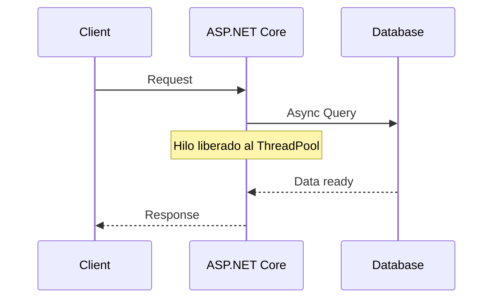

# Concurrencia y Runtime en .NET 10 [Semi-Senior]

## 1. Contexto General & Definición del Concepto
La concurrencia en .NET 10 se basa en el modelo de ejecución asíncrona basada en tareas (TAP - Task-based Asynchronous Pattern). A diferencia del paralelismo (hacer varias cosas a la vez), la concurrencia es la capacidad de gestionar múltiples tareas intercalando su ejecución, optimizando el uso de los hilos del ThreadPool. En backend, esto previene que los hilos de E/S bloqueen el servidor, permitiendo manejar miles de peticiones simultáneas con recursos limitados.

## 2. Forma de Aplicación, Buenas Prácticas & Ventajas
- **Cuándo aplicar:** Operaciones de red, acceso a bases de datos, lectura/escritura de archivos.
- **Antipatrón:** Uso de `.Result` o `.Wait()` (causa deadlocks en el contexto de sincronización).
- **Matriz de Trade-offs:**

| Característica | Ventaja | Desventaja |
| :--- | :--- | :--- |
| **Escalabilidad** | Alta (No bloqueante) | Complejidad en debug |
| **Resource Usage** | Bajo consumo de hilos | Gestión de stack traces compleja |

## 3. Flujo Arquitectónico y Diagrama


## 4. Implementación en C# .NET 10
```csharp
public class ConcurrencyService(IDbContext context) : IConcurrencyService
{
    public async Task<Result<Data>> ProcessAsync(Guid id, CancellationToken ct)
    {
        // Patrón Async + CancellationToken para manejo de timeouts/cancelación
        var record = await context.Items.FindAsync([id], ct);
        if (record is null) return Result.Failure<Data>("Not found");

        // Operación no bloqueante
        return await Task.Run(() => PerformCalculation(record), ct);
    }

    private Data PerformCalculation(Item item) => new(item.Value * 2);
}
```

## 5. Implementación en React con Vite.js
Para manejar concurrencia en el frontend, usamos `AbortController` para cancelar peticiones obsoletas y evitar estados de carrera en el UI.

```tsx
import { useEffect, useState } from 'react';

export const useFetchData = (id: string) => {
  const [data, setData] = useState(null);

  useEffect(() => {
    const controller = new AbortController();
    fetch(`/api/data/${id}`, { signal: controller.signal })
      .then(res => res.json())
      .then(setData)
      .catch(err => { if (err.name !== 'AbortError') console.error(err); });

    return () => controller.abort(); // Cleanup: Cancela si el componente se desmonta
  }, [id]);

  return data;
};
```

## 6. Consideraciones de Concurrencia
La sincronización entre React y .NET requiere:
1. **Idempotencia:** Asegurar que reintentos por red no dupliquen entidades.
2. **Optimistic Locking:** Usar versiones o timestamps en el header de las respuestas API.
3. **Resiliencia:** Implementar políticas de reintento en el cliente mediante Axios o Fetch wrappers.

## 7. Enlaces y Referencias
- [[Optimistic-vs-Pessimistic-Locking]]
- [[Bulkhead-Pattern-Aislamiento-Recursos]]
