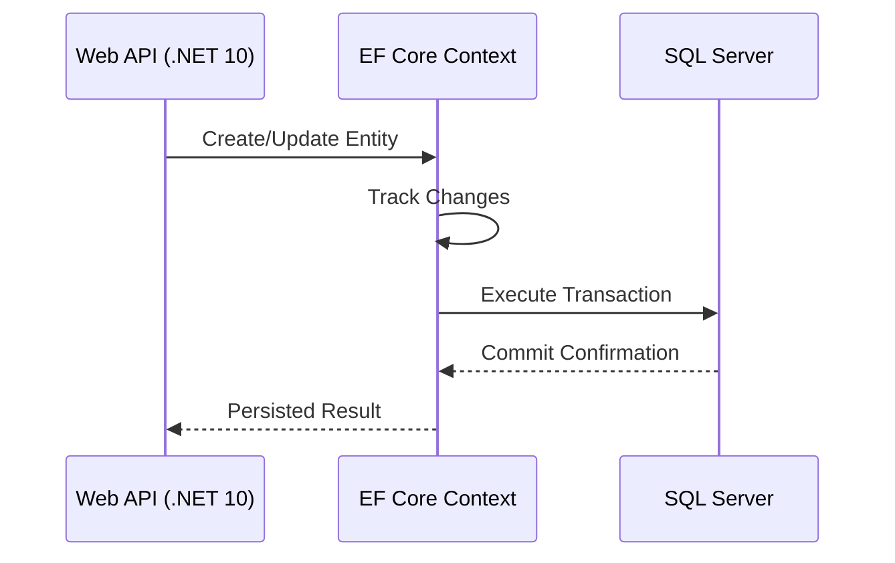

# Persistencia y EF Core en .NET 10 [Semi-Senior]

## 1. Contexto General & Definición del Concepto
La persistencia en el backend moderno se abstrae mediante Object-Relational Mappers (ORM). Entity Framework Core (EF Core) 10 permite mapear el modelo de dominio a estructuras relacionales. El problema que resuelve es la impedancia entre el grafo de objetos en memoria y las tablas relacionales, permitiendo gestionar la concurrencia y transaccionalidad de forma declarativa.

## 2. Forma de Aplicación, Buenas Prácticas & Ventajas
- **Cuándo usar:** Aplicaciones empresariales con modelos de datos complejos.
- **Antipatrón:** Realizar consultas intensivas en bucles (N+1 problem) o no usar el `DbContext` con alcance (Scoped).

| Ventaja | Desventaja |
| :--- | :--- |
| Productividad y mantenibilidad | Abstracción puede ocultar consultas ineficientes |
| Migraciones automatizadas | Curva de aprendizaje en tuning de rendimiento |
| Soporte integrado para LINQ | Overhead de memoria en grandes grafos |

## 3. Flujo Arquitectónico y Diagrama


## 4. Implementación en .NET 10
```csharp
public record User(Guid Id, string Username, string Email);

public class AppDbContext(DbContextOptions<AppDbContext> options) : DbContext(options)
{
    public DbSet<User> Users => Set<User>();

    protected override void OnModelCreating(ModelBuilder modelBuilder) => 
        modelBuilder.Entity<User>().HasKey(u => u.Id);
}

// Uso en Servicio
public async Task CreateUser(User user, AppDbContext db)
{
    db.Users.Add(user);
    await db.SaveChangesAsync(); // Transaccionalidad automática
}
```

## 5. Implementación en React con Vite.js
```typescript
import { useMutation, useQueryClient } from '@tanstack/react-query';

export const useCreateUser = () => {
  const queryClient = useQueryClient();
  return useMutation({
    mutationFn: (data: User) => fetch('/api/users', { 
      method: 'POST', body: JSON.stringify(data) 
    }),
    onSuccess: () => queryClient.invalidateQueries({ queryKey: ['users'] })
  });
};
```

## 6. Consideraciones de Concurrencia
Para concurrencia, EF Core utiliza el `RowVersion` (Timestamp). Si dos usuarios editan el mismo registro, `SaveChangesAsync` lanzará una `DbUpdateConcurrencyException`, forzando al desarrollador a decidir entre `ClientWins` o `DatabaseWins`.

## 7. Enlaces y Referencias
- [[Clean-Architecture-DDD-en-DotNet10]]
- [[Optimistic-vs-Pessimistic-Locking]]
