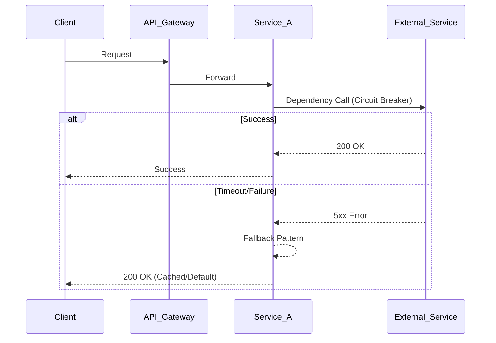

# Arquitectura de APIs y Resiliencia [Senior]

## 1. Contexto General & Definición del Concepto
La resiliencia en APIs modernas no es una característica opcional, sino un requisito de diseño para sistemas distribuidos. Se define como la capacidad de un sistema para absorber fallos, degradarse de forma elegante y recuperarse automáticamente sin intervención manual. A nivel Senior, nos enfocamos en el control del tráfico (Circuit Breaker), aislamiento de recursos (Bulkheads) y estrategias de reintento inteligente.

## 2. Forma de Aplicación, Buenas Prácticas & Ventajas
Se aplica cuando el sistema depende de servicios externos (Red, APIs de terceros, Bases de Datos distribuidas). Evita el "efecto dominó" donde un fallo en un servicio menor causa el colapso de todo el ecosistema.

| Característica | Ventaja | Desventaja / Costo |
| :--- | :--- | :--- |
| Circuit Breaker | Previene sobrecarga de sistemas caídos | Complejidad en estados (Half-open) |
| Bulkheads | Aísla fallos por thread pool | Requiere monitoreo granular |
| Retry con Exponential Backoff | Mejora éxito ante fallos transitorios | Riesgo de Retry Storms |

## 3. Flujo Arquitectónico


## 4. Implementación y Ejemplos Prácticos en C# / .NET 10
Usamos `Microsoft.Extensions.Http.Resilience` para encapsular pipelines de resiliencia directamente en la DI.

```csharp
// Program.cs - .NET 10 Configuration
services.AddHttpClient("RemoteService", client => {
    client.BaseAddress = new Uri("https://api.external.com");
})
.AddStandardResilienceHandler(options => {
    options.CircuitBreaker.FailureRatio = 0.5;
    options.Retry.MaxRetryAttempts = 3;
    options.TotalRequestTimeout.Timeout = TimeSpan.FromSeconds(5);
});

// Service Implementation
public class DataProcessor(IHttpClientFactory clientFactory) {
    public async Task<Result> GetDataAsync(CancellationToken ct) {
        var client = clientFactory.CreateClient("RemoteService");
        return await client.GetFromJsonAsync<Result>("/data", ct) ?? Result.Default();
    }
}
```

## 5. Implementación y Ejemplos Prácticos en React con Vite.js
En el frontend, la resiliencia se manifiesta en la gestión del estado y la recuperación de errores mediante `QueryClient`.

```tsx
// useResilientQuery.ts
import { useQuery } from '@tanstack/react-query';

export const useResilientData = () => {
  return useQuery({
    queryKey: ['resource'],
    queryFn: fetchResource,
    retry: (failureCount, error) => error.status !== 404 && failureCount < 3,
    staleTime: 5000,
  });
};
```

## 6. Consideraciones de Concurrencia, Consistencia y Rendimiento
La latencia p99 es el indicador clave. En entornos distribuidos, la consistencia eventual es preferible a la fuerte (CAP theorem). El uso de `ValueTask` en .NET 10 para operaciones I/O frecuentes reduce la presión sobre el Garbage Collector, mejorando la densidad de concurrencia.

## 7. Enlaces y Referencias
[[CQRS-y-Event-Sourcing]], [[Bulkhead-Pattern-Aislamiento-Recursos]], [[CAP-y-Eventual-Consistency]]
