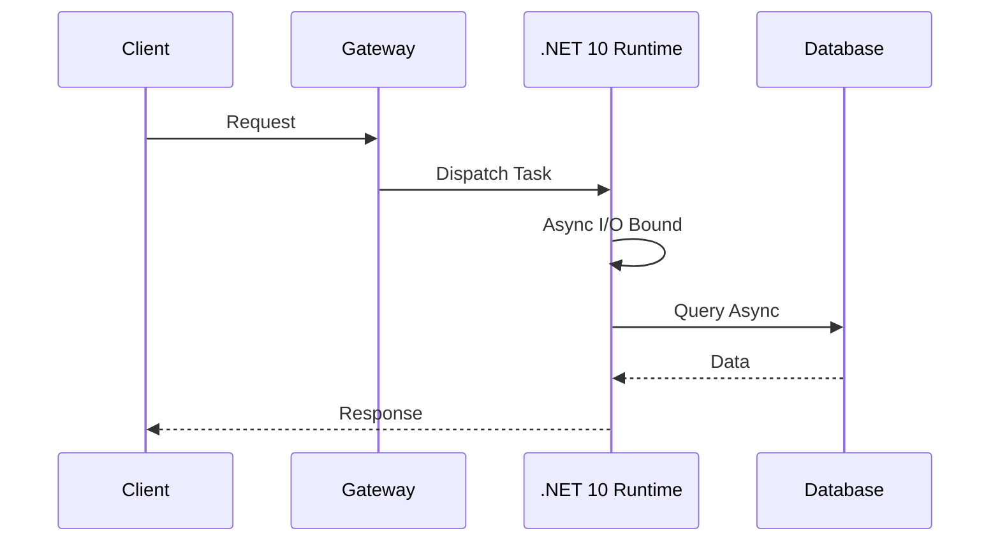

# Concurrencia y Runtime en .NET 10 [Senior]

## 1. Contexto General & Definición del Concepto
La concurrencia en .NET 10 no trata solo de hilos (threads), sino de una gestión eficiente del *Task-based Asynchronous Pattern (TAP)* y el *ThreadPool* optimizado para arquitecturas de alta densidad. El objetivo es maximizar el *throughput* minimizando el *context switching* y la contención en el runtime.

## 2. Forma de Aplicación, Buenas Prácticas & Ventajas
Aplicar concurrencia es vital en microservicios bajo alta carga para evitar el agotamiento del ThreadPool. Es un antipatrón usar `Task.Wait()` o `.Result`, lo cual causa *thread starvation*.

| Criterio | Ventajas | Desventajas / Costo |
| :--- | :--- | :--- |
| **Performance** | Alta latencia p99 | Complejidad de depuración |
| **Escalabilidad** | Eficiencia de recursos | Riesgo de race conditions |
| **Operatividad** | Alta densidad por nodo | Necesidad de observabilidad avanzada |

## 3. Flujo Arquitectónico y Diagrama


## 4. Implementación en C# .NET 10
```csharp
public async Task<Result<T>> ExecuteAsync<T>(Func<CancellationToken, Task<T>> operation, CancellationToken ct = default) 
{
    // Uso de ValueTask para evitar asignaciones en memoria si el resultado ya está disponible
    try {
        return await operation(ct).ConfigureAwait(false);
    } catch (OperationCanceledException) {
        return Result.Failure<T>("Operación cancelada");
    }
}
```

## 5. Implementación en React con Vite.js
```typescript
import { useQuery } from '@tanstack/react-query';

export const useConcurrencyControlledData = (id: string) => {
  // Manejo de estados optimistas para latencia percibida cero
  return useQuery({
    queryKey: ['data', id],
    queryFn: () => apiClient.fetch(id),
    staleTime: 5000,
    retry: 2
  });
};
```

## 6. Consideraciones de Concurrencia, Consistencia y Rendimiento
Para evitar *Race Conditions* entre el Frontend y el Backend, es imperativo implementar **Optimistic Locking** mediante `ETags` o versiones en el header de las respuestas API. La consistencia se garantiza a nivel de base de datos utilizando [[Optimistic-vs-Pessimistic-Locking]] cuando la integridad es crítica.

## 7. Enlaces y Referencias en Obsidian
- [[CQRS-y-Event-Sourcing]]
- [[CAP-y-Eventual-Consistency]]
