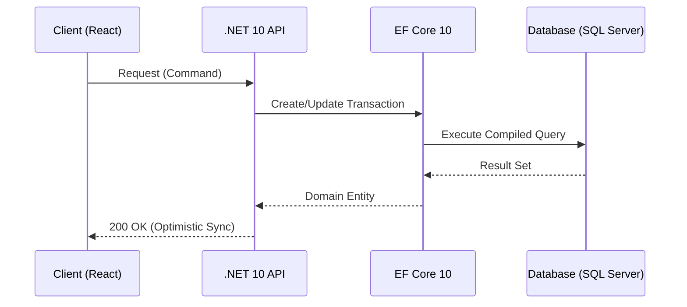

# Persistencia de Alto Rendimiento con EF Core 10 [Senior]

## 1. Contexto General & Definición del Concepto
La persistencia en sistemas distribuidos bajo .NET 10 requiere un equilibrio entre la abstracción del ORM y el rendimiento de acceso a datos (I/O). EF Core 10 no es solo un mapeador; es una capa de orquestación de cambios. En sistemas de alta concurrencia, el desafío es evitar el bloqueo de recursos (Lock Contention) y optimizar el throughput mediante consultas proyectadas y gestión eficiente de la unidad de trabajo (Unit of Work).

## 2. Forma de Aplicación, Buenas Prácticas & Ventajas

| Criterio | Ventaja | Desventaja / Costo |
| :--- | :--- | :--- |
| **Abstracción** | Reduce el boilerplate de SQL | Puede ocultar consultas N+1 |
| **Performance** | Uso de `CompiledQuery` y `AsNoTracking` | Requiere optimización manual de queries |
| **Escalabilidad** | Soporte nativo para async/await | Alta latencia si no hay `BulkUpdate` |

## 3. Flujo Arquitectónico y Diagrama (Mermaid)


## 4. Implementación y Ejemplos Prácticos en C# / .NET 10
Utilizamos `CompiledQuery` y optimizaciones de lectura para minimizar el overhead de reflexión.

```csharp
public static class OrderQueries
{
    private static readonly Func<MyDbContext, Guid, Task<Order?>> GetOrderById = 
        EF.CompileAsyncQuery((MyDbContext db, Guid id) => 
            db.Orders.AsNoTracking().FirstOrDefault(o => o.Id == id));

    public async Task<Order?> GetOrderAsync(Guid id) => await GetOrderById(_context, id);
}
```

## 5. Implementación y Ejemplos Prácticos en React con Vite.js
Uso de `TanStack Query` para el estado optimista, sincronizando con la API de .NET 10.

```tsx
import { useMutation, useQueryClient } from '@tanstack/react-query';

export const useUpdateOrder = () => {
  const queryClient = useQueryClient();
  return useMutation({
    mutationFn: (data: Order) => api.put(`/orders/${data.id}`, data),
    onMutate: async (newOrder) => {
      await queryClient.cancelQueries(['order', newOrder.id]);
      const previous = queryClient.getQueryData(['order', newOrder.id]);
      queryClient.setQueryData(['order', newOrder.id], newOrder);
      return { previous };
    }
  });
};
```

## 6. Consideraciones de Concurrencia, Consistencia y Rendimiento
Para sistemas de alta escala, se debe implementar [[Optimistic-vs-Pessimistic-Locking]]. Usar `RowVersion` en EF Core para detectar conflictos de concurrencia y manejar `DbUpdateConcurrencyException` con políticas de reintento (Polly).

## 7. Enlaces y Referencias en Obsidian
- [[CQRS-y-Event-Sourcing]]
- [[Transactional-Outbox-Pattern]]
- [[CAP-y-Eventual-Consistency]]
