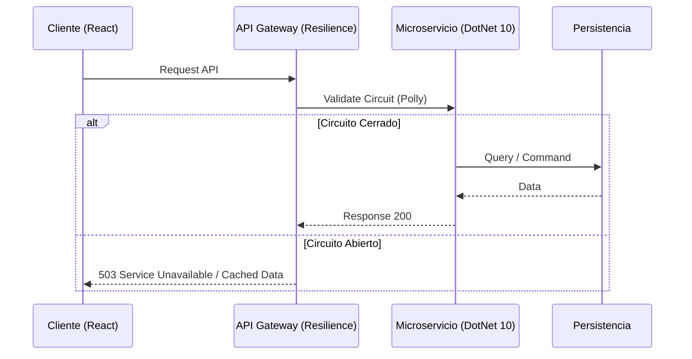

# Arquitectura de APIs y Resiliencia [Principal]

## 1. Contexto General & Definición del Concepto
La resiliencia en APIs a nivel Staff/Principal no se trata solo de implementar reintentos (retries), sino de diseñar sistemas capaces de absorber fallos sin degradar la experiencia global. Se fundamenta en el aislamiento de fallos (Bulkheads), control de carga (Backpressure) y degradación elegante.

## 2. Forma de Aplicación, Buenas Prácticas & Ventajas
Se aplica cuando el sistema requiere una disponibilidad > 99.99%. Es un antipatrón cuando se aplica a sistemas monolíticos simples donde la latencia de red es despreciable frente a la lógica de negocio.

| Característica | Ventaja | Desventaja/Costo |
| :--- | :--- | :--- |
| Circuit Breaker | Previene colapso en cascada | Complejidad en la gestión de estados |
| Bulkheads | Aísla el impacto del fallo | Fragmentación de recursos |
| Rate Limiting | Protección contra DDoS/Spikes | Requiere store compartido (Redis) |

## 3. Flujo Arquitectónico y Diagrama (Mermaid)


## 4. Implementación y Ejemplos Prácticos en C# / .NET 10
Utilizando `Microsoft.Extensions.Http.Resilience` para una integración nativa en .NET 10.

```csharp
builder.Services.AddHttpClient("OrderClient")
    .AddResilienceHandler("resilience-pipeline", builder => {
        builder.AddCircuitBreaker(new CircuitBreakerStrategyOptions {
            FailureRatio = 0.5,
            SamplingDuration = TimeSpan.FromSeconds(30),
            MinimumThroughput = 10
        });
        builder.AddRetry(new RetryStrategyOptions { MaxRetryAttempts = 3 });
    });
```

## 5. Implementación y Ejemplos Prácticos en React con Vite.js
Uso de un custom hook para manejar el estado resiliente con `SWR` o `TanStack Query`.

```typescript
const useResilientData = (endpoint: string) => {
  const { data, error } = useSWR(endpoint, fetcher, {
    shouldRetryOnError: true,
    errorRetryCount: 3,
    dedupingInterval: 2000,
  });

  return { data, isLoading: !error && !data, isError: error };
};
```

## 6. Consideraciones de Concurrencia, Consistencia y Rendimiento
A nivel Principal, la sincronización entre el estado del cliente y servidor debe ser **eventualmente consistente**. El uso de *Optimistic UI* en React junto con *Idempotency Keys* en .NET 10 garantiza que, ante reintentos de red, el sistema backend no duplique transacciones.

## 7. Enlaces y Referencias en Obsidian
- [[CQRS-y-Event-Sourcing]]
- [[Bulkhead-Pattern-Aislamiento-Recursos]]
- [[CAP-y-Eventual-Consistency]]
