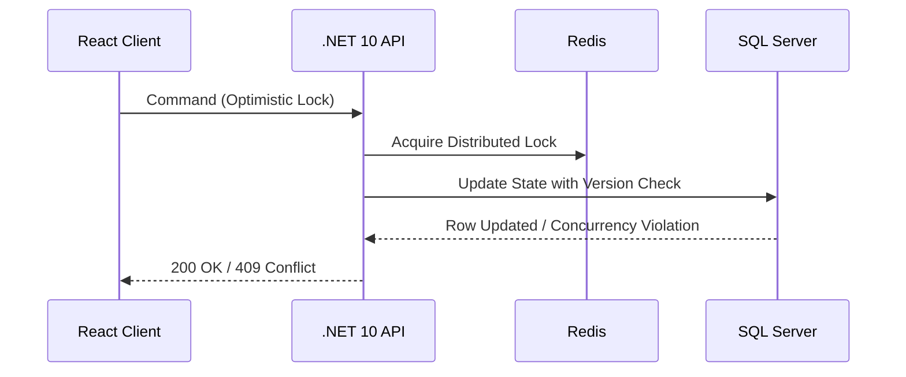

# Concurrencia y Runtime en .NET 10 [Principal]

## 1. Contexto General & Definición del Concepto
La gestión de la concurrencia en sistemas distribuidos modernos requiere una comprensión profunda del *Runtime* (CLR/CoreCLR). En .NET 10, la concurrencia evoluciona hacia modelos de memoria más eficientes (Zero-copy), canales de comunicación asíncronos y un control granular sobre el *Thread Pool*. El problema principal es la contención de recursos en entornos de alta densidad de microservicios.

## 2. Forma de Aplicación, Buenas Prácticas & Ventajas
- **Cuándo aplicar**: En sistemas de alto throughput, servicios de procesamiento en tiempo real, o cuando la latencia de contexto (context switching) impacta el SLA.
- **Antipatrón**: Uso excesivo de `Task.Run` para operaciones I/O-bound o bloqueo de hilos con `lock` en escenarios de alta contención.

| Característica | Ventaja | Desventaja / Costo |
| :--- | :--- | :--- |
| Channels (System.Threading.Channels) | Backpressure nativo | Complejidad de diseño |
| ValueTask | Menor presión de GC | Riesgo de uso indebido |
| Optimistic Concurrency | Alta disponibilidad | Retries en capa de aplicación |

## 3. Flujo Arquitectónico y Diagrama


## 4. Implementación en C# / .NET 10
```csharp
public async ValueTask<Result> UpdateResourceAsync(Guid id, int version, CancellationToken ct)
{
    // Usando Channel para desacoplar el procesamiento pesado de la respuesta HTTP
    await _channel.Writer.WriteAsync(new UpdateCommand(id, version), ct);
    return Result.Accepted();
}

// Manejo de concurrencia optimista con EF Core 10
public async Task SaveChangesAsync(Entity entity) 
{
    try { await _context.SaveChangesAsync(); }
    catch (DbUpdateConcurrencyException ex) 
    {
        // Estrategia de resolución de conflictos
        throw new ConcurrencyException("El recurso fue modificado por otro proceso");
    }
}
```

## 5. Implementación en React con Vite.js
```tsx
import { useMutation, useQueryClient } from '@tanstack/react-query';

export const useUpdateResource = () => {
  const queryClient = useQueryClient();
  return useMutation({
    mutationFn: (data: Resource) => apiClient.put('/resource', data),
    onMutate: async (newData) => {
      // Optimistic UI Update
      await queryClient.cancelQueries(['resource']);
      const previous = queryClient.getQueryData(['resource']);
      queryClient.setQueryData(['resource'], newData);
      return { previous };
    },
    onError: (err, _, context) => queryClient.setQueryData(['resource'], context?.previous)
  });
};
```

## 6. Consideraciones de Concurrencia, Consistencia y Rendimiento
La sincronización entre el cliente y el servidor debe basarse en *ETags* para control de versiones HTTP. En el backend, priorizar estructuras de datos inmutables y evitar la mutación de estado compartido entre hilos, delegando la consistencia a la capa de persistencia mediante bloqueo optimista.

## 7. Enlaces y Referencias en Obsidian
- [[CQRS-y-Event-Sourcing]]
- [[CAP-y-Eventual-Consistency]]
- [[Bulkhead-Pattern-Aislamiento-Recursos]]
