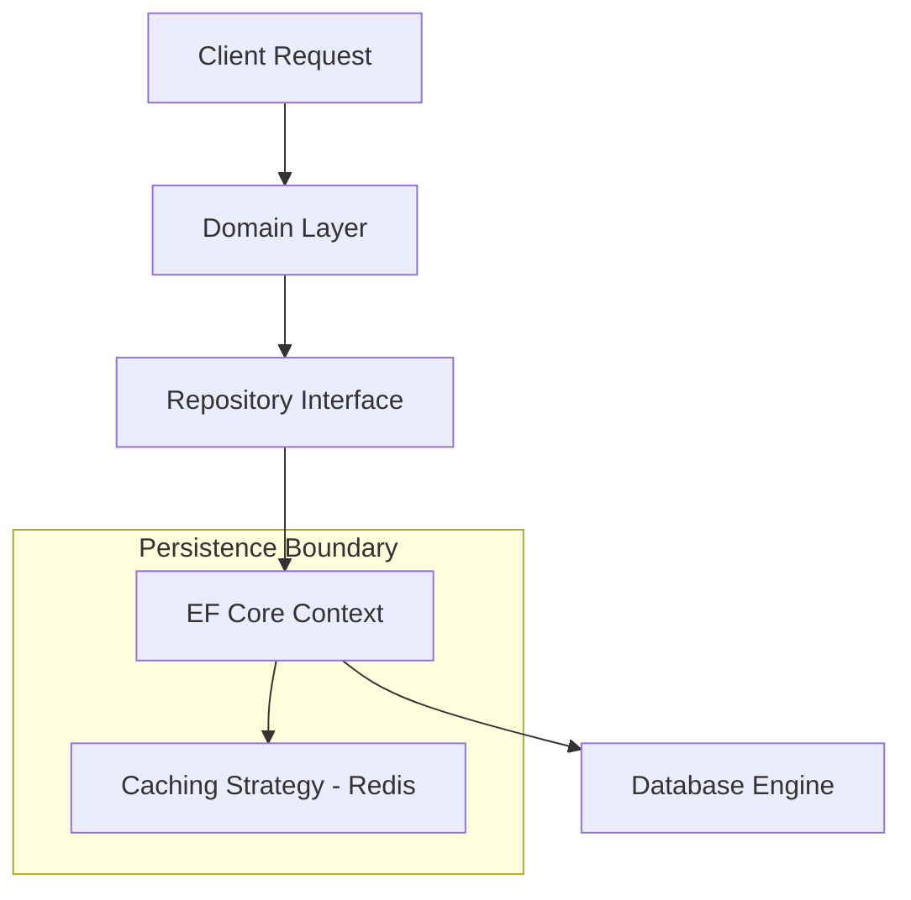

# Arquitectura de Persistencia de Alto Rendimiento con EF Core 10 [Principal]

## 1. Contexto General & Definición del Concepto
La persistencia en sistemas distribuidos no es solo CRUD; es una preocupación transversal que impacta en la latencia, la consistencia y la capacidad de recuperación. En .NET 10, EF Core 10 no es un simple ORM, sino una capa de abstracción de persistencia que, si se configura incorrectamente, genera cuellos de botella en la base de datos (contingencias de bloqueo, consultas N+1 y saturación de pool).

Como arquitecto, el enfoque debe estar en la **inmutabilidad, el desacoplamiento mediante patrones de repositorio/unidad de trabajo y la observabilidad**. Resolvemos el problema de la "fuga de abstracción" que ocurre cuando la lógica de negocio depende directamente de estructuras de base de datos.

## 2. Forma de Aplicación, Buenas Prácticas & Ventajas
- **Cuándo aplicar:** Entidades de dominio complejas con reglas de negocio estrictas, necesidad de integridad transaccional ACID y cuando la mantenibilidad a largo plazo supera el costo de rendimiento de una consulta SQL pura.
- **Antipatrón:** Uso de `IQueryable` fuera de la capa de persistencia (causa filtrado inseguro y latencia) o no gestionar el ciclo de vida del `DbContext` en arquitecturas asíncronas.

### Matriz de Trade-offs
| Dimensión | EF Core 10 (Abstracción) | Dapper / SQL Puro |
| :--- | :--- | :--- |
| **Velocidad Desarrollo** | Alta | Baja |
| **Control de Plan de Ejecución** | Bajo | Alto |
| **Mantenibilidad** | Alta | Media |
| **Overhead de Memoria** | Moderado | Muy Bajo |

## 3. Flujo Arquitectónico y Diagrama


## 4. Implementación en C# / .NET 10
Utilizamos `Records` para inmutabilidad y `Value Objects` para encapsular la lógica.

```csharp
// Domain/ValueObjects/Email.cs
public record Email(string Value);

// Application/Interfaces/IUnitOfWork.cs
public interface IUnitOfWork : IDisposable {
    Task<int> SaveChangesAsync(CancellationToken ct = default);
}

// Infrastructure/Persistence/AppDbContext.cs
public class AppDbContext(DbContextOptions<AppDbContext> options) : DbContext(options) {
    public DbSet<User> Users => Set<User>();
    
    protected override void OnModelCreating(ModelBuilder mb) {
        mb.Entity<User>(u => {
            u.Property(x => x.Email).HasConversion(e => e.Value, v => new Email(v));
        });
    }
}
```

## 5. Implementación en React con Vite.js
El frontend debe manejar el estado optimista para mejorar la percepción de rendimiento mientras la persistencia ocurre en segundo plano.

```typescript
// src/hooks/useOptimisticUpdate.ts
import { useMutation, useQueryClient } from '@tanstack/react-query';

export const useUpdateUser = () => {
  const queryClient = useQueryClient();
  return useMutation({
    mutationFn: (userData: User) => apiClient.put('/users', userData),
    onMutate: async (newUser) => {
      await queryClient.cancelQueries({ queryKey: ['user'] });
      const previousUser = queryClient.getQueryData(['user']);
      queryClient.setQueryData(['user'], newUser);
      return { previousUser };
    },
    onError: (err, _, context) => queryClient.setQueryData(['user'], context?.previousUser)
  });
};
```

## 6. Consideraciones de Concurrencia y Rendimiento
Para sistemas de alta escala, EF Core debe usar `Optimistic Concurrency` mediante un token de versión (`RowVersion` o `ETag`) para evitar pérdidas de actualizaciones. En escenarios de alta carga, la escritura debe delegarse a una cola (`Transactional Outbox`) para garantizar la consistencia eventual entre el estado de la base de datos y los microservicios aguas abajo.

## 7. Enlaces y Referencias
- [[CQRS-y-Event-Sourcing]]
- [[Transactional-Outbox-Pattern]]
- [[CAP-y-Eventual-Consistency]]
