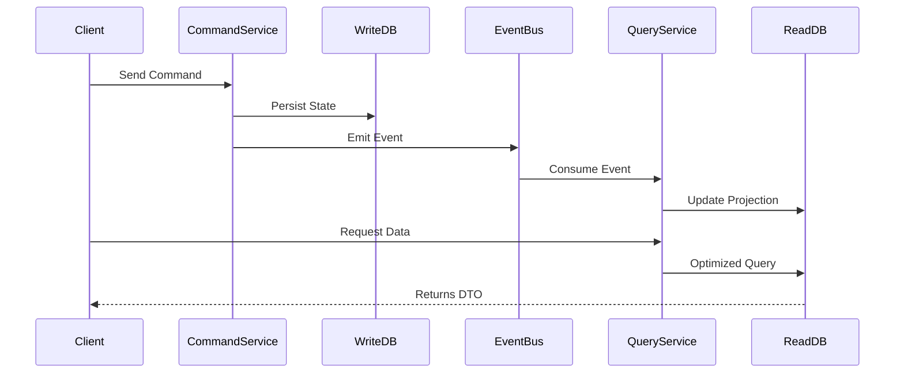

# CQRS: Segregación de Responsabilidades de Consulta y Comando

## 1. Contexto & Definición del Problema
En sistemas de alta escala, las operaciones de escritura (comandos) suelen tener requerimientos de validación complejos y transaccionales, mientras que las operaciones de lectura (queries) requieren baja latencia y alta disponibilidad. El modelo CRUD tradicional impone una carga innecesaria al reutilizar el mismo modelo de dominio para ambos propósitos, creando cuellos de botella en la base de datos y complejidad accidental en la lógica de negocio.

## 2. Decisión Arquitectónica & Justificación
Adoptamos CQRS para separar físicamente los modelos de lectura y escritura. Esto permite escalar los modelos de forma independiente, optimizar el esquema de almacenamiento para queries (denormalización) y aplicar reglas de validación de negocio estrictas solo en el pipeline de comandos.

## 3. Flujo y Diagrama de Secuencia


## 4. Matriz de Trade-offs
| Ventajas | Desventajas | Costos Operacionales |
| :--- | :--- | :--- |
| Escalabilidad independiente | Consistencia eventual | Mayor complejidad de infraestructura |
| Optimización de consultas | Sincronización de modelos | Necesidad de monitoreo de latencia | 
| Separación de intereses | Curva de aprendizaje alta | Gestión de eventos distribuida |

## 5. Consideraciones de Concurrencia, Consistencia y Rendimiento
- **Consistencia:** Implementamos consistencia eventual. La latencia entre la escritura y la proyección es crítica. Se recomienda el uso de `[[Outbox-Pattern]]` para asegurar la entrega de eventos.
- **Concurrencia:** En el modelo de comandos, el uso de *Optimistic Concurrency Control* (versiones de entidad) evita condiciones de carrera durante la actualización del estado.
- **Performance:** Las proyecciones de lectura deben diseñarse para ser de solo lectura y altamente denormalizadas (evitando JOINS).

## 6. Implementación de Referencia en .NET 10
```csharp
public record CreateUserCommand(string Username, string Email);

public class UserCommandHandler(IUserRepository repository, IEventDispatcher dispatcher) 
    : ICommandHandler<CreateUserCommand>
{
    public async Task HandleAsync(CreateUserCommand command, CancellationToken ct)
    {
        var user = User.Create(command.Username, command.Email);
        await repository.SaveAsync(user, ct);
        await dispatcher.PublishAsync(new UserCreatedEvent(user.Id, user.Email), ct);
    }
}

// Query Side usando proyecciones
public record UserDto(Guid Id, string Username);

public class GetUserQueryHandler(ReadOnlyDbContext dbContext) 
    : IQueryHandler<GetUserQuery, UserDto>
{
    public async Task<UserDto> HandleAsync(GetUserQuery query, CancellationToken ct) =>
        await dbContext.Users.AsNoTracking()
            .Where(u => u.Id == query.UserId)
            .Select(u => new UserDto(u.Id, u.Username))
            .FirstOrDefaultAsync(ct) ?? throw new KeyNotFoundException();
}
```

## 7. Enlaces y Referencias en Obsidian
- [[clean-architecture-distributed]]
- [[Outbox-Pattern]]
