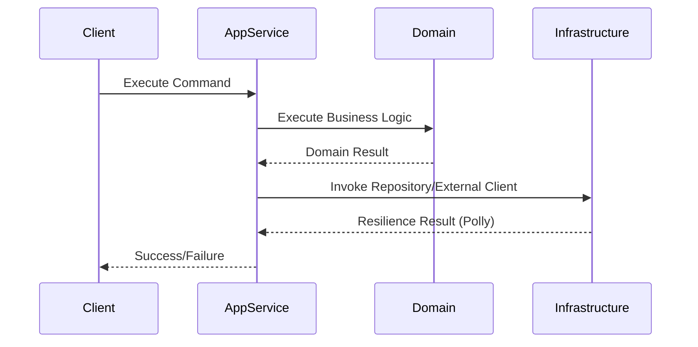

# Clean Architecture en Sistemas Distribuidos

## 1. Contexto & Definición del Problema
La Clean Architecture (Uncle Bob) busca desacoplar la lógica de negocio de los detalles de infraestructura. En sistemas distribuidos, esto se vuelve complejo: ¿Cómo mantenemos el aislamiento de los casos de uso cuando las dependencias externas (bases de datos, message brokers, APIs externas) son intrínsecamente inestables y requieren resiliencia distribuida?

## 2. Decisión Arquitectónica & Justificación
Adoptar una implementación donde los *Application Services* orquestan el dominio sin conocer los detalles de transporte, utilizando *Resilience Pipelines* (Polly) en la capa de infraestructura. Esto garantiza que la lógica de negocio permanezca pura, mientras que los *cross-cutting concerns* (retries, timeouts) se delegan a adaptadores configurables.

## 3. Flujo y Diagrama de Secuencia


## 4. Matriz de Trade-offs
| Ventajas | Desventajas | Costos Operacionales |
| :--- | :--- | :--- |
| Alta testeabilidad (Unit tests puros) | Over-engineering en servicios simples | Curva de aprendizaje del equipo |
| Independencia de frameworks | Mayor número de capas/archivos | Mantenimiento de mapeadores (AutoMapper/Manual) |

## 5. Consideraciones de Concurrencia, Consistencia y Rendimiento
- **Idempotencia:** Vital en la capa de aplicación al recibir eventos distribuidos.
- **Transaccionalidad:** Uso del [[Outbox-Pattern]] para mantener la consistencia entre el estado del dominio y la persistencia en el bus de eventos.
- **Performance:** Evitar el *lock contention* mediante la inyección de repositorios asíncronos que soporten *Optimistic Locking*.

## 6. Implementación de Referencia en .NET 10
```csharp
public record OrderCommand(Guid Id, decimal Amount);

public interface IOrderRepository { Task SaveAsync(Order order, CancellationToken ct); }

public class CreateOrderHandler(IOrderRepository repository, ResiliencePipeline pipeline) {
    public async Task HandleAsync(OrderCommand command, CancellationToken ct) {
        // La lógica de negocio está aislada de la infraestructura
        var order = Order.Create(command.Id, command.Amount);
        
        // Infraestructura encapsulada con resiliencia
        await pipeline.ExecuteAsync(async token => 
            await repository.SaveAsync(order, token), ct);
    }
}
```

## 7. Enlaces y Referencias en Obsidian
- [[Clean-Onion-Architecture-Distributed]]
- [[Circuit-Breaker-Pattern]]
- [[Outbox-Pattern]]
