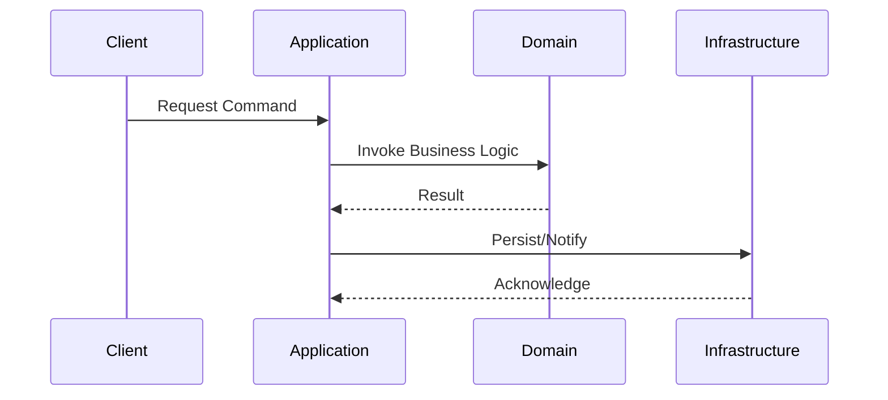

# Onion Architecture en Sistemas Distribuidos

## 1. Contexto & Definición del Problema
En sistemas distribuidos complejos, el acoplamiento entre la infraestructura (bases de datos, colas, servicios externos) y la lógica de negocio suele degenerar en un "Big Ball of Mud". La Onion Architecture (Arquitectura en Cebolla) propone un diseño basado en capas concéntricas donde la dependencia siempre apunta hacia el centro (Domain Layer), garantizando que el núcleo sea agnóstico a la tecnología.

## 2. Decisión Arquitectónica & Justificación
La adopción de esta arquitectura permite la testeabilidad unitaria del negocio sin necesidad de mocks complejos de infraestructura. En .NET 10, esto se potencia mediante el uso de `primary constructors` y `records` para modelar el dominio de forma inmutable.

## 3. Flujo y Diagrama de Secuencia


## 4. Matriz de Trade-offs
| Ventaja | Desventaja | Costo Operacional |
| :--- | :--- | :--- |
| Alta testeabilidad | Boilerplate elevado (Mappers) | Medio-Alto |
| Desacoplamiento total | Curva de aprendizaje empinada | Bajo |
| Flexibilidad tecnológica | Abstracción excesiva si es simple | Bajo |

## 5. Consideraciones de Concurrencia y Consistencia
Para evitar condiciones de carrera, el núcleo de dominio expone métodos de estado que validan invariantes, mientras que la capa de infraestructura implementa el [[Outbox-Pattern]] o bloqueos optimistas. El rendimiento se protege mediante el uso de `System.Threading.Channels` para procesamiento asíncrono.

## 6. Implementación de Referencia en .NET 10
```csharp
namespace Domain.Entities;

public record OrderId(Guid Value);

public class Order(OrderId id, decimal amount) {
    public OrderId Id { get; } = id;
    public decimal Amount { get; private set; } = amount;

    public void UpdateAmount(decimal newAmount) {
        if (newAmount < 0) throw new InvalidOperationException("Invalid amount");
        Amount = newAmount;
    }
}

// Application Service
public class OrderService(IOrderRepository repository) {
    public async Task ProcessOrderAsync(Guid id, decimal amount) {
        var order = await repository.GetByIdAsync(id);
        order.UpdateAmount(amount);
        await repository.SaveChangesAsync();
    }
}
```

## 7. Enlaces y Referencias en Obsidian
- [[Clean-Onion-Architecture-Distributed]]
- [[clean-architecture-distributed]]
- [[Outbox-Pattern]]
