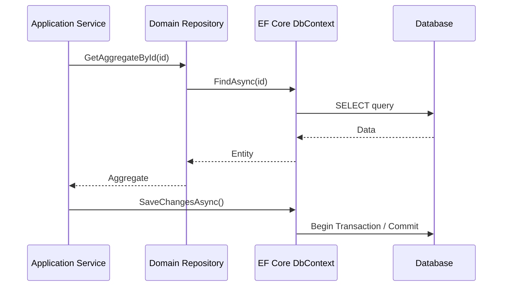

# Repository & Unit of Work vs. EF Core DbContext

## 1. Contexto & Definición del Problema
En aplicaciones modernas con .NET 10, existe un debate constante sobre si abstraer `DbContext` tras un Repository y un Unit of Work (UoW). A menudo, los equipos implementan capas de abstracción innecesarias, dado que `DbSet<T>` ya actúa como un repositorio y `DbContext` implementa por defecto el patrón Unit of Work.

## 2. Decisión Arquitectónica & Justificación
La recomendación actual es no abstraer `DbContext` si la aplicación no requiere explícitamente desacoplarse del motor de persistencia (ej. cambiar de SQL Server a un servicio externo en tiempo de ejecución). Sin embargo, en implementaciones de DDD con [[onion-architecture-distributed]], el Repository permite encapsular la lógica de consulta (Specification Pattern) sin exponer los detalles de IQueryable al dominio.

## 3. Flujo y Diagrama de Secuencia


## 4. Matriz de Trade-offs
| Característica | Repository + UoW | EF Core Directo |
| :--- | :--- | :--- |
| **Abstracción** | Alta (Desacoplado) | Baja (Acoplado) |
| **Complejidad** | Elevada (Boilerplate) | Mínima |
| **Testabilidad** | Fácil (Mocking) | Difícil (Requiere InMemory/TestContainers) |
| **Productividad** | Baja | Alta |

## 5. Consideraciones de Concurrencia, Consistencia y Rendimiento
- **Concurrencia:** EF Core gestiona el locking optimista mediante `RowVersion` (Timestamp). Un Repository mal implementado puede romper esta lógica si no propaga el `DbContext` correctamente.
- **Performance:** Evitar el 'Repository Pattern' estilo genérico CRUD, ya que suele resultar en consultas N+1. Prefiera repositorios específicos por Aggregate Root.

## 6. Implementación de Referencia en .NET 10
```csharp
public interface IRepository<T> where T : AggregateRoot {
    Task<T?> GetByIdAsync(Guid id, CancellationToken ct = default);
}

public sealed class OrderRepository(ApplicationDbContext context) : IRepository<Order> {
    public async Task<T?> GetByIdAsync(Guid id, CancellationToken ct = default) =>
        await context.Orders.Include(o => o.Items).FirstOrDefaultAsync(o => o.Id == id, ct);
}

// Uso en servicio
public async Task HandleCommand(PlaceOrderCommand cmd) {
    var order = await repository.GetByIdAsync(cmd.Id);
    order.AddItems(cmd.Items);
    await dbContext.SaveChangesAsync(); // UoW implícito
}
```

## 7. Enlaces y Referencias en Obsidian
Consulte [[CQRS-Architecture-Pattern]] para ver cómo este patrón evoluciona en arquitecturas de solo escritura, y [[clean-architecture-distributed]] para la ubicación estratégica de estas interfaces.
