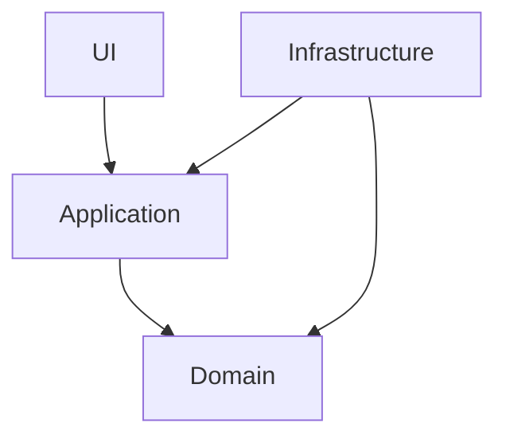

# Clean Architecture: Fundamentos y Aplicación [Semi-Senior]

## 1. Contexto General & Definición del Concepto
La Clean Architecture propone un diseño basado en capas donde la **regla de dependencia** dicta que las dependencias deben apuntar únicamente hacia adentro, hacia las políticas de negocio. El núcleo (Domain) nunca debe conocer los detalles de infraestructura (DB, UI, Frameworks).

## 2. Forma de Aplicación, Buenas Prácticas & Ventajas
- **Cuándo aplicar:** Proyectos con lógica de negocio compleja que requieren mantenibilidad a largo plazo.
- **Cuándo evitar:** Microservicios CRUD extremadamente simples (Over-engineering).

| Ventaja | Desventaja | Costo de Operación |
| :--- | :--- | :--- |
| Independencia de Frameworks | Aumento de archivos (Boilerplate) | Medio-Alto |
| Testeabilidad Total | Curva de aprendizaje inicial | Medio |

## 3. Flujo Arquitectónico


## 4. Implementación en C# .NET 10
```csharp
// Domain Layer: Pure Logic
public record User(Guid Id, string Email);

// Application Layer: Use Case
public class RegisterUserHandler(IUserRepository repository) {
    public async Task Handle(RegisterUserCommand cmd) {
        var user = new User(Guid.NewGuid(), cmd.Email);
        await repository.AddAsync(user);
    }
}
```

## 5. Implementación en React + Vite
```tsx
// Use case layer en frontend: Hooks para encapsular llamadas
export const useRegisterUser = () => {
  return useMutation({
    mutationFn: (userData: UserDTO) => apiClient.post('/users', userData),
    onError: (err) => toast.error('Error de registro')
  });
};
```

## 6. Consideraciones de Concurrencia y Consistencia
- **Consistencia:** Usar `Optimistic UI` en React para latencia baja.
- **Concurrencia:** Aplicar `RowVersion` en EF Core para evitar colisiones en actualizaciones concurrentes.

## 7. Enlaces y Referencias en Obsidian
[[Clean-Architecture-DDD-en-DotNet10]], [[CQRS-Architecture-Pattern]]
