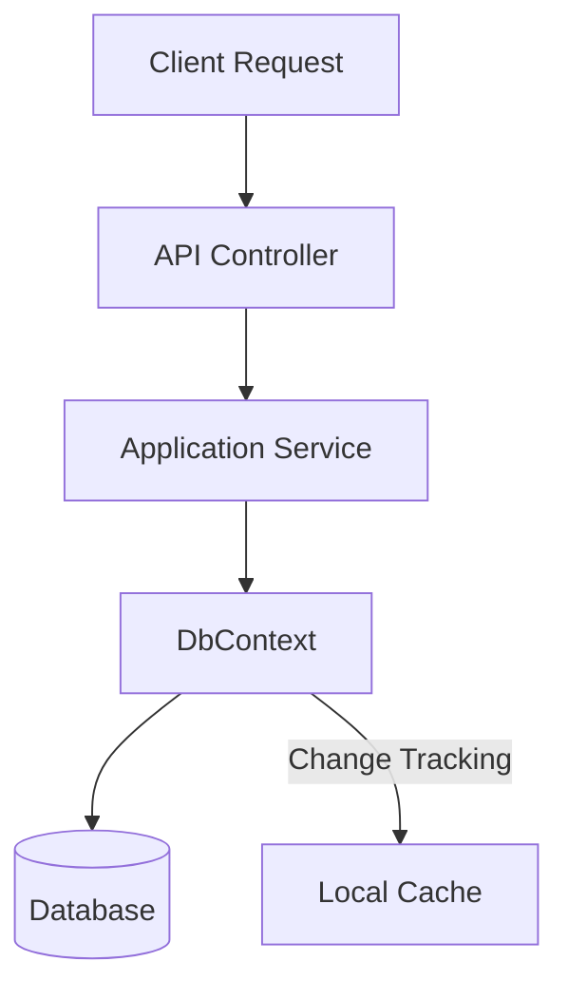

# Arquitectura y Buenas Prácticas con EF Core DbContext [Semi-Senior]

## 1. Contexto General & Definición del Concepto
El `DbContext` es la pieza central de Entity Framework Core. Actúa como una implementación del patrón *Unit of Work* y *Repository*, gestionando la conexión a la base de datos y el seguimiento de cambios (*Change Tracking*) de las entidades. En una arquitectura profesional, es vital evitar exponer el `DbContext` directamente en las capas de presentación, delegando su acceso a servicios de aplicación o repositorios.

## 2. Forma de Aplicación, Buenas Prácticas & Ventajas
- **Uso correcto**: Registrar como `Scoped` en la inyección de dependencias.
- **Antipatrón**: Inyectar `DbContext` directamente en los Controllers de ASP.NET Core (viola la separación de responsabilidades).

| Ventaja | Desventaja | Costo de Operación |
| :--- | :--- | :--- |
| Abstracción de persistencia | Riesgo de acoplamiento a EF | Medio |
| Tracking automático de cambios | Sobrecarga de memoria en consultas masivas | Bajo |

## 3. Flujo Arquitectónico


## 4. Implementación en C# .NET 10
```csharp
public class AppDbContext(DbContextOptions<AppDbContext> options) : DbContext(options)
{
    public DbSet<Product> Products => Set<Product>();

    protected override void OnModelCreating(ModelBuilder modelBuilder) =>
        modelBuilder.ApplyConfigurationsFromAssembly(typeof(AppDbContext).Assembly);
}

// Uso en Servicio (Service Layer)
public class ProductService(AppDbContext context) : IProductService
{
    public async Task UpdatePriceAsync(Guid id, decimal newPrice)
    {
        var product = await context.Products.FindAsync(id) ?? throw new NotFoundException();
        product.UpdatePrice(newPrice);
        await context.SaveChangesAsync(); // Unidad de trabajo confirmada
    }
}
```

## 5. Implementación en React con Vite.js
```typescript
import { useQuery, useMutation, useQueryClient } from '@tanstack/react-query';

export const useProduct = (id: string) => {
  const queryClient = useQueryClient();
  
  return useMutation({
    mutationFn: (newPrice: number) => 
      fetch(`/api/products/${id}`, { 
        method: 'PATCH', 
        body: JSON.stringify({ newPrice }) 
      }),
    onSuccess: () => queryClient.invalidateQueries({ queryKey: ['products'] })
  });
};
```

## 6. Consideraciones de Concurrencia
Para evitar conflictos, utiliza `Concurrency Tokens` (Timestamp en BD) en EF Core. En el frontend, utiliza *Optimistic Updates* mediante `TanStack Query` para mejorar la experiencia de usuario mientras la transacción en el servidor se procesa.

## 7. Enlaces y Referencias
- [[Clean-Architecture-Fundamentos]]
- [[repository-unit-of-work-pattern]]
