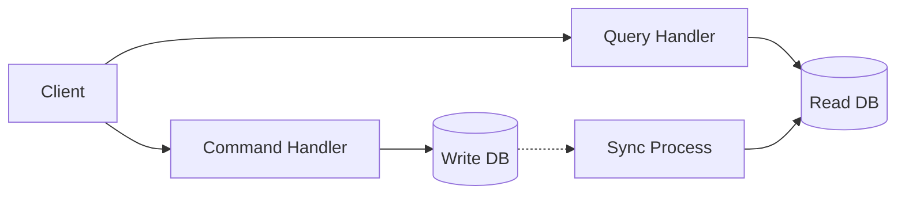

# CQRS: Command Query Responsibility Segregation [Semi-Senior]

## 1. Contexto General & Definición del Concepto
CQRS propone separar las operaciones de escritura (Commands) de las de lectura (Queries). Mientras que en sistemas CRUD tradicionales usamos un mismo modelo para ambos, CQRS permite escalar y optimizar cada lado de forma independiente.

- **Command:** Cambia el estado del sistema (crear, actualizar, borrar).
- **Query:** Retorna datos sin modificar el estado.

## 2. Forma de Aplicación, Buenas Prácticas & Ventajas
### Cuándo aplicarlo
Úsalo cuando la complejidad del dominio es alta o las necesidades de lectura difieren significativamente de las de escritura (ej. proyecciones complejas con JOINs vs. validaciones transaccionales).

| Ventaja | Desventaja |
| :--- | :--- |
| Escalabilidad independiente | Mayor complejidad inicial |
| Optimización de lecturas (denormalización) | Eventual Consistency |
| Código más limpio y mantenible | Mayor sobrecarga operativa |

## 3. Flujo Arquitectónico y Diagrama (Mermaid)


## 4. Implementación en C# .NET 10
Usamos `MediatR` como estándar de facto para desacoplar el envío de comandos.

```csharp
// Command
public record CreateProductCommand(string Name, decimal Price) : IRequest<Guid>;

// Handler
public class CreateProductHandler : IRequestHandler<CreateProductCommand, Guid>
{
    private readonly AppDbContext _context;
    public CreateProductHandler(AppDbContext context) => _context = context;

    public async Task<Guid> Handle(CreateProductCommand request, CancellationToken ct)
    {
        var product = new Product(request.Name, request.Price);
        _context.Products.Add(product);
        await _context.SaveChangesAsync(ct);
        return product.Id;
    }
}
```

## 5. Implementación en React con Vite.js
En el frontend, separamos los servicios de consulta (usando React Query) de las acciones de mutación.

```tsx
// useCreateProduct.ts
export const useCreateProduct = () => {
  const queryClient = useQueryClient();
  return useMutation({
    mutationFn: (data: ProductDto) => api.post('/products', data),
    onSuccess: () => queryClient.invalidateQueries({ queryKey: ['products'] })
  });
};

// ProductList.tsx
export const ProductList = () => {
  const { data } = useQuery({ queryKey: ['products'], queryFn: fetchProducts });
  return <div>{data?.map(p => <li key={p.id}>{p.name}</li>)}</div>;
};
```

## 6. Consideraciones de Concurrencia
Al usar CQRS, debemos ser conscientes de la **consistencia eventual**. Si realizamos un `Command` y navegamos a una `Query` inmediatamente, es posible que el dato aún no aparezca. Estrategia común: Actualización optimista del estado local en React mientras el backend procesa la solicitud asíncrona.

## 7. Enlaces y Referencias en Obsidian
- [[Clean-Architecture-Fundamentos]]
- [[repository-unit-of-work-pattern]]
