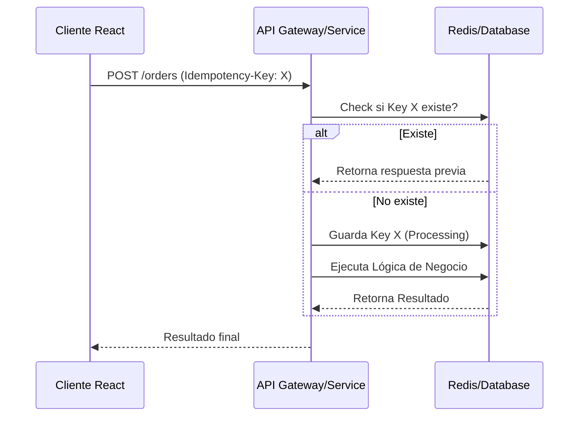

# Idempotencia en APIs [Semi-Senior]

## 1. Contexto General & Definición del Concepto
La idempotencia es la propiedad de una operación que permite que esta se realice múltiples veces sin cambiar el resultado más allá de la aplicación inicial. En sistemas distribuidos y REST APIs, es crítica para manejar fallos de red donde una petición puede haber llegado al servidor pero la respuesta se perdió.

## 2. Forma de Aplicación, Buenas Prácticas & Ventajas
Se aplica principalmente en métodos `POST` y `PATCH`. La mejor práctica es utilizar un `Idempotency-Key` enviado en los headers. Evita la sobre-ingeniería: solo úsalo en operaciones con efectos secundarios (pagos, creación de registros únicos).

| Ventaja | Desventaja |
| :--- | :--- |
| Recuperación automática ante fallos de red | Aumento de complejidad en almacenamiento |
| Consistencia de estado en sistemas distribuidos | Gestión de expiración de claves (TTL) |
| Mejora la experiencia de usuario (evita doble pago) | Overhead adicional en cada request |

## 3. Flujo Arquitectónico


## 4. Implementación y Ejemplos Prácticos en C# / .NET 10
```csharp
public record IdempotencyRequest(Guid Key, string Payload);

public class IdempotencyFilter : IAsyncActionFilter {
    private readonly IDistributedCache _cache;
    public async Task OnActionExecutionAsync(ActionExecutingContext context, ActionExecutionDelegate next) {
        if (context.HttpContext.Request.Headers.TryGetValue("Idempotency-Key", out var key)) {
            var cachedResponse = await _cache.GetStringAsync(key);
            if (cachedResponse != null) {
                context.Result = new ContentResult { Content = cachedResponse, StatusCode = 200 };
                return;
            }
        }
        await next();
    }
}
```

## 5. Implementación y Ejemplos Prácticos en React con Vite.js
```typescript
import { v4 as uuidv4 } from 'uuid';

const useIdempotentApi = () => {
  const sendOrder = async (data: any) => {
    const idempotencyKey = uuidv4();
    return await fetch('/api/orders', {
      method: 'POST',
      headers: {
        'Content-Type': 'application/json',
        'Idempotency-Key': idempotencyKey
      },
      body: JSON.stringify(data)
    });
  };
  return { sendOrder };
};
```

## 6. Consideraciones de Concurrencia, Consistencia y Rendimiento
Para evitar condiciones de carrera, usa operaciones atómicas (`SETNX` en Redis). Considera que el estado debe ser 'en progreso' hasta que la transacción se confirme para bloquear solicitudes paralelas con la misma llave.

## 7. Enlaces y Referencias en Obsidian
[[Clean-Architecture-Fundamentos]]
[[cqrs-pattern-implementation]]
