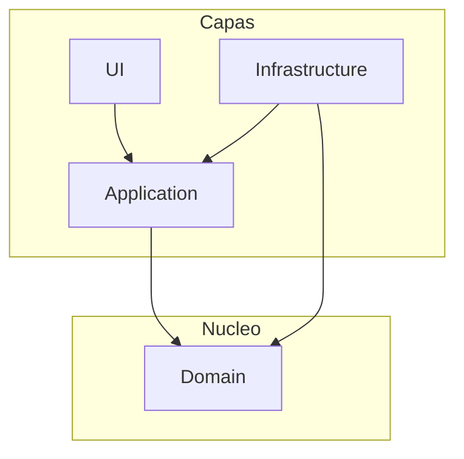

# Onion Architecture [Semi-Senior]

## 1. Contexto General & Definición del Concepto
La Onion Architecture, propuesta por Jeffrey Palermo, estructura el software en capas concéntricas alrededor de un núcleo de dominio. A diferencia de las arquitecturas de n-capas tradicionales, aquí **las dependencias solo apuntan hacia adentro**. 

Resuelve el problema del acoplamiento excesivo con infraestructura (bases de datos, frameworks de UI), permitiendo que el dominio sea testeable de forma aislada y agnóstica a la tecnología externa.

## 2. Forma de Aplicación, Buenas Prácticas & Ventajas
### Cuándo aplicar:
- Aplicaciones de lógica de negocio compleja.
- Proyectos con largo ciclo de vida donde se requiere facilitar la migración de tecnologías.

| Ventaja | Desventaja / Costo |
| :--- | :--- |
| Testeabilidad total del dominio | Mayor número de proyectos/ensamblados |
| Desacoplamiento de infraestructura | Curva de aprendizaje inicial |
| Mantenibilidad a largo plazo | Over-engineering en CRUDs simples |

## 3. Flujo Arquitectónico y Diagrama


## 4. Implementación en C# .NET 10
En .NET 10, utilizamos `records` para entidades inmutables y la inyección de dependencias para cumplir con la inversión de control.

```csharp
// Domain: Entidad pura
public record User(Guid Id, string Email);

// Application: Interfaz para el contrato (Inversión de dependencias)
public interface IUserRepository { Task<User> GetByIdAsync(Guid id); }

// Infrastructure: Implementación con EF Core
public class UserRepository(AppDbContext context) : IUserRepository {
    public async Task<User> GetByIdAsync(Guid id) => await context.Users.FindAsync(id);
}
```

## 5. Implementación en React con Vite.js
El frontend sigue el patrón de "Clean Architecture" mediante capas de servicios que consumen contratos, desacoplando la lógica de vista de los endpoints.

```typescript
// src/services/userService.ts
import { User } from '../types';

export const userService = {
  getUser: async (id: string): Promise<User> => {
    const response = await fetch(`/api/users/${id}`);
    if (!response.ok) throw new Error('Network error');
    return response.json();
  }
};

// src/hooks/useUser.ts
export const useUser = (id: string) => {
  const [data, setData] = useState<User | null>(null);
  useEffect(() => { userService.getUser(id).then(setData); }, [id]);
  return data;
};
```

## 6. Consideraciones de Concurrencia y Rendimiento
Para evitar *race conditions* en entornos distribuidos:
1. **Optimistic Concurrency**: Usar `RowVersion` en EF Core junto con el header `If-Match` en peticiones HTTP.
2. **Estados en Frontend**: Implementar *React Query* o *SWR* para manejar la caché y la revalidación de datos automáticamente, evitando sobrecargar el servidor innecesariamente.

## 7. Enlaces y Referencias
- [[Clean-Architecture-Fundamentos]]
