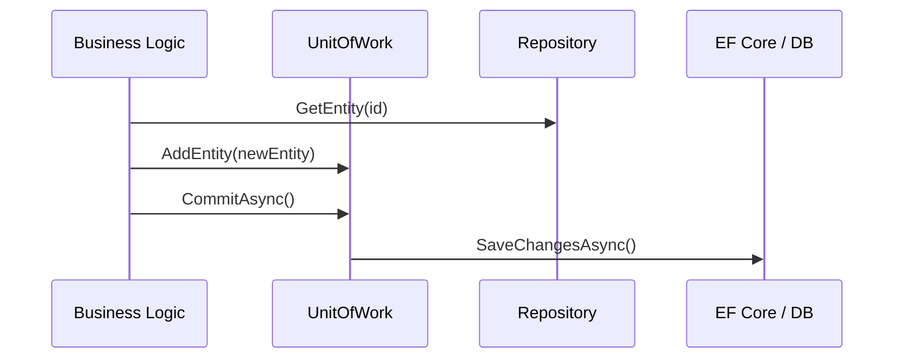

# Repository & Unit of Work [Semi-Senior]

## 1. Contexto General & Definición del Concepto
El patrón **Repository** actúa como una capa de abstracción entre la lógica de negocio y la capa de acceso a datos, permitiendo un acceso a colecciones de entidades mediante una interfaz similar a una colección en memoria. 

El patrón **Unit of Work (UoW)** mantiene una lista de objetos afectados por una transacción de negocio y coordina la escritura de los cambios, garantizando la atomicidad: o todo se persiste, o nada lo hace. Esto desacopla el dominio de la infraestructura de persistencia (como EF Core 10).

## 2. Forma de Aplicación, Buenas Prácticas & Ventajas
- **Cuándo aplicar:** En aplicaciones que requieren alta mantenibilidad, testing unitario riguroso y donde se desea aislar la lógica de acceso a datos.
- **Antipatrón:** No sobre-ingenierices aplicaciones CRUD simples donde EF Core ya actúa como un UoW implícito. El exceso de abstracción puede ocultar el poder de LINQ.

### Matriz de Trade-offs
| Ventaja | Desventaja |
| :--- | :--- |
| Desacoplamiento de persistencia | Mayor complejidad en el código |
| Facilidad para Testing (Mocking) | Riesgo de abstracción "fuga" |
| Centralización de transacciones | Sobrecarga de mantenimiento de interfaces |

## 3. Flujo Arquitectónico


## 4. Implementación en C# .NET 10
```csharp
public interface IRepository<T> where T : class { Task<T?> GetByIdAsync(Guid id); }
public interface IUnitOfWork : IDisposable { IRepository<User> Users { get; } Task<int> SaveChangesAsync(); }

public class UnitOfWork(AppDbContext context) : IUnitOfWork {
    private readonly AppDbContext _context = context;
    public IRepository<User> Users => new UserRepository(_context);

    public async Task<int> SaveChangesAsync() => await _context.SaveChangesAsync();
    public void Dispose() => _context.Dispose();
}
```

## 5. Implementación en React con Vite.js
En el frontend, el "Repository" se traduce en **Service Layers** que encapsulan llamadas HTTP, manteniendo la lógica de UI limpia de URLs y métodos Fetch.
```typescript
// UserService.ts
export const userService = {
  getUser: async (id: string): Promise<User> => {
    const response = await fetch(`/api/users/${id}`);
    if (!response.ok) throw new Error('Network error');
    return response.json();
  }
};

// Custom Hook para consumo
export const useUser = (id: string) => {
  const [user, setUser] = useState<User | null>(null);
  useEffect(() => { userService.getUser(id).then(setUser); }, [id]);
  return user;
};
```

## 6. Consideraciones de Concurrencia
- **Backend:** Usar *Optimistic Concurrency* con columnas `RowVersion` en EF Core para evitar colisiones.
- **Frontend:** Implementar *Optimistic Updates* mediante librerías como TanStack Query, donde la UI se actualiza inmediatamente antes de recibir la confirmación del servidor.

## 7. Enlaces y Referencias
- [[CQRS-Patron-Implementacion-Practica]]
- [[Clean-Architecture-Fundamentos]]
