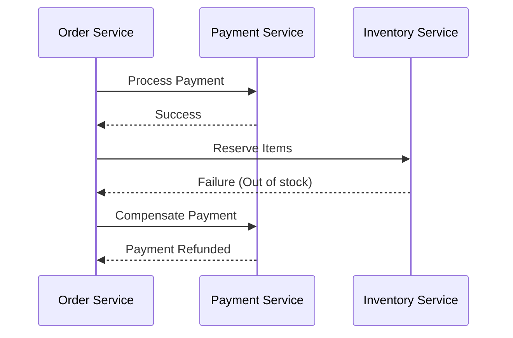

# Saga Pattern: Gestión de Transacciones Distribuidas [Semi-Senior]

## 1. Contexto General & Definición del Concepto
El patrón Saga resuelve el problema de mantener la integridad de datos en arquitecturas de microservicios donde las transacciones ACID tradicionales no son viables al abarcar múltiples bases de datos. Una "Saga" es una secuencia de transacciones locales. Cada transacción actualiza la base de datos y publica un evento/mensaje para disparar la siguiente transacción. Si una falla, se ejecutan transacciones compensatorias para revertir los cambios previos.

## 2. Forma de Aplicación, Buenas Prácticas & Ventajas
Se debe aplicar cuando existe un proceso de negocio complejo que atraviesa servicios independientes. No es recomendable para sistemas monolíticos o donde la latencia sea crítica y la consistencia fuerte sea obligatoria.

| Ventaja | Desventaja / Costo |
| :--- | :--- |
| Consistencia eventual en sistemas distribuidos | Alta complejidad de debugging |
| Desacoplamiento de servicios | Requiere lógica de compensación |
| Escalabilidad horizontal | Dificultad para visualizar el estado global |

## 3. Flujo Arquitectónico y Diagrama


## 4. Implementación en .NET 10
Utilizando C# 10 con records para inmutabilidad y una estructura de orquestación simple.

```csharp
public record OrderCommand(Guid OrderId, decimal Amount);

public class OrderSagaOrchestrator(IPaymentService payment, IInventoryService inventory) {
    public async Task<bool> ExecuteAsync(OrderCommand cmd) {
        try {
            await payment.ProcessAsync(cmd.OrderId, cmd.Amount);
            await inventory.ReserveAsync(cmd.OrderId);
            return true;
        } catch (Exception) {
            await payment.RefundAsync(cmd.OrderId);
            return false;
        }
    }
}
```

## 5. Implementación en React + Vite
En el frontend, el estado debe reflejar que la operación está "en progreso" para evitar duplicidad.

```tsx
import { useState } from 'react';

export const useOrderSaga = () => {
  const [status, setStatus] = useState<'idle' | 'processing' | 'error'>('idle');

  const placeOrder = async (data: OrderPayload) => {
    setStatus('processing');
    try {
      await api.post('/orders', data);
      setStatus('idle');
    } catch (e) {
      setStatus('error');
      // Mostrar UI de compensación al usuario
    }
  };
  return { placeOrder, status };
};
```

## 6. Consideraciones de Concurrencia y Consistencia
- **Consistencia Eventual**: El usuario debe recibir feedback inmediato (Optimistic UI) mientras el backend procesa la saga de forma asíncrona.
- **Idempotencia**: Es crítico que todos los endpoints de compensación sean idempotentes para evitar estados inconsistentes ante reintentos de red.

## 7. Enlaces y Referencias
- [[CQRS-Patron-Implementacion-Practica]]
- [[transactional-outbox-pattern]]
