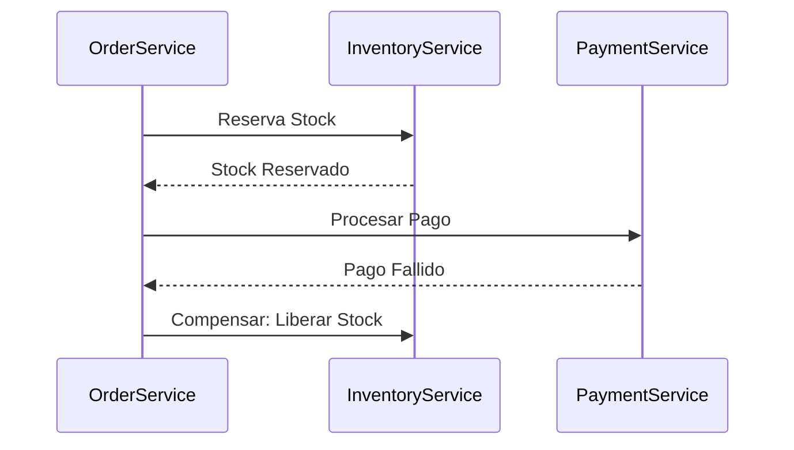

# Patrón Saga [Semi-Senior]

## 1. Contexto General & Definición del Concepto
El patrón Saga resuelve el problema de la **consistencia de datos distribuida** en arquitecturas de microservicios. En un sistema monolítico, usamos transacciones ACID. En microservicios, una operación que abarca múltiples servicios no puede usar transacciones distribuidas (2PC es ineficiente). Una Saga es una secuencia de transacciones locales. Si una falla, la Saga ejecuta **transacciones de compensación** para revertir los cambios previos.

## 2. Forma de Aplicación, Buenas Prácticas & Ventajas
- **Cuándo aplicar:** Operaciones de negocio que involucran múltiples microservicios (ej. Pedido -> Inventario -> Pago).
- **Anti-patrón:** Aplicarlo para flujos simples que podrían ser síncronos o parte de un solo contexto.

| Ventaja | Desventaja |
| :--- | :--- |
| Alta disponibilidad | Complejidad de depuración |
| Escalabilidad horizontal | Dificultad en el testing |
| Desacoplamiento | Consistencia eventual |

## 3. Flujo Arquitectónico y Diagrama (Mermaid)


## 4. Implementación en C# .NET 10
Usando patrones de diseño modernos y C# 13/14 features.

```csharp
public record SagaContext(Guid OrderId, decimal Amount);

public interface ISagaStep {
    Task<bool> ExecuteAsync(SagaContext context);
    Task UndoAsync(SagaContext context);
}

public class InventoryStep(IInventoryClient client) : ISagaStep {
    public async Task<bool> ExecuteAsync(SagaContext context) => await client.Reserve(context.OrderId);
    public async Task UndoAsync(SagaContext context) => await client.Release(context.OrderId);
}
```

## 5. Implementación en React con Vite.js
El frontend debe manejar estados intermedios y ofrecer feedback visual claro.

```tsx
import { useState } from 'react';

export const useOrderSaga = () => {
  const [status, setStatus] = useState<'idle' | 'processing' | 'error'>('idle');
  
  const executeOrder = async (data: any) => {
    setStatus('processing');
    try {
      const response = await api.post('/orders', data);
      setStatus('idle');
    } catch (e) {
      setStatus('error');
      // Mostrar notificación de fallo en compensación
    }
  };
  return { executeOrder, status };
};
```

## 6. Consideraciones de Concurrencia
- **Consistencia Eventual:** El usuario debe ser informado que su orden está "en proceso".
- **Idempotencia:** Cada servicio debe garantizar que procesar dos veces el mismo mensaje no duplique efectos.

## 7. Enlaces y Referencias
- [[Clean-Architecture-Fundamentos]]
- [[transactional-outbox-pattern]]
