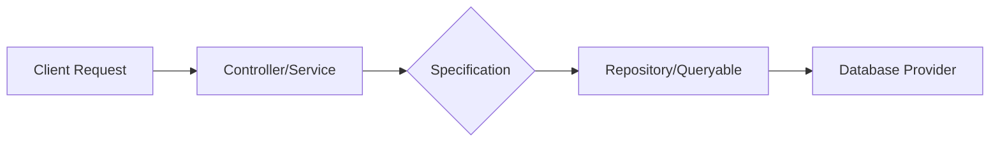

# Specification Pattern [Semi-Senior]

## 1. Contexto General & Definición del Concepto
El *Specification Pattern* es un patrón de diseño de comportamiento que permite encapsular reglas de negocio en objetos reusables. En lugar de tener lógica de filtrado o validación dispersa en servicios o repositorios, encapsulamos una condición booleana en una clase dedicada (`ISpecification`). Es fundamental para mantener el [[Clean-Architecture-Fundamentos]] evitando el sangrado de lógica de dominio hacia capas de persistencia.

## 2. Forma de Aplicación, Buenas Prácticas & Ventajas
- **Cuándo usarlo:** Cuando necesites filtros complejos o reglas de negocio que se reutilizan en múltiples endpoints o capas.
- **Antipatrón:** No lo uses para validaciones triviales; el *over-engineering* aquí complica innecesariamente la base de código.

| Ventaja | Desventaja | Costo de Operación |
| :--- | :--- | :--- |
| Alta Reusabilidad | Incremento en número de clases | Bajo |
| Alta Testabilidad | Curva de aprendizaje | Bajo |
| Código Limpio | Puede volverse verboso | Medio |

## 3. Flujo Arquitectónico


## 4. Implementación en C# .NET 10
```csharp
public interface ISpecification<T> {
    Expression<Func<T, bool>> ToExpression();
    bool IsSatisfiedBy(T entity);
}

public class ActiveUserSpecification : ISpecification<User> {
    public Expression<Func<User, bool>> ToExpression() => u => u.IsActive && u.EmailConfirmed;
    public bool IsSatisfiedBy(User entity) => entity.IsActive && entity.EmailConfirmed;
}

// Uso en repositorio
public async Task<List<User>> GetUsersAsync(ISpecification<User> spec) {
    return await _context.Users.Where(spec.ToExpression()).ToListAsync();
}
```

## 5. Implementación en React con Vite.js
En el frontend, el patrón se traslada a la composición de criterios de filtro para llamadas API.
```typescript
// hooks/useUserFilter.ts
export const useUserFilter = (criteria: { isActive: boolean }) => {
  const fetchUsers = async () => {
    const params = new URLSearchParams({ active: String(criteria.isActive) });
    return await api.get(`/users?${params.toString()}`);
  };
  return { fetchUsers };
};
```

## 6. Consideraciones de Concurrencia y Rendimiento
La sincronización cliente-servidor es crítica. Asegúrate de que las especificaciones complejas se traduzcan a `Expression Trees` en EF Core 10 para evitar cargar todos los datos en memoria (evita el *Client-Side Evaluation*). En el frontend, utiliza *caching* (React Query) para evitar peticiones redundantes con las mismas especificaciones.

## 7. Referencias
- [[CQRS-Patron-Implementacion-Practica]]
- [[repository-unit-of-work-pattern]]
