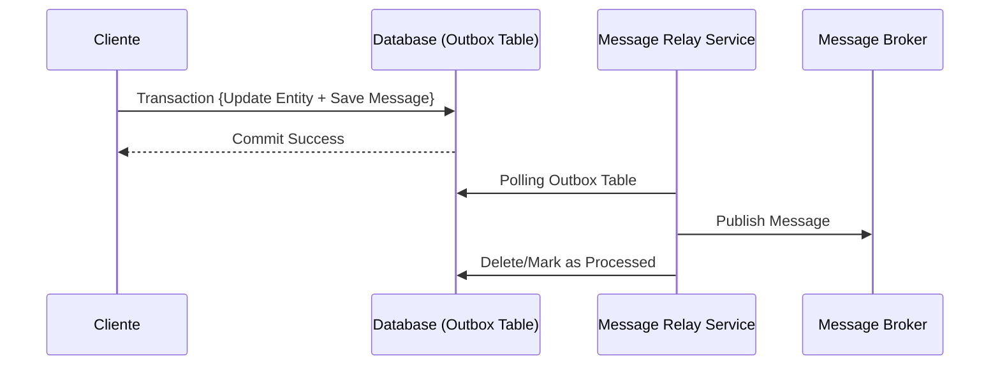

# Transactional Outbox Pattern [Semi-Senior]

## 1. Contexto General & Definición del Concepto
El patrón Transactional Outbox soluciona el problema de la **consistencia atómica** entre una base de datos y un sistema de mensajería (Message Broker). En sistemas distribuidos, si actualizas tu DB y luego intentas enviar un mensaje a Kafka o RabbitMQ, uno puede fallar mientras el otro tiene éxito. El patrón asegura que el mensaje se envíe *si y solo si* la transacción de base de datos se confirma.

## 2. Forma de Aplicación, Buenas Prácticas & Ventajas
Úsalo cuando necesites consistencia eventual fuerte entre servicios. Evita usarlo para operaciones síncronas simples; es sobre-ingeniería si basta con una API REST estándar.

| Ventaja | Desventaja |
| :--- | :--- |
| Consistencia garantizada | Latencia en el procesamiento |
| Resiliencia ante caídas del broker | Complejidad de infraestructura |
| Desacoplamiento de servicios | Requiere procesos de limpieza |

## 3. Flujo Arquitectónico


## 4. Implementación en C# .NET 10
Usamos el patrón con Entity Framework Core 10:
```csharp
public async Task CreateOrderAsync(Order order, CancellationToken ct) {
    using var transaction = await _dbContext.Database.BeginTransactionAsync(ct);
    try {
        _dbContext.Orders.Add(order);
        _dbContext.OutboxMessages.Add(new OutboxMessage {
            Id = Guid.NewGuid(),
            Payload = JsonSerializer.Serialize(new OrderCreatedEvent(order.Id)),
            OccurredOn = DateTime.UtcNow
        });
        await _dbContext.SaveChangesAsync(ct);
        await transaction.CommitAsync(ct);
    } catch { await transaction.RollbackAsync(); throw; }
}
```

## 5. Implementación en React con Vite.js
El frontend debe manejar el estado optimista mientras el backend procesa el outbox:
```tsx
export const useCreateOrder = () => {
  const [isPending, setIsPending] = useState(false);
  const createOrder = async (data: OrderDto) => {
    setIsPending(true);
    try {
      const response = await api.post('/orders', data);
      // El backend retorna 202 Accepted, el proceso de outbox sigue en background
      return response.data;
    } catch (e) { console.error('Error enviando orden'); }
    finally { setIsPending(false); }
  };
  return { createOrder, isPending };
};
```

## 6. Consideraciones de Concurrencia
- **Idempotencia:** Dado que el Relay podría procesar un mensaje dos veces, el consumidor debe ser idempotente.
- **Polling vs Log Tailing:** Para alto rendimiento, prefiere leer el Transaction Log (CDC) en lugar de hacer polling `SELECT` constante a la tabla.

## 7. Enlaces y Referencias
- [[CQRS-Patron-Implementacion-Practica]]
- [[EF-Core-DbContext-Pattern]]
